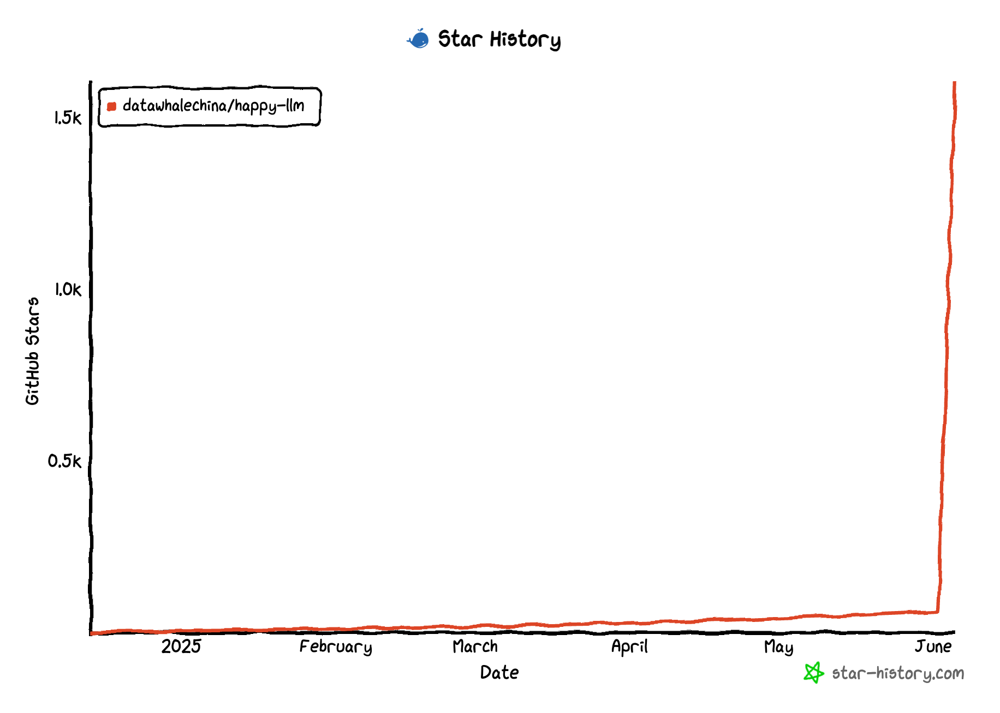

    
    <h1>Happy-LLM</h1>

  
  
  

[中文](./README.md) | [English](./README_en.md)

  <h3>📚 A Comprehensive Tutorial on Large Language Model Principles and Practice from Scratch</h3>
  
<em>Deep understanding of LLM core principles, hands-on implementation of your first large model</em>

---

## 🎯 Project Introduction

> &emsp;&emsp;*Many friends felt unsatisfied after reading the Datawhale open-source project: [self-llm Open Source Large Model Usage Guide](https://github.com/datawhalechina/self-llm), wanting to deeply understand the principles and training processes of large language models. Therefore, we (Datawhale) decided to launch the "Happy-LLM" project, aiming to help everyone deeply understand the principles and training processes of large language models.*

&emsp;&emsp;This project is a **systematic LLM learning tutorial** that starts from basic NLP research methods and gradually deepens according to LLM concepts and principles, systematically analyzing the architectural foundations and training processes of LLMs for readers. At the same time, we will combine the most mainstream code frameworks in the current LLM field to demonstrate how to build and train an LLM from scratch, aiming to achieve "give a man a fish and you feed him for a day; teach a man to fish and you feed him for a lifetime." We hope everyone can start their journey into the vast world of LLMs from this book and explore the endless possibilities of LLMs.

### ✨ What Will You Gain?

- 📚 **Datawhale Open Source Free** - Completely free access to all content of this project
- 🔍 **Deep Understanding** of Transformer architecture and attention mechanisms
- 📚 **Master** the basic principles of pre-trained language models
- 🧠 **Understand** the basic structures of existing large models
- 🏗️ **Hands-on Implementation** of a complete LLaMA2 model
- ⚙️ **Master Training** from pre-training to fine-tuning full pipeline
- 🚀 **Practical Applications** of cutting-edge technologies like RAG and Agent

## 📖 Content Navigation

| Chapter | Key Content | Status |
| --- | --- | --- |
| [Preface](./docs/README.md) | Project origin, background, and reader recommendations | ✅ |
| [Chapter 1: NLP Basic Concepts](./docs/chapter1/第一章%20NLP基础概念.md) | What is NLP, development history, task classification, text representation evolution | ✅ |
| [Chapter 2: Transformer Architecture](./docs/chapter2/第二章%20Transformer架构.md) | Attention mechanism, Encoder-Decoder, hands-on Transformer building | ✅ |
| [Chapter 3: Pre-trained Language Models](./docs/chapter3/第三章%20预训练语言模型.md) | Comparison of Encoder-only, Encoder-Decoder, Decoder-Only models | ✅ |
| [Chapter 4: Large Language Models](./docs/chapter4/第四章%20大语言模型.md) | LLM definition, training strategies, emergent ability analysis | ✅ |
| [Chapter 5: Building Large Models from Scratch](./docs/chapter5/第五章%20动手搭建大模型.md) | Implementing LLaMA2, training Tokenizer, pre-training small LLM | ✅ |
| [Chapter 6: Large Model Training Practice](./docs/chapter6/第六章%20大模型训练流程实践.md) | Pre-training, supervised fine-tuning, LoRA/QLoRA efficient fine-tuning | ✅ |
| [Chapter 7: Large Model Applications](./docs/chapter7/第七章%20大模型应用.md) | Model evaluation, RAG retrieval enhancement, Agent intelligent agents | ✅ |

## 💡 How to Learn

&emsp;&emsp;This project is suitable for university students, researchers, and LLM enthusiasts. Before learning this project, it is recommended to have some programming experience, especially familiarity with the Python programming language. It's best to have knowledge of deep learning and understand concepts and terminology in the NLP field to learn this project more easily.

&emsp;&emsp;This project is divided into two parts - foundational knowledge and practical applications. Chapters 1-4 are the foundational knowledge section, introducing the basic principles of LLMs from shallow to deep. Chapter 1 briefly introduces basic NLP tasks and development, providing reference for non-NLP field researchers; Chapter 2 introduces the basic architecture of LLMs - Transformer, including principle introduction and code implementation, serving as the most important theoretical foundation for LLMs; Chapter 3 comprehensively introduces classic PLMs, including Encoder-Only, Encoder-Decoder, and Decoder-Only architectures, while also introducing the architectures and concepts of some current mainstream LLMs; Chapter 4 formally enters the LLM section, detailing the characteristics, capabilities, and overall training process of LLMs. Chapters 5-7 are the practical application section, gradually leading everyone into the underlying details of LLMs. Chapter 5 will guide readers to build an LLM from scratch based on PyTorch and implement the full pipeline of pre-training and supervised fine-tuning; Chapter 6 will introduce the current industry-mainstream LLM training framework Transformers, guiding learners to quickly and efficiently implement the LLM training process based on this framework; Chapter 7 will introduce various applications based on LLMs, completing learners' understanding of the LLM system, including LLM evaluation, Retrieval-Augmented Generation (RAG), and the concepts and simple implementation of intelligent agents (Agents). You can selectively read relevant chapters based on personal interests and needs.

&emsp;&emsp;During the reading process, it is recommended to combine theory with practice. LLM is a rapidly developing, practice-oriented field. We recommend investing more in hands-on practice, reproducing the various codes provided in this book, while actively participating in LLM-related projects and competitions, truly diving into the wave of LLM development. We encourage you to follow Datawhale and other LLM-related open-source communities. When encountering problems, you can ask questions in the issue section of this project at any time.

&emsp;&emsp;Finally, we welcome every reader to join the ranks of LLM developers after learning this project. As a domestic AI open-source community, we hope to fully gather co-creators to enrich this open-source LLM world together and create more comprehensive and distinctive LLM tutorials. Sparks gather into an ocean. We hope to become a bridge between LLMs and the general public, embracing a more magnificent and vast LLM world with the spirit of free and equal open source.

## 🤝 How to Contribute

We welcome any form of contribution!

- 🐛 **Report Bugs** - Please submit an Issue if you find problems
- 💡 **Feature Suggestions** - Tell us if you have good ideas
- 📝 **Content Improvement** - Help improve tutorial content
- 🔧 **Code Optimization** - Submit Pull Requests

## 🙏 Acknowledgments

### Core Contributors
- [Song Zhixue - Project Leader](https://github.com/KMnO4-zx) (Datawhale Member - China University of Mining and Technology, Beijing)
- [Zou Yuheng - Project Leader](https://github.com/logan-zou) (Datawhale Member - University of International Business and Economics)
- [Zhu Xinzhong - Expert Advisor](https://xinzhongzhu.github.io/) (Datawhale Chief Scientist - Professor at Hangzhou Institute for Advanced Study, Zhejiang Normal University)

### Special Thanks
- Thanks to [@Sm1les](https://github.com/Sm1les) for help and support on this project
- Thanks to all developers who contributed to this project ❤️

  

## Star History

    

  
⭐ If this project helps you, please give us a Star!

## About Datawhale

    
    
Scan the QR code to follow Datawhale WeChat Official Account for more quality open-source content

---

## 📜 Open Source License

This work is licensed under a [Creative Commons Attribution-NonCommercial-ShareAlike 4.0 International License](http://creativecommons.org/licenses/by-nc-sa/4.0/).