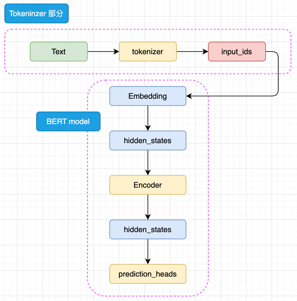
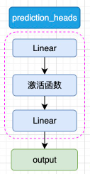
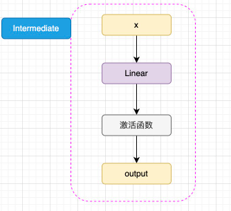
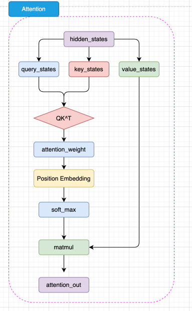

# 3.1 Encoder-only PLM

在上一章，我们详细讲解了给 NLP 领域带来巨大变革的 Attention 机制以及使用 Attention 机制搭建的模型 Transformer，NLP 模型的里程碑式转变也就自此而始。在上文对 Transformer 的讲解中我们可以看到，Transformer 主要由 Encoder、Decoder 两个部分组成，两个部分分别具有不一样的结构和输入输出。

针对 Encoder、Decoder 的特点，引入 ELMo 的预训练思路，开始出现不同的、对 Transformer 进行优化的思路。例如，Google 仅选择了 Encoder 层，通过将 Encoder 层进行堆叠，再提出不同的预训练任务 MLM（Mask Language Model，掩码语言模型），打造了一统 NLU（Natural Language Understanding，自然语言理解）任务的代表模型——BERT。而 OpenAI 则选择了 Decoder 层，使用原有的 LM（语言模型）任务，通过不断增加模型参数和预训练语料，打造了在 NLG（Natural Language Generation，自然语言生成）任务上优势明显的 GPT 系列模型，也是现今大火的 LLM 的基座模型。当然，还有一种思路是同时保留 Encoder 与 Decoder，打造预训练的 Transformer 模型，例如由 Google 发布的 T5模型。

在本章中，我们将以 Encoder-Only、Encoder-Decoder、Decoder-Only 的顺序来依次介绍 Transformer 时代的各个主流预训练模型，分别介绍三种核心的模型架构、每种主流模型选择的预训练任务及其独特优势，这也是目前所有主流 LLM 的模型基础。

## 3.1.1 BERT

BERT，全名为 Bidirectional Encoder Representations from Transformers，是由 Google 团队在 2018年发布的预训练语言模型。该模型发布于论文《BERT: Pre-training of Deep Bidirectional Transformers for Language Understanding》，实现了包括 GLUE、MultiNLI 等七个自然语言处理评测任务的 the-state-of-art（最优分数），堪称里程碑式的成果。自 BERT 推出以来，预训练+微调的模式开始成为自然语言处理任务的主流，不仅 BERT 自身在不断更新迭代提升模型性能，也出现了如 MacBERT、BART 等基于 BERT 进行优化提升的模型。可以说，BERT 是自然语言处理的一个阶段性成果，标志着各种自然语言处理任务的重大进展以及预训练模型的统治地位建立，一直到 LLM 的诞生，NLP 领域的主导地位才从 BERT 系模型进行迁移。即使在 LLM 时代，要深入理解 LLM 与 NLP，BERT 也是无法绕过的一环。

### （1）思想沿承

BERT 是一个统一了多种思想的预训练模型。其所沿承的核心思想包括：

- Transformer 架构。正如我们在上一章所介绍的，在 2017年发表的《Attention is All You Need》论文提出了完全使用 Attention 机制而抛弃 RNN、LSTM 结构的 Transformer 模型，带来了新的模型架构。BERT 正沿承了 Transformer 的思想，在 Transformer 的模型基座上进行优化，通过将 Encoder 结构进行堆叠，扩大模型参数，打造了在 NLU 任务上独居天分的模型架构；
- 预训练+微调范式。同样在 2018年，ELMo 的诞生标志着预训练+微调范式的诞生。ELMo 模型基于双向 LSTM 架构，在训练数据上基于语言模型进行预训练，再针对下游任务进行微调，表现出了更加优越的性能，将 NLP 领域导向预训练+微调的研究思路。而 BERT 也采用了该范式，并通过将模型架构调整为 Transformer，引入更适合文本理解、能捕捉深层双向语义关系的预训练任务 MLM，将预训练-微调范式推向了高潮。

接下来，我们将从模型架构、预训练任务以及下游任务微调三个方面深入剖析 BERT，分析 BERT 的核心思路及优势，帮助大家理解 BERT 为何能够具备远超之前模型的性能，也从而更加深刻地理解 LLM 如何能够战胜 BERT 揭开新时代的大幕。

### （2）模型架构——Encoder Only

BERT 的模型架构是取了 Transformer 的 Encoder 部分堆叠而成，其主要结构如下图：

BERT 是针对于 NLU 任务打造的预训练模型，其输入一般是文本序列，而输出一般是 Label，例如情感分类的积极、消极 Label。但是，正如 Transformer 是一个 Seq2Seq 模型，使用 Encoder 堆叠而成的 BERT 本质上也是一个 Seq2Seq 模型，只是没有加入对特定任务的 Decoder，因此，为适配各种 NLU 任务，在模型的最顶层加入了一个分类头 prediction_heads，用于将多维度的隐藏状态通过线性层转换到分类维度（例如，如果一共有两个类别，prediction_heads 输出的就是两维向量）。

模型整体既是由 Embedding、Encoder 加上 prediction_heads 组成：

输入的文本序列会首先通过 tokenizer 转化成 input_ids（基本每一个模型在 tokenizer 的操作都类似，可以参考 Transformer 的 tokenizer 机制，后文不再赘述），然后进入 Embedding 层转化为特定维度的 hidden_states，再经过 Encoder 块。Encoder 块中是对叠起来的 N 层 Encoder Layer，BERT 有两种规模的模型，分别是 base 版本（12层 Encoder Layer，768 的隐藏层维度，总参数量 110M），large 版本（24层 Encoder Layer，1024 的隐藏层维度，总参数量 340M）。通过Encoder 编码之后的最顶层 hidden_states 最后经过 prediction_heads 就得到了最后的类别概率，经过 Softmax 计算就可以计算出模型预测的类别。

prediction_heads 其实就是线性层加上激活函数，一般而言，最后一个线性层的输出维度和任务的类别数相等：

而每一层 Encoder Layer 都是和 Transformer 中的 Encoder Layer 结构类似的层：

如图，已经通过 Embedding 层映射的 hidden_states 进入核心的 attention 机制，然后通过残差连接的机制和原输入相加，再经过一层 Intermediate 层得到最终输出。Intermediate 层是 BERT 的特殊称呼，其实就是一个线性层加上激活函数：

注意，BERT 所使用的激活函数是 GELU 函数，全名为高斯误差线性单元激活函数，这也是自 BERT 才开始被普遍关注的激活函数。GELU 的计算方式为：

$$GELU(x) = 0.5x(1 + tanh(\sqrt{\frac{2}{\pi}})(x + 0.044715x^3))$$

GELU 的核心思路为将随机正则的思想引入激活函数，通过输入自身的概率分布，来决定抛弃还是保留自身的神经元。关于 GELU 的原理与核心思路，此处不再赘述，有兴趣的读者可以自行学习。

BERT 的 Attention 机制和 Transformer 中 Encoder 的 Self-Attention 机制几乎完全一致，但是 BERT 将相对位置编码融合在了 Attention 机制中，将相对位置编码同样视为可训练的权重参数：

如图，BERT 的 Attention 计算过程和 Transformer 的唯一差异在于，在完成注意力分数的计算之后，先通过 Position Embedding 层来融入相对位置信息。这里的 Position Embedding 层，其实就是一层线性矩阵。通过可训练的参数来拟合相对位置，相对而言比 Transformer 使用的绝对位置编码 Sinusoidal 能够拟合更丰富的相对位置信息，但是，这样也增加了不少模型参数，同时完全无法处理超过模型训练长度的输入（例如，对 BERT 而言能处理的最大上下文长度是 512 个 token）。

可以看出，BERT 的模型架构既是建立在 Transformer 的 Encoder 之上的，这也是为什么说 BERT 沿承了 Transformer 的思想。

### （3）预训练任务——MLM + NSP

相较于基本沿承 Transformer 的模型架构，BERT 更大的创新点在于其提出的两个新的预训练任务上——MLM 和 NSP（Next Sentence Prediction）。预训练-微调范式的核心优势在于，通过将预训练和微调分离，完成一次预训练的模型可以仅通过微调应用在几乎所有下游任务上，只要微调的成本较低，即使预训练成本是之前的数倍甚至数十倍，模型仍然有更大的应用价值。因此，可以进一步扩大模型参数和预训练数据量，使用海量的预训练语料来让模型拟合潜在语义与底层知识，从而让模型通过长时间、大规模的预训练获得强大的语言理解和生成能力。

因此，预训练数据的核心要求即是需要极大的数据规模（数亿 token）。毫无疑问，通过人工标注产出的全监督数据很难达到这个规模。因此，预训练数据一定是从无监督的语料中获取。这也是为什么传统的预训练任务都是 LM 的原因——LM 使用上文预测下文的方式可以直接应用到任何文本中，对于任意文本，我们只需要将下文遮蔽将上文输入模型要求其预测就可以实现 LM 训练，因此互联网上所有文本语料都可以被用于预训练。

但是，LM 预训练任务的一大缺陷在于，其直接拟合从左到右的语义关系，但忽略了双向的语义关系。虽然 Transformer 中通过位置编码表征了文本序列中的位置信息，但这和直接拟合双向语义关系还是有本质区别。例如，BiLSTM（双向 LSTM 模型）在语义表征上就往往优于 LSTM 模型，就是因为 BiLSTM 通过双向的 LSTM 拟合了双向语义关系。因此，有没有一种预训练任务，能够既利用海量无监督语料，又能够训练模型拟合双向语义关系的能力？

基于这一思想，Jacob 等学者提出了 MLM，也就是掩码语言模型作为新的预训练任务。相较于模拟人类写作的 LM，MLM 模拟的是“完形填空”。MLM 的思路也很简单，在一个文本序列中随机遮蔽部分 token，然后将所有未被遮蔽的 token 输入模型，要求模型根据输入预测被遮蔽的 token。例如，输入和输出可以是：

    输入：I <MASK> you because you are <MASK>
    输出：<MASK> - love; <MASK> - wonderful

由于模型可以利用被遮蔽的 token 的上文和下文一起理解语义来预测被遮蔽的 token，因此通过这样的任务，模型可以拟合双向语义，也就能够更好地实现文本的理解。同样，MLM 任务无需对文本进行任何人为的标注，只需要对文本进行随机遮蔽即可，因此也可以利用互联网所有文本语料实现预训练。例如，BERT 的预训练就使用了足足 3300M 单词的语料。

不过，MLM 也存在其固有缺陷。LM 任务模拟了人自然创作的过程，其训练和下游任务是完全一致的，也就是说，训练时是根据上文预测下文，下游任务微调和推理时也同样如此。但是 MLM 不同，在下游任务微调和推理时，其实是不存在我们人工加入的 \<MASK\> 的，我们会直接通过原文本得到对应的隐藏状态再根据下游任务进入分类器或其他组件。预训练和微调的不一致，会极大程度影响模型在下游任务微调的性能。针对这一问题，作者对 MLM 的策略进行了改进。

在具体进行 MLM 训练时，会随机选择训练语料中 15% 的 token 用于遮蔽。但是这 15% 的 token 并非全部被遮蔽为 \<MASK\>，而是有 80% 的概率被遮蔽，10% 的概率被替换为任意一个 token，还有 10% 的概率保持不变。其中 10% 保持不变就是为了消除预训练和微调的不一致，而 10% 的随机替换核心意义在于迫使模型保持对上下文信息的学习。因为如果全部遮蔽的话，模型仅需要处理被遮蔽的位置，从而仅学习要预测的 token 而丢失了对上下文的学习。通过引入部分随机 token，模型无法确定需要预测的 token，从而被迫保持每一个 token 的上下文表征分布，从而具备了对句子的特征表示能力。且由于随机 token 的概率很低，其并不会影响模型实质的语言理解能力。

除去 MLM，BERT 还提出了另外一个预训练任务——NSP，即下一个句子预测。NSP 的核心思想是针对句级的 NLU 任务，例如问答匹配、自然语言推理等。问答匹配是指，输入一个问题和若干个回答，要求模型找出问题的真正回答；自然语言推理是指，输入一个前提和一个推理，判断推理是否是符合前提的。这样的任务都需要模型在句级去拟合关系，判断两个句子之间的关系，而不仅是 MLM 在 token 级拟合的语义关系。因此，BERT 提出了 NSP 任务来训练模型在句级的语义关系拟合。

NSP 任务的核心思路是要求模型判断一个句对的两个句子是否是连续的上下文。例如，输入和输入可以是：

    输入：
        Sentence A：I love you.
        Sentence B: Because you are wonderful.
    输出：
        1（是连续上下文）

    输入：
        Sentence A：I love you.
        Sentence B: Because today's dinner is so nice.
    输出：
        0（不是连续上下文）

通过要求模型判断句对关系，从而迫使模型拟合句子之间的关系，来适配句级的 NLU 任务。同样，由于 NSP 的正样本可以从无监督语料中随机抽取任意连续的句子，而负样本可以对句子打乱后随机抽取（只需要保证不要抽取到原本就连续的句子就行），因此也可以具有几乎无限量的训练数据。

在具体预训练时，BERT 使用了 800M 的 BooksCorpus 语料和 2500M 的英文维基百科语料，90% 的数据使用 128 的上下文长度训练，剩余 10% 的数据使用 512 作为上下文长度进行预训练，总共约训练了 3.3B token。其训练的超参数也是值得关注的，BERT 的训练语料共有 13GB 大小，其在 256 的 batch size 上训练了 1M 步（40 个 Epoch）。而相较而言，LLM 一般都只会训练一个 Epoch，且使用远大于 256 的 batch size。

可以看到，相比于传统的非预训练模型，其训练的数据量有指数级增长。当然，更海量的训练数据需要更大成本的算力，BERT 的 base 版本和 large 版本分别使用了 16块 TPU 和 64块 TPU 训练了 4天才完成。

### （4）下游任务微调

作为 NLP 领域里程碑式的成果，BERT 的一个重大意义就是正式确立了预训练-微调的两阶段思想，即在海量无监督语料上进行预训练来获得通用的文本理解与生成能力，再在对应的下游任务上进行微调。该种思想的一个重点在于，预训练得到的强大能力能否通过低成本的微调快速迁移到对应的下游任务上。

针对这一点，BERT 设计了更通用的输入和输出层来适配多任务下的迁移学习。对每一个输入的文本序列，BERT 会在其首部加入一个特殊 token /<CLS/>。在后续编码中，该 token 代表的即是整句的状态，也就是句级的语义表征。在进行 NSP 预训练时，就使用了该 token 对应的特征向量来作为最后分类器的输入。

在完成预训练后，针对每一个下游任务，只需要使用一定量的全监督人工标注数据，对预训练的 BERT 在该任务上进行微调即可。所谓微调，其实和训练时更新模型参数的策略一致，只不过在特定的任务、更少的训练数据、更小的 batch_size 上进行训练，更新参数的幅度更小。对于绝大部分下游任务，都可以直接使用 BERT 的输出。例如，对于文本分类任务，可以直接修改模型结构中的 prediction_heads 最后的分类头即可。对于序列标注等任务，可以集成 BERT 多层的隐含层向量再输出最后的标注结果。对于文本生成任务，也同样可以取 Encoder 的输出直接解码得到最终生成结果。因此，BERT 可以非常高效地应用于多种 NLP 任务。

BERT 一经提出，直接在 NLP 11个赛道上取得 SOTA 效果，成为 NLU 方向上当之无愧的霸主，后续若干在 NLU 任务上取得更好效果的模型都是在 BERT 基础上改进得到的。直至 LLM 时代，BERT 也仍然能在很多标注数据丰富的 NLU 任务上达到最优效果，事实上，对于某些特定、训练数据丰富且强调高吞吐的任务，BERT 比 LLM 更具有可用性。

## 3.1.2 RoBERTa

BERT 作为 NLP 划时代的杰作，同时在多个榜单上取得 SOTA 效果，也带动整个 NLP 领域向预训练模型方向迁移。以 BERT 为基础，在多个方向上进行优化，还涌现了一大批效果优异的 Encoder-Only 预训练模型。它们大都有和 BERT 类似或完全一致的模型结构，在训练数据、预训练任务、训练参数等方面上进行了优化，以取得能力更强大、在下游任务上表现更亮眼的预训练模型。其中之一即是同样由 Facebook 发布的 RoBERTa。

前面我们说过，预训练-微调的一个核心优势在于可以使用远大于之前训练数据的海量无监督语料进行预训练。因为在传统的深度学习范式中，对每一个任务，我们需要从零训练一个模型，那么就无法使用太大的模型参数，否则需要极大规模的有监督数据才能让模型较好地拟合，成本太大。但在预训练-微调范式，我们在预训练阶段可以使用尽可能大量的训练数据，只需要一次预训练好的模型，后续在每一个下游任务上通过少量有监督数据微调即可。而 BERT 就使用了 13GB（3.3B token）的数据进行预训练，这相较于传统 NLP 来说是一个极其巨大的数据规模了。

但是，13GB 的预训练数据是否让 BERT 达到了充分的拟合呢？如果我们使用更多预训练语料，是否可以进一步增强模型性能？更多的，BERT 所选用的预训练任务、训练超参数是否是最优的？RoBERTa 应运而生。

### （1）优化一：去掉 NSP 预训练任务

RoBERTa 的模型架构与 BERT 完全一致，也就是使用了 BERT-large（24层 Encoder Layer，1024 的隐藏层维度，总参数量 340M）的模型参数。在预训练任务上，有学者质疑 NSP 任务并不能提高模型性能，因为其太过简单，加入到预训练中并不能使下游任务微调时明显受益，甚至会带来负面效果。RoBERTa 设置了四个实验组：

    1. 段落构建的 MLM + NSP：BERT 原始预训练任务，输入是一对片段，每个片段包括多个句子，来构造 NSP 任务；
    2. 文档对构建的 MLM + NSP：一个输入构建一对句子，通过增大 batch 来和原始输入达到 token 等同；
    3. 跨越文档的 MLM：去掉 NSP 任务，一个输入为从一个或多个文档中连续采样的完整句子，为使输入达到最大长度（512），可能一个输入会包括多个文档；
    4. 单文档的 MLM：去掉 NSP 任务，且限制一个输入只能从一个文档中采样，同样通过增大 batch 来和原始输入达到 token 等同

实验结果证明，后两组显著优于前两组，且单文档的 MLM 组在下游任务上微调时性能最佳。因此，RoBERTa 在预训练中去掉了 NSP，只使用 MLM 任务。

同时，RoBERTa 对 MLM 任务本身也做出了改进。在 BERT 中，Mask 的操作是在数据处理的阶段完成的，因此后期预训练时同一个 sample 待预测的 \<MASK\> 总是一致的。由于 BERT 共训练了 40 个 Epoch，为使模型的训练数据更加广泛，BERT 将数据进行了四次随机 Mask，也就是每 10个 Epoch 模型训练的数据是完全一致的。而 RoBERTa 将 Mask 操作放到了训练阶段，也就是动态遮蔽策略，从而让每一个 Epoch 的训练数据 Mask 的位置都不一致。在实验中，动态遮蔽仅有很微弱的优势优于静态遮蔽，但由于动态遮蔽更高效、易于实现，后续 MLM 任务基本都使用了动态遮蔽。

### （2）优化二：更大规模的预训练数据和预训练步长

RoBERTa 使用了更大量的无监督语料进行预训练，除去 BERT 所使用的 BookCorpus 和英文维基百科外，还使用了 CC-NEWS（CommonCrawl 数据集新闻领域的英文部分）、OPENWEBTEXT（英文网页）、STORIES（CommonCrawl 数据集故事风格子集），共计 160GB 的数据，十倍于 BERT。

同时，RoBERTa 认为更大的 batch size 既可以提高优化速度，也可以提高任务结束性能。因此，实验在 8K 的 batch size（对比 BERT 的 batch size 为 256）下训练 31K Step，也就是总训练 token 数和 BERT 一样是 3.3B 时，模型性能更好，从而证明了大 batch size 的意义。在此基础上，RoBERTa 一共训练了 500K Step（约合 66个 Epoch）。同时，RoBERTa 不再采用 BERT 在 256 长度上进行大部分训练再在 512 长度上完成训练的策略，而是全部在 512 长度上进行训练。

当然，更大的预训练数据、更长的序列长度和更多的训练 Epoch，需要预训练阶段更多的算力资源。训练一个 RoBERTa，Meta 使用了 1024 块 V100（32GB 显存）训练了一天。

### （3）优化三：更大的 bpe 词表

RoBERTa、BERT 和 Transformer 一样，都使用了 bpe 作为 tokenizer 的编码策略。bpe，即 Byte Pair Encoding，字节对编码，是指以子词对作为分词的单位。例如，对“Hello World”这句话，可能会切分为“Hel，lo，Wor，ld”四个子词对。而对于以字为基本单位的中文，一般会按照 字节编码进行切分。例如，在 UTF-8 编码中，“我”会被编码为“E68891”，那么在 bpe 中可能就会切分成“E68”，“891”两个字词对。

一般来说，bpe 编码的词典越大，编码效果越好。当然，由于 Embedding 层就是把 token 从词典空间映射到隐藏空间（也就是说 Embedding 的形状为 (vocab_size, hidden_size)，越大的词表也会带来模型参数的增加。

BERT 原始的 bpe 词表大小为 30K，RoBERTa 选择了 50K 大小的词表来优化模型的编码能力。

通过上述三个部分的优化，RoBERTa 成功地在 BERT 架构的基础上刷新了多个下游任务的 SOTA，也一度成为 BERT 系模型最热门的预训练模型。同时，RoBERTa 的成功也证明了更大的预训练数据、更大的预训练步长的重要意义，这也是 LLM 诞生的基础之一。

## 3.1.3 ALBERT

在 BERT 的基础上，RoBERTa 进一步探究了更大规模预训练的作用。同样是基于 BERT 架构进行优化的 ALBERT 模型，则从是否能够减小模型参数保持模型能力的角度展开了探究。通过对模型结构进行优化并对 NSP 预训练任务进行改进，ALBERT 成功地以更小规模的参数实现了超越 BERT 的能力。虽然 ALBERT 所提出的一些改进思想并没有在后续研究中被广泛采用，但其降低模型参数的方法及提出的新预训练任务 SOP 仍然对 NLP 领域提供了重要的参考意义。

### （1）优化一：将 Embedding 参数进行分解

BERT 等预训练模型具有远超传统神经网络的参数量，如前所述，BERT-large 具有 24层 Encoder Layer，1024 的隐藏层维度，总共参数量达 340M。而这其中，Embedding 层的参数矩阵维度为 $V*H$，此处的 V 为词表大小 30K，H 即为隐藏层大小 768，也就是 Embedding 层参数达到了 23M。而这样的设置还会带来一个更大的问题，即 Google 探索尝试搭建更宽（也就是隐藏层维度更大）的模型时发现，隐藏层维度的增加会带来 Embedding 层参数的巨大上升，如果把隐藏层维度增加到 2048，Embedding 层参数就会膨胀到 61M，这无疑是极大增加了模型的计算开销。

而从另一个角度看，Embedding 层输出的向量是我们对文本 token 的稠密向量表示，从 Word2Vec 的成功经验来看，这种词向量并不需要很大的维度，Word2Vec 仅使用了 100维大小就取得了很好的效果。因此，Embedding 层的输出也许不需要和隐藏层大小一致。

因此，ALBERT 对 Embedding 层的参数矩阵进行了分解，让 Embedding 层的输出维度和隐藏层维度解绑，也就是在 Embedding 层的后面加入一个线性矩阵进行维度变换。ALBERT 设置了 Embedding 层的输出为 128，因此在 Embedding 层后面加入了一个 128\*768 的线性矩阵来将 Embedding 层的输出再升维到隐藏层大小。也就是说，Embedding 层的参数从 $V*H$ 降低到了 $V*E + E*H$，当 E 的大小远小于 H 时，该方法对 Embedding 层参数的优化就会很明显。

### （2）优化二：跨层进行参数共享

通过对 BERT 的参数进行分析，ALBERT 发现各个 Encoder 层的参数出现高度一致的情况。由于 24个 Encoder 层带来了巨大的模型参数，因此，ALBERT 提出，可以让各个 Encoder 层共享模型参数，来减少模型的参数量。

在具体实现上，其实就是 ALBERT 仅初始化了一个 Encoder 层。在计算过程中，仍然会进行 24次计算，但是每一次计算都是经过这一个 Encoder 层。因此，虽然是 24个 Encoder 计算的模型，但只有一层 Encoder 参数，从而大大降低了模型参数量。在这样的情况下，就可以极大程度地扩大隐藏层维度，实现一个更宽但参数量更小的模型。ALBERT 通过实验证明，相较于 334M 的 BERT，同样是 24层 Encoder 但将隐藏层维度设为 2048 的 ALBERT（xlarge 版本）仅有 59M 的参数量，但在具体效果上还要更优于 BERT。

但是，上述优化虽然极大程度减小了模型参数量并且还提高了模型效果，却也存在着明显的不足。虽然 ALBERT 的参数量远小于 BERT，但训练效率却只略微优于 BERT，因为在模型的设置中，虽然各层共享权重，但计算时仍然要通过 24次 Encoder Layer 的计算，也就是说训练和推理时的速度相较 BERT 还会更慢。这也是 ALBERT 最终没能取代 BERT 的一个重要原因。

### （3）优化三：提出 SOP 预训练任务

类似于 RoBERTa，ALBERT 也同样认为 NSP 任务过于简单，在预训练中无法对模型效果的提升带来显著影响。但是不同于 RoBERTa 选择直接去掉 NSP，ALBERT 选择改进 NSP，增加其难度，来优化模型的预训练。

在传统的 NSP 任务中，正例是由两个连续句子组成的句对，而负例则是从任意两篇文档中抽取出的句对，模型可以较容易地判断正负例，并不能很好地学习深度语义。而 SOP 任务提出的改进是，正例同样由两个连续句子组成，但负例是将这两个的顺序反过来。也就是说，模型不仅要拟合两个句子之间的关系，更要学习其顺序关系，这样就大大提升了预训练的难度。例如，相较于我们在上文中提出的 NSP 任务的示例，SOP 任务的示例形如：

    输入：
        Sentence A：I love you.
        Sentence B: Because you are wonderful.
    输出：
        1（正样本）

    输入：
        Sentence A：Because you are wonderful.
        Sentence B: I love you.
    输出：
        0（负样本）

ALBERT 通过实验证明，SOP 预训练任务对模型效果有显著提升。使用 MLM + SOP 预训练的模型效果优于仅使用 MLM 预训练的模型更优于使用 MLM + NSP 预训练的模型。

通过上述三点优化，ALBERT 成功地以更小的参数实现了更强的性能，虽然由于其架构带来的训练、推理效率降低限制了模型的进一步发展，但打造更宽的模型这一思路仍然为众多更强大的模型提供了参考价值。

作为预训练时代的 NLP 王者，BERT 及 BERT 系模型在多个 NLP 任务上扮演了极其重要的角色。除去上文介绍过的 RoBERTa、ALBERT 外，还有许多从其他更高角度对 BERT 进行优化的后起之秀，包括进一步改进了预训练任务的 ERNIE、对 BERT 进行蒸馏的小模型 DistilBERT、主打多语言任务的 XLM 等，本文就不再一一赘述。以 BERT 为代表的 Encoder-Only 架构并非 Transformer 的唯一变种，接下来，我们将介绍 Transformer 的另一种主流架构，与原始 Transformer 更相似、以 T5 为代表的 Encoder-Decoder 架构。

**参考资料**

1. [BERT: Pre-training of Deep Bidirectional Transformers for Language Understanding](https://arxiv.org/abs/1810.04805)
2. [RoBERTa: A Robustly Optimized BERT Pretraining Approach](https://arxiv.org/abs/1907.11692)
3. [ALBERT: A Lite BERT for Self-supervised Learning of Language Representations](https://arxiv.org/abs/1909.11942)