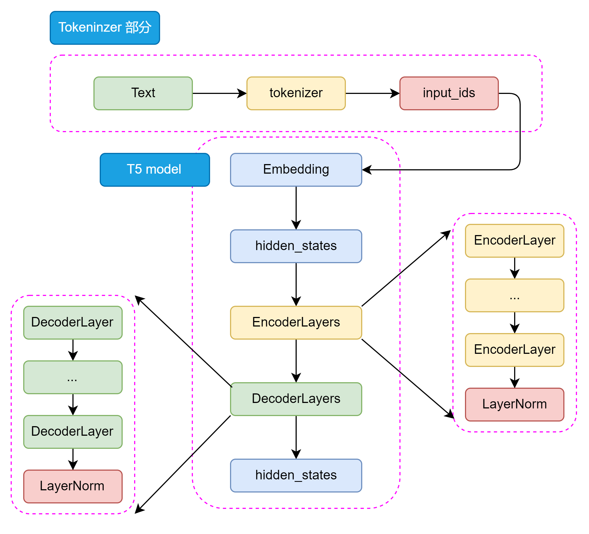
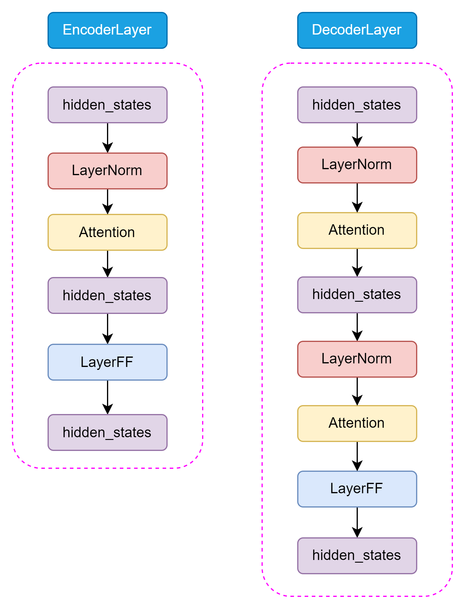

# 3.2 Encoder-Decoder PLM

在上一节，我们学习了 Encoder-Only 结构的模型，主要介绍了 BERT 的模型架构、预训练任务和下游任务微调。BERT 是一个基于 Transformer 的 Encoder-Only 模型，通过预训练任务 MLM 和 NSP 来学习文本的双向语义关系，从而在下游任务中取得了优异的性能。但是，BERT 也存在一些问题，例如 MLM 任务和下游任务微调的不一致性，以及无法处理超过模型训练长度的输入等问题。为了解决这些问题，研究者们提出了 Encoder-Decoder 模型，通过引入 Decoder 部分来解决这些问题，同时也为 NLP 领域带来了新的思路和方法。

在本节中，我们将学习 Encoder-Decoder 结构的模型，主要介绍 T5 的模型架构和预训练任务，以及 T5 模型首次提出的 NLP 大一统思想。

## 3.2.1 T5 

T5（Text-To-Text Transfer Transformer）是由 Google 提出的一种预训练语言模型，通过将所有 NLP 任务统一表示为文本到文本的转换问题，大大简化了模型设计和任务处理。T5 基于 Transformer 架构，包含编码器和解码器两个部分，使用自注意力机制和多头注意力捕捉全局依赖关系，利用相对位置编码处理长序列中的位置信息，并在每层中包含前馈神经网络进一步处理特征。

T5 的大一统思想将不同的 NLP 任务如文本分类、问答、翻译等统一表示为输入文本到输出文本的转换，这种方法简化了模型设计、参数共享和训练过程，提高了模型的泛化能力和效率。通过这种统一处理方式，T5不仅减少了任务特定的模型调试工作，还能够使用相同的数据处理和训练框架，极大地提升了多任务学习的性能和应用的便捷性。接下来我们将会从模型结构、预训练任务和大一统思想三个方面来介绍 T5 模型。

### （1）模型结构：Encoder-Decoder

Bert 采用了 Encoder-Only 结构，只包含编码器部分；而 GPT 采用了 Decoder-Only 结构，只包含解码器部分。T5 则采用了 Encoder-Decoder 结构，其中编码器和解码器都是基于 Transformer 架构设计。编码器用于处理输入文本，解码器用于生成输出文本。编码器和解码器之间通过注意力机制进行信息交互，从而实现输入文本到输出文本的转换。其主要结构如下所示：

    

从整体来看 T5 的模型结构包括 Tokenizer 部分和 Transformer 部分。Tokenizer 部分主要负责将输入文本转换为模型可接受的输入格式，包括分词、编码等操作。Transformer 部分又分为 EncoderLayers 和 DecoderLayers 两部分，他们分别由一个个小的 Block组成，每个 Block 包含了多头注意力机制、前馈神经网络和 Norm 层。Block 的设计可以使模型更加灵活，像乐高一样可以根据任务的复杂程度和数据集的大小来调整 Block 的数量和层数。

    

T5 模型的 Encoder 和 Decoder 部分都是基于 Transformer 架构设计的，主要包括 Self-Attention 和 Feed-Forward 两种结构。Self-Attention 用于捕捉输入序列中的全局依赖关系，Feed-Forward 用于处理特征的非线性变换。

和 Encoder 不一样的是，在 Decoder 中还包含了 Encoder-Decoder Attention 结构，用于捕捉输入和输出序列之间的依赖关系。这两种 Attention 结构几乎完全一致，只有在位置编码和 Mask 机制上有所不同。

    

T5 的 Self-Attention 机制和 Bert 的 Attention 机制是一样的，都是基于 Self-Attention 机制设计的。Self-Attention 机制是一种全局依赖关系建模方法，通过计算 Query、Key 和 Value 之间的相似度来捕捉输入序列中的全局依赖关系。Encoder-Decoder Attention 仅仅在位置编码和 Mask 机制上有所不同，主要是为了区分输入和输出序列。

    

与原始 Transformer 模型不同，T5 模型的LayerNorm 采用了 RMSNorm，通过计算每个神经元的均方根（Root Mean Square）来归一化每个隐藏层的激活值。RMSNorm 的参数设置与Layer Normalization 相比更简单，只有一个可调参数，可以更好地适应不同的任务和数据集。RMSNorm函数可以用以下数学公式表示：

$$
\text{RMSNorm}(x) = \frac{x}{\sqrt{\frac{1}{n}\sum_{i=1}^{n}w_i^2 + \epsilon}}
$$

其中：
- \( $x$ \) 是层的输入。
- \( $w_i$ \) 代表层的权重。
- \( $n$ \) 是权重的数量。
- \( $\epsilon$ \) 是一个小常数，用于数值稳定性（以避免除以零的情况）。

这种归一化有助于通过确保权重的规模不会变得过大或过小来稳定学习过程，这在具有许多层的深度学习模型中特别有用。

### （2）预训练任务

T5 模型的预训练任务是一个关键的组成部分，它能使模型能够学习到丰富的语言表示，语言表示能力可以在后续的微调过程中被迁移到各种下游任务。训练所使用的数据集是一个大规模的文本数据集，包含了各种各样的文本数据，如维基百科、新闻、书籍等等。对数据经过细致的处理后，生成了用于训练的750GB 的数据集 C4，且已在 TensorflowData 中开源。

我们可以简单概括一下 T5 的预训练任务，主要包括以下几个部分：

- 预训练任务: T5模型的预训练任务是遮蔽语言模型(Masked Language Model， MLM)，也称为BERT-style目标。具体来说，就是在输入文本中随机遮蔽15%的token，然后让模型预测这些被遮蔽的token。这个过程不需要标签，可以在大量未标注的文本上进行。
- 输入格式: 预训练时，T5将输入文本转换为"文本到文本"的格式。对于一个给定的文本序列，随机选择一些token进行遮蔽，并用特殊的占位符(token)替换。然后将被遮蔽的token序列作为模型的输出目标。
- 预训练数据集: T5 使用了自己创建的大规模数据集"Colossal Clean Crawled Corpus"(C4)，该数据集从Common Crawl中提取了大量干净的英语文本。C4数据集经过了一定的清洗，去除了无意义的文本、重复文本等。
- 多任务预训练: T5 还尝试了将多个任务混合在一起进行预训练，而不仅仅是单独的MLM任务。这有助于模型学习更通用的语言表示。
- 预训练到微调的转换: 预训练完成后，T5模型会在下游任务上进行微调。微调时，模型在任务特定的数据集上进行训练，并根据任务调整解码策略。

通过大规模预训练，T5模型能够学习到丰富的语言知识，并获得强大的语言表示能力，在多个NLP任务上取得了优异的性能，预训练是T5成功的关键因素之一。

### （3）大一统思想

T5模型的一个核心理念是“大一统思想”，即所有的 NLP 任务都可以统一为文本到文本的任务，这一思想在自然语言处理领域具有深远的影响。其设计理念是将所有不同类型的NLP任务（如文本分类、翻译、文本生成、问答等）转换为一个统一的格式：输入和输出都是纯文本。

例如：
- 对于文本分类任务，输入可以是“classify: 这是一个很好的产品”，输出是“正面”；
- 对于翻译任务，输入可以是“translate English to French: How are you?”, 输出是“Comment ça va?”。

T5通过大规模的文本数据进行预训练，然后在具体任务上进行微调。这一过程与BERT、GPT等模型类似，但T5将预训练和微调阶段的任务统一为文本到文本的形式，使其在各种任务上的适应性更强。

我们可以通过下面这张图来直观地理解 T5 的大一统思想：

    

对于不同的NLP任务，每次输入前都会加上一个任务描述前缀，明确指定当前任务的类型。这不仅帮助模型在预训练阶段学习到不同任务之间的通用特征，也便于在微调阶段迅速适应具体任务。例如，任务前缀可以是“summarize: ”用于摘要任务，或“translate English to German: ”用于翻译任务。

T5的大一统思想通过将所有NLP任务统一为文本到文本的形式，简化了任务处理流程，增强了模型的通用性和适应性。这一思想不仅推动了自然语言处理技术的发展，也为实际应用提供了更为便捷和高效的解决方案。

**参考文献**

1. [Exploring the Limits of Transfer Learning with a Unified Text-to-Text Transformer](http://arxiv.org/abs/1910.10683)
2. [Dataset：Colossal Clean Crawled Corpus（c4）](https://www.tensorflow.org/datasets/catalog/c4)