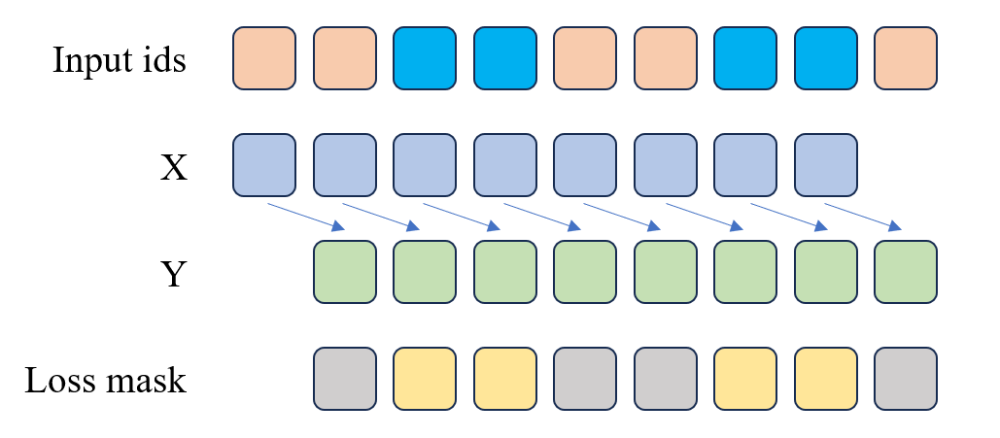

# 5.3 预训练一个小型LLM

在前面的章节中，我们熟悉了各种大模型的模型结构，以及如如何训练Tokenizer。在本节中，我们将动手训练一个八千万参数的LLM。

## 5.3.0 数据下载

首先，我们需要下载预训练数据集。在这里，我们使用两个开源的数据集，包含了大量的中文对话数据，可以用于训练对话生成模型。

- 出门问问序列猴子开源数据集：出门问问序列猴子通用文本数据集由来自网页、百科、博客、问答、开源代码、书籍、报刊、专利、教材、考题等多种公开可获取的数据进行汇总清洗之后而形成的大语言模型预训练语料。总量大概在 10B Token。

- BelleGroup：350万条中文对话数据集，包含了人机对话、人人对话、人物对话等多种对话数据，可以用于训练对话生成模型。


```python
# 下载预训练数据集
os.system("modelscope download --dataset ddzhu123/seq-monkey mobvoi_seq_monkey_general_open_corpus.jsonl.tar.bz2 --local_dir your_local_dir")
# 解压预训练数据集
os.system("tar -xvf your_local_dir/mobvoi_seq_monkey_general_open_corpus.jsonl.tar.bz2")

# 下载SFT数据集
os.system(f'huggingface-cli download --repo-type dataset --resume-download BelleGroup/train_3.5M_CN --local-dir BelleGroup')


# 1 处理预训练数据
def split_text(text, chunk_size=512):
    """将文本按指定长度切分成块"""
    return [text[i:i+chunk_size] for i in range(0, len(text), chunk_size)]

input_file = 'mobvoi_seq_monkey_general_open_corpus.jsonl'

with open('seq_monkey_datawhale.jsonl', 'a', encoding='utf-8') as pretrain:
    with open(input_file, 'r', encoding='utf-8') as f:
        data = f.readlines()
        for line in tqdm(data, desc=f"Processing lines in {input_file}", leave=False):  # 添加行级别的进度条
            line = json.loads(line)
            text = line['text']
            chunks = split_text(text)
            for chunk in chunks:
                pretrain.write(json.dumps({'text': chunk}, ensure_ascii=False) + '\n')

# 2 处理SFT数据

def convert_message(data):
    """
    将原始数据转换为标准格式
    """
    message = [
        {"role": "system", "content": "你是一个AI助手"},
    ]
    for item in data:
        if item['from'] == 'human':
            message.append({'role': 'user', 'content': item['value']})
        elif item['from'] == 'assistant':
            message.append({'role': 'assistant', 'content': item['value']})
    return message

with open('BelleGroup_sft.jsonl', 'a', encoding='utf-8') as sft:
    with open('BelleGroup/train_3.5M_CN.json', 'r') as f:
        data = f.readlines()
        for item in tqdm(data, desc="Processing", unit="lines"):
            item = json.loads(item)
            message = convert_message(item['conversations'])
            sft.write(json.dumps(message, ensure_ascii=False) + '\n')
```

## 5.3.1 训练Tokenize

首先，我们需要为文本处理训练一个Tokenizer。Tokenizer的作用是将文本转换为数字序列，以便模型能够理解和处理。我们使用的数据集是 [出门问问序列猴子开源数据集](https://www.modelscope.cn/datasets/ddzhu123/seq-monkey/files) ，这个数据集包含了大量的中文文本数据，可以用于训练Tokenizer。

> 注：由于数据集较大，如果大家在自己本地电脑训练的话进度比较慢，所以在这里我们提供了一个已经训练好的Tokenizer，大家可以直接使用。如果大家想要自己训练的话，可以参考下面的代码。

```bash
python code/train_tokenizer.py

```

```python
import random
import json
import os
from transformers import AutoTokenizer, PreTrainedTokenizerFast
from tokenizers import (
    decoders,
    models,
    pre_tokenizers,
    trainers,
    Tokenizer,
)
from tokenizers.normalizers import NFKC
from typing import Generator

random.seed(42)

def read_texts_from_jsonl(file_path: str) -> Generator[str, None, None]:
    """读取JSONL文件并安全提取文本数据"""
    with open(file_path, 'r', encoding='utf-8') as f:
        for line_num, line in enumerate(f, 1):
            try:
                data = json.loads(line)
                if 'text' not in data:
                    raise KeyError(f"Missing 'text' field in line {line_num}")
                yield data['text']
            except json.JSONDecodeError:
                print(f"Error decoding JSON in line {line_num}")
                continue
            except KeyError as e:
                print(e)
                continue

def create_tokenizer_config(save_dir: str) -> None:
    """创建完整的tokenizer配置文件"""
    config = {
        "add_bos_token": False,
        "add_eos_token": False,
        "add_prefix_space": True,
        "bos_token": "<|im_start|>",
        "eos_token": "<|im_end|>",
        "pad_token": "<|im_end|>",
        "unk_token": "<unk>",
        "model_max_length": 1000000000000000019884624838656,
        "clean_up_tokenization_spaces": False,
        "tokenizer_class": "PreTrainedTokenizerFast",
        "chat_template": (
            ""
            ""
            "<|im_start|>system\n{{ message['content'] }}<|im_end|>\n"
            ""
            "<|im_start|>user\n{{ message['content'] }}<|im_end|>\n"
            ""
            "<|im_start|>assistant\n{{ message['content'] }}<|im_end|>\n"
            ""
            ""
            ""
            "{{ '<|im_start|>assistant\n' }}"
            ""
        )
    }

    # 保存主配置文件
    with open(os.path.join(save_dir, "tokenizer_config.json"), "w", encoding="utf-8") as f:
        json.dump(config, f, ensure_ascii=False, indent=4)

    # 创建special_tokens_map.json
    special_tokens_map = {
        "bos_token": "<|im_start|>",
        "eos_token": "<|im_end|>",
        "unk_token": "<unk>",
        "pad_token": "<|im_end|>",
        "additional_special_tokens": ["<s>", "</s>"]
    }
    with open(os.path.join(save_dir, "special_tokens_map.json"), "w", encoding="utf-8") as f:
        json.dump(special_tokens_map, f, ensure_ascii=False, indent=4)

def train_tokenizer(data_path: str, save_dir: str, vocab_size: int = 8192) -> None:
    """训练并保存自定义tokenizer"""
    os.makedirs(save_dir, exist_ok=True)
    
    # 初始化tokenizer
    tokenizer = Tokenizer(models.BPE(unk_token="<unk>"))
    tokenizer.normalizer = NFKC()  # 添加文本规范化
    tokenizer.pre_tokenizer = pre_tokenizers.ByteLevel(add_prefix_space=False)
    tokenizer.decoder = decoders.ByteLevel()

    # 配置特殊token
    special_tokens = [
        "<unk>", 
        "<s>", 
        "</s>", 
        "<|im_start|>", 
        "<|im_end|>"
    ]

    # 配置训练器
    trainer = trainers.BpeTrainer(
        vocab_size=vocab_size,
        special_tokens=special_tokens,
        min_frequency=2,  # 提高低频词过滤
        show_progress=True,
        initial_alphabet=pre_tokenizers.ByteLevel.alphabet()
    )

    # 训练tokenizer
    print(f"Training tokenizer with data from {data_path}")
    texts = read_texts_from_jsonl(data_path)
    tokenizer.train_from_iterator(texts, trainer=trainer, length=os.path.getsize(data_path))

    # 验证特殊token映射
    try:
        assert tokenizer.token_to_id("<unk>") == 0
        assert tokenizer.token_to_id("<s>") == 1
        assert tokenizer.token_to_id("</s>") == 2
        assert tokenizer.token_to_id("<|im_start|>") == 3
        assert tokenizer.token_to_id("<|im_end|>") == 4
    except AssertionError as e:
        print("Special tokens mapping error:", e)
        raise

    # 保存tokenizer文件
    tokenizer.save(os.path.join(save_dir, "tokenizer.json"))
    
    # 创建配置文件
    create_tokenizer_config(save_dir)
    print(f"Tokenizer saved to {save_dir}")

def eval_tokenizer(tokenizer_path: str) -> None:
    """评估tokenizer功能"""
    try:
        tokenizer = AutoTokenizer.from_pretrained(tokenizer_path)
    except Exception as e:
        print(f"Error loading tokenizer: {e}")
        return

    # 测试基本属性
    print("\n=== Tokenizer基本信息 ===")
    print(f"Vocab size: {len(tokenizer)}")
    print(f"Special tokens: {tokenizer.all_special_tokens}")
    print(f"Special token IDs: {tokenizer.all_special_ids}")

    # 测试聊天模板
    messages = [
        {"role": "system", "content": "你是一个AI助手。"},
        {"role": "user", "content": "How are you?"},
        {"role": "assistant", "content": "I'm fine, thank you. and you?"},
        {"role": "user", "content": "I'm good too."},
        {"role": "assistant", "content": "That's great to hear!"},
    ]
    
    print("\n=== 聊天模板测试 ===")
    prompt = tokenizer.apply_chat_template(
        messages, 
        tokenize=False, 
        # add_generation_prompt=True
    )
    print("Generated prompt:\n", prompt, sep="")

    # 测试编码解码
    print("\n=== 编码解码测试 ===")
    encoded = tokenizer(prompt, truncation=True, max_length=256)
    decoded = tokenizer.decode(encoded["input_ids"], skip_special_tokens=False)
    print("Decoded text matches original:", decoded == prompt)

    # 测试特殊token处理
    print("\n=== 特殊token处理 ===")
    test_text = "<|im_start|>user\nHello<|im_end|>"
    encoded = tokenizer(test_text).input_ids
    decoded = tokenizer.decode(encoded)
    print(f"Original: {test_text}")
    print(f"Decoded:  {decoded}")
    print("Special tokens preserved:", decoded == test_text)

def main():
    # 配置路径
    data_path = "your data path"
    save_dir = "tokenizer_k"

    # 训练tokenizer
    train_tokenizer(
        data_path=data_path,
        save_dir=save_dir,
        vocab_size=6144
    )

    # 评估tokenizer
    eval_tokenizer(save_dir)

if __name__ == '__main__':
    main()
```

训练完成之后可以可以使用 `eval_tokenizer()` 测试 Tokenizer 的功能，确保 Tokenizer 正常工作。在这个函数中，我们首先加载训练好的 Tokenizer，然后测试了 Tokenizer 的基本属性、聊天模板、编码解码等功能。这些测试可以帮助我们验证 Tokenizer 的正确性，确保它能够正常工作。正确的输出为：

OUT:
```
=== Tokenizer基本信息 ===
Vocab size: 6144
Special tokens: ['<|im_start|>', '<|im_end|>', '<unk>', '<s>', '</s>']
Special token IDs: [3, 4, 0, 1, 2]

=== 聊天模板测试 ===
Generated prompt:
<|im_start|>system
你是一个AI助手。<|im_end|>
<|im_start|>user
How are you?<|im_end|>
<|im_start|>assistant
I'm fine, thank you. and you?<|im_end|>
<|im_start|>user
I'm good too.<|im_end|>
<|im_start|>assistant
That's great to hear!<|im_end|>


=== 编码解码测试 ===
Decoded text matches original: False

=== 特殊token处理 ===
Original: <|im_start|>user
Hello<|im_end|>
Decoded:  <|im_start|> user
Hello<|im_end|>
Special tokens preserved: False
```

## 5.3.2 Dataset

### PretrainDataset

在将数据送入到模型之前，我们还需要进行一些处理用于将文本数据转化为模型能够理解的Token。在这里我们使用的是Pytorch的Dataset类，用于加载数据集。我们定义了一个`PretrainDataset`类，用于加载已预处理好的数据集。我们继承了`torch.utils.data.IterableDataset`来定义该数据集，这使得我们可以更灵活、高效地处理数据。

```python
from torch.utils.data import Dataset

class PretrainDataset(Dataset):
    def __init__(self, data_path, tokenizer, max_length=512):
        super().__init__()
        self.data_path = data_path
        self.tokenizer = tokenizer
        self.max_length = max_length
        self.padding = 0
        with open(data_path, 'r', encoding='utf-8') as f:
            self.data = f.readlines()

    def __len__(self):
        return len(self.data)

    def __getitem__(self, index: int):
        sample = json.loads(self.data[index])
        text = f"{self.tokenizer.bos_token}{sample['text']}"
        input_id = self.tokenizer(text).data['input_ids'][:self.max_length]
        text_len = len(input_id)
        # 没满最大长度的剩余部分
        padding_len = self.max_length - text_len
        input_id = input_id + [self.padding] * padding_len
        # 0表示不计算损失
        loss_mask = [1] * text_len + [0] * padding_len

        input_id = np.array(input_id)
        X = np.array(input_id[:-1]).astype(np.int64)
        Y = np.array(input_id[1:]).astype(np.int64)
        loss_mask = np.array(loss_mask[1:]).astype(np.int64)
        return torch.from_numpy(X), torch.from_numpy(Y), torch.from_numpy(loss_mask)
```

在以上代码可以看出，我们的 `Pretrain Dataset` 主要是将 `text` 通过 `tokenizer` 转换成 `input_id`，然后将 `input_id` 拆分成 `X` 和 `Y`，其中 `X` 为 `input_id` 的前 n-1 个元素，`Y` 为 `input_id` 的后 n-1 `个元素。loss_mask` 主要是用来标记哪些位置需要计算损失，哪些位置不需要计算损失。如果你不太能明白，可以看下面的示意图。


图中示例展示了当`max_length=9`时的处理过程：
- **输入序列**：`[BOS, T1, T2, T3, T4, T5, T6, T7, EOS]`
- **样本拆分**：
  - X：`[BOS, T1, T2, T3, T4, T5, T6, T7]` → 模型输入上下文
  - Y：`[T1, T2, T3, T4, T5, T6, T7, EOS]` → 模型预测目标
- **损失掩码**：
  - 有效位置：`[0, 1, 1, 1, 1, 1, 1, 1, 1]` → 仅对T1-EOS计算损失

### SFTDataset

`SFTDataset` 其实是一个多轮对话数据集，我们的目标是让模型学会如何进行多轮对话。在这个阶段我们的输入是上一轮的对话内容，输出是当前轮的对话内容。

```python
class SFTDataset(Dataset):
    def __init__(self, data_path, tokenizer, max_length=512):
        super().__init__()
        self.data_path = data_path
        self.tokenizer = tokenizer
        self.max_length = max_length
        self.padding = 0
        with open(data_path, 'r', encoding='utf-8') as f:
            self.data = f.readlines()

    def __len__(self):
        return len(self.data)

    def generate_loss_mask(self, input_ids):
        # 生成 loss mask, 0 表示不计算损失, 1 表示计算损失
        mask = [0] * len(input_ids)
        a_sequence = [3, 1074, 537, 500, 203]  # <|im_start|>assistant\n
        a_length = len(a_sequence)
        n = len(input_ids)
        i = 0
        
        while i <= n - a_length:
            # 检查当前位置是否匹配目标子序列
            match = True
            for k in range(a_length):
                if input_ids[i + k] != a_sequence[k]:
                    match = False
                    break
            if match:
                # 从子序列结束的位置开始查找第一个4, 4 为 <|im_end|> EOS id
                j = None
                for idx in range(i + a_length, n):
                    if input_ids[idx] == 4:
                        j = idx
                        break
                if j is not None:
                    start = i + a_length
                    end = j  # 结束位置设为j（包含4）
                    # 标记区间为1（包括start到end）
                    if start <= end:
                        for pos in range(start, end + 1):
                            if pos < len(mask):
                                mask[pos] = 1
                # 跳过当前子序列，避免重叠匹配
                i += a_length
            else:
                i += 1
        return mask

    def __getitem__(self, index: int):
        sample = json.loads(self.data[index])
        text = self.tokenizer.apply_chat_template(sample, tokenize=False, add_generation_prompt=False)
        input_id = self.tokenizer(text).data['input_ids'][:self.max_length]
        text_len = len(input_id)
        # 没满最大长度的剩余部分
        padding_len = self.max_length - text_len
        input_id = input_id + [self.padding] * padding_len
        # 0表示不计算损失
        loss_mask = self.generate_loss_mask(input_id)

        input_id = np.array(input_id)
        X = np.array(input_id[:-1]).astype(np.int64)
        Y = np.array(input_id[1:]).astype(np.int64)
        loss_mask = np.array(loss_mask[1:]).astype(np.int64)
        return torch.from_numpy(X), torch.from_numpy(Y), torch.from_numpy(loss_mask)
```

在 SFT 阶段，我这里使用的是多轮对话数据集，所以就需要区分哪些位置需要计算损失，哪些位置不需要计算损失。在上面的代码中，我使用了一个 `generate_loss_mask` 函数来生成 `loss_mask`。这个函数主要是用来生成 `loss_mask`，其中 `loss_mask` 的生成规则是：当遇到 `|<im_start|>assistant\n` 时，就开始计算损失，直到遇到 `|<im_end|>` 为止。这样就可以保证我们的模型在 SFT 阶段只计算当前轮的对话内容。那我也给出一个示意图，帮助大家理解。



可以看到，其实 SFT Dataset 和 Pretrain Dataset 的 `X` 和 `Y` 是一样的，只是在 SFT Dataset 中我们需要生成一个 `loss_mask` 来标记哪些位置需要计算损失，哪些位置不需要计算损失。 图中 `Input ids` 中的蓝色小方格就是AI的回答，所以是需要模型学习的地方。所以在 `loss_mask` 中，蓝色小方格对应的位置是黄色，其他位置是灰色。在代码 `loss_mask` 中的 1 对应的位置计算损失，0 对应的位置不计算损失。


## 5.3.3 预训练

在数据预处理完成后，我们就可以开始训练模型了。我们使用的模型是一个和LLama2结构一样的 Decoder only Transformer模型，使用Pytorch实现。相关代码在`code/k_model.py`文件中。此处不再赘述，源码中有详细的中文注释，且我们在之前的文章中也有详细的介绍。

在模型这一部分可以重点看一下生成式模型是如何实现生成token的，可以查看`k_model.py`文件中的`Transforerm`类中的`generate`方法。

```python
@torch.inference_mode()
    def generate(self, idx, stop_id=None, max_new_tokens=256, temperature=1.0, top_k=None):
        """
        给定输入序列 idx（形状为 (bz,seq_len) 的长整型张量），通过多次生成新 token 来完成序列。
        在 model.eval() 模式下运行。效率较低的采样版本，没有使用键k/v cache。
        """
        index = idx.shape[1]
        for _ in range(max_new_tokens):
            # 如果序列上下文过长，截断它到最大长度
            idx_cond = idx if idx.size(1) <= self.args.max_seq_len else idx[:, -self.args.max_seq_len:]
            
            # 前向传播获取序列中最后一个位置的 logits
            logits = self(idx_cond).logits
            logits = logits[:, -1, :] # 只保留最后一个时间步的输出
            
            if temperature == 0.0:
                # 选择最有可能的索引
                _, idx_next = torch.topk(logits, k=1, dim=-1)
            else:
                # 缩放 logits 并应用 softmax
                logits = logits / temperature
                if top_k is not None:
                    v, _ = torch.topk(logits, min(top_k, logits.size(-1)))
                    logits[logits < v[:, [-1]]] = -float('Inf')
                probs = F.softmax(logits, dim=-1)
                idx_next = torch.multinomial(probs, num_samples=1)
            

            if idx_next == stop_id:
                break

            # 将采样的索引添加到序列中并继续
            idx = torch.cat((idx, idx_next), dim=1)

        return idx[:, index:] # 只返回生成的token

```

在 `generate` 方法中，我们首先获取序列中最后一个位置的 `logits`，然后基于这些 `logits` 生成新的 `token`。接着，生成的新 `token` 会被添加到序列中，模型随后会继续生成下一个 `token`。通过这种迭代过程，我们能够生成完整的文本。

接下来就是最重要的部分，训练模型!

> 注：在使用下面代码进行模型训练时，需要指定 `--data_path` 参数为预处理好的数据集路径，例如 `--data_path seq_monkey_datawhale.jsonl`，也需要指定要用哪几张GPU进行训练，例如 `--gpus 0,1`。

```python
def get_lr(it, all):
    warmup_iters = args.warmup_iters
    lr_decay_iters = all
    min_lr = args.learning_rate / 10

    if it < warmup_iters:
        return args.learning_rate * it / warmup_iters
    
    if it > lr_decay_iters:
        return min_lr
    
    decay_ratio = (it - warmup_iters) / (lr_decay_iters - warmup_iters)
    assert 0 <= decay_ratio <= 1
    coeff = 0.5 * (1.0 + math.cos(math.pi * decay_ratio))
    return min_lr + coeff * (args.learning_rate - min_lr)

def train_epoch(epoch):
    start_time = time.time()
    for step, (X, Y, loss_mask) in enumerate(train_loader):
        X = X.to(args.device)
        Y = Y.to(args.device)
        loss_mask = loss_mask.to(args.device)

        lr = get_lr(epoch * iter_per_epoch + step, args.epochs * iter_per_epoch)
        for param_group in optimizer.param_groups:
            param_group['lr'] = lr

        with ctx:
            out = model(X, Y)
            loss = out.last_loss / args.accumulation_steps
            loss_mask = loss_mask.view(-1)
            loss = torch.sum(loss * loss_mask) / loss_mask.sum()

        scaler.scale(loss).backward()

        if (step + 1) % args.accumulation_steps == 0:
            scaler.unscale_(optimizer)
            torch.nn.utils.clip_grad_norm_(model.parameters(), args.grad_clip)

            scaler.step(optimizer)
            scaler.update()

            optimizer.zero_grad(set_to_none=True)

        if step % args.log_interval == 0:
            spend_time = time.time() - start_time
            Logger(
                'Epoch:[{}/{}]({}/{}) loss:{:.3f} lr:{:.7f} epoch_Time:{}min:'.format(
                    epoch + 1,
                    args.epochs,
                    step,
                    iter_per_epoch,
                    loss.item() * args.accumulation_steps,
                    optimizer.param_groups[-1]['lr'],
                    spend_time / (step + 1) * iter_per_epoch // 60 - spend_time // 60))
            if args.use_swanlab:
                swanlab.log({
                    "loss": loss.item() * args.accumulation_steps,
                    "lr": optimizer.param_groups[-1]['lr']
                })

        if (step + 1) % args.save_interval == 0:
            model.eval()
            ckp = f'{args.save_dir}/pretrain_{lm_config.dim}_{lm_config.n_layers}_{lm_config.vocab_size}.pth'

            # 处理多卡保存
            state_dict = model.module.state_dict() if isinstance(model, torch.nn.DataParallel) else model.state_dict()
            torch.save(state_dict, ckp)
            model.train()
        
        if (step + 1) % 20000 == 0:
            model.eval()
            ckp = f'{args.save_dir}/pretrain_{lm_config.dim}_{lm_config.n_layers}_{lm_config.vocab_size}_step{step+1}.pth'

            state_dict = model.module.state_dict() if isinstance(model, torch.nn.DataParallel) else model.state_dict()
            torch.save(state_dict, ckp)
            model.train()


def init_model():
    def count_parameters(model):
        return sum(p.numel() for p in model.parameters() if p.requires_grad)

    tokenizer = AutoTokenizer.from_pretrained('./tokenizer_k/')

    model = Transformer(lm_config)
    
    # 多卡初始化
    num_gpus = torch.cuda.device_count()
    if num_gpus > 1:
        Logger(f"Using {num_gpus} GPUs with DataParallel!")
        model = torch.nn.DataParallel(model)
    
    model = model.to(args.device)
    Logger(f'LLM总参数量：{count_parameters(model) / 1e6:.3f} 百万')
    return model, tokenizer

if __name__ == "__main__":
    parser = argparse.ArgumentParser(description="Tiny-LLM Pretraining")
    parser.add_argument("--out_dir", type=str, default="output", help="Output directory")
    parser.add_argument("--epochs", type=int, default=1, help="Number of epochs")
    parser.add_argument("--batch_size", type=int, default=64, help="Batch size")
    parser.add_argument("--learning_rate", type=float, default=2e-4, help="Learning rate")
    parser.add_argument("--device", type=str, default="cuda:0" if torch.cuda.is_available() else "cpu", help="Device to use")
    parser.add_argument("--dtype", type=str, default="bfloat16", help="Data type")
    parser.add_argument("--use_swanlab", type=bool, default=True, help="Use Weights & Biases")
    parser.add_argument("--num_workers", type=int, default=8, help="Number of workers for data loading")
    parser.add_argument("--data_path", type=str, default="", help="Path to training data")
    parser.add_argument("--accumulation_steps", type=int, default=8, help="Gradient accumulation steps")
    parser.add_argument("--grad_clip", type=float, default=1.0, help="Gradient clipping threshold")
    parser.add_argument("--warmup_iters", type=int, default=0, help="Number of warmup iterations")
    parser.add_argument("--log_interval", type=int, default=100, help="Logging interval")
    parser.add_argument("--save_interval", type=int, default=1000, help="Model saving interval")
    # 添加多卡参数
    parser.add_argument("--gpus", type=str, default='0,1', help="Comma-separated GPU IDs (e.g. '0,1,2')")

    args = parser.parse_args()

    # 设置可见GPU
    if args.gpus is not None:
        os.environ["CUDA_VISIBLE_DEVICES"] = args.gpus
        # 自动设置主设备为第一个GPU
        if torch.cuda.is_available():
            args.device = "cuda:0"
        else:
            args.device = "cpu"

    if args.use_swanlab:
        swanlab.login(api_key='your key')
        run = swanlab.init(
            project="Tiny-LLM",
            experiment_name="Pretrain-215M",
            config=args,
        )

    lm_config = ModelConfig(
        dim=1024,
        n_layers=18,
    )
    max_seq_len = lm_config.max_seq_len
    args.save_dir = os.path.join(args.out_dir)
    os.makedirs(args.save_dir, exist_ok=True)
    os.makedirs(args.out_dir, exist_ok=True)
    torch.manual_seed(42)
    device_type = "cuda" if "cuda" in args.device else "cpu"

    ctx = nullcontext() if device_type == "cpu" else torch.cuda.amp.autocast()

    model, tokenizer = init_model()
    
    train_ds = PretrainDataset(args.data_path, tokenizer, max_length=max_seq_len)
    train_loader = DataLoader(
        train_ds,
        batch_size=args.batch_size,
        pin_memory=True,
        drop_last=False,
        shuffle=True,
        num_workers=args.num_workers
    )

    scaler = torch.cuda.amp.GradScaler(enabled=(args.dtype in ['float16', 'bfloat16']))
    optimizer = optim.Adam(model.parameters(), lr=args.learning_rate)

    iter_per_epoch = len(train_loader)
    for epoch in range(args.epochs):
        train_epoch(epoch)
```

## 5.3.4 SFT 训练

SFT 训练和预训练的代码基本一样，只是导入的 Dataset 不一样。在这里我们使用的是 SFTDataset，用于多轮对话的训练。

```python
import os
import platform
import argparse
import time
import warnings
import math
import pandas as pd
import torch
from torch import optim
from torch.utils.data import DataLoader
from contextlib import nullcontext

from transformers import AutoTokenizer

from k_model import ModelConfig, Transformer
from dataset import SFTDataset

import swanlab

warnings.filterwarnings('ignore')


def Logger(content):
    print(content)

def get_lr(it, all):
    warmup_iters = args.warmup_iters
    lr_decay_iters = all
    min_lr = args.learning_rate / 10

    if it < warmup_iters:
        return args.learning_rate * it / warmup_iters
    
    if it > lr_decay_iters:
        return min_lr
    
    decay_ratio = (it - warmup_iters) / (lr_decay_iters - warmup_iters)
    assert 0 <= decay_ratio <= 1
    coeff = 0.5 * (1.0 + math.cos(math.pi * decay_ratio))
    return min_lr + coeff * (args.learning_rate - min_lr)

def train_epoch(epoch):
    start_time = time.time()
    for step, (X, Y, loss_mask) in enumerate(train_loader):
        X = X.to(args.device)
        Y = Y.to(args.device)
        loss_mask = loss_mask.to(args.device)

        lr = get_lr(epoch * iter_per_epoch + step, args.epochs * iter_per_epoch)
        for param_group in optimizer.param_groups:
            param_group['lr'] = lr

        with ctx:
            out = model(X, Y)
            loss = out.last_loss / args.accumulation_steps
            loss_mask = loss_mask.view(-1)
            loss = torch.sum(loss * loss_mask) / loss_mask.sum()

        scaler.scale(loss).backward()

        if (step + 1) % args.accumulation_steps == 0:
            scaler.unscale_(optimizer)
            torch.nn.utils.clip_grad_norm_(model.parameters(), args.grad_clip)

            scaler.step(optimizer)
            scaler.update()

            optimizer.zero_grad(set_to_none=True)

        if step % args.log_interval == 0:
            spend_time = time.time() - start_time
            Logger(
                'Epoch:[{}/{}]({}/{}) loss:{:.3f} lr:{:.7f} epoch_Time:{}min:'.format(
                    epoch + 1,
                    args.epochs,
                    step,
                    iter_per_epoch,
                    loss.item() * args.accumulation_steps,
                    optimizer.param_groups[-1]['lr'],
                    spend_time / (step + 1) * iter_per_epoch // 60 - spend_time // 60))
            if args.use_swanlab:
                swanlab.log({
                    "loss": loss.item() * args.accumulation_steps,
                    "lr": optimizer.param_groups[-1]['lr']
                })

        if (step + 1) % args.save_interval == 0:
            model.eval()
            ckp = f'{args.save_dir}/sft_dim{lm_config.dim}_layers{lm_config.n_layers}_vocab_size{lm_config.vocab_size}.pth'

            # 处理多卡保存
            state_dict = model.module.state_dict() if isinstance(model, torch.nn.DataParallel) else model.state_dict()
            torch.save(state_dict, ckp)
            model.train()
        
        if (step + 1) % 20000 == 0:
            model.eval()
            ckp = f'{args.save_dir}/sft_dim{lm_config.dim}_layers{lm_config.n_layers}_vocab_size{lm_config.vocab_size}_step{step+1}.pth'

            state_dict = model.module.state_dict() if isinstance(model, torch.nn.DataParallel) else model.state_dict()
            torch.save(state_dict, ckp)
            model.train()


def init_model():
    def count_parameters(model):
        return sum(p.numel() for p in model.parameters() if p.requires_grad)

    tokenizer = AutoTokenizer.from_pretrained('./tokenizer_k/')

    model = Transformer(lm_config)

    ckp = './base_monkey_215M/pretrain_1024_18_6144.pth'
    state_dict = torch.load(ckp, map_location=args.device)
    unwanted_prefix = '_orig_mod.'
    for k, v in list(state_dict.items()):
        if k.startswith(unwanted_prefix):
            state_dict[k[len(unwanted_prefix):]] = state_dict.pop(k)
    model.load_state_dict(state_dict, strict=False)
    
    # 多卡初始化
    num_gpus = torch.cuda.device_count()
    if num_gpus > 1:
        Logger(f"Using {num_gpus} GPUs with DataParallel!")
        model = torch.nn.DataParallel(model)
    
    model = model.to(args.device)
    Logger(f'LLM总参数量：{count_parameters(model) / 1e6:.3f} 百万')
    return model, tokenizer


if __name__ == "__main__":
    parser = argparse.ArgumentParser(description="Tiny-LLM Pretraining")
    parser.add_argument("--out_dir", type=str, default="output", help="Output directory")
    parser.add_argument("--epochs", type=int, default=1, help="Number of epochs")
    parser.add_argument("--batch_size", type=int, default=64, help="Batch size")
    parser.add_argument("--learning_rate", type=float, default=2e-4, help="Learning rate")
    parser.add_argument("--device", type=str, default="cuda:0" if torch.cuda.is_available() else "cpu", help="Device to use")
    parser.add_argument("--dtype", type=str, default="bfloat16", help="Data type")
    parser.add_argument("--use_swanlab", type=bool, default=True, help="Use Weights & Biases")
    parser.add_argument("--num_workers", type=int, default=4, help="Number of workers for data loading")
    parser.add_argument("--data_path", type=str, default="", help="Path to training data")
    parser.add_argument("--accumulation_steps", type=int, default=4, help="Gradient accumulation steps")
    parser.add_argument("--grad_clip", type=float, default=1.0, help="Gradient clipping threshold")
    parser.add_argument("--warmup_iters", type=int, default=0, help="Number of warmup iterations")
    parser.add_argument("--log_interval", type=int, default=100, help="Logging interval")
    parser.add_argument("--save_interval", type=int, default=1000, help="Model saving interval")
    # 添加多卡参数
    parser.add_argument("--gpus", type=str, default='0,1', help="Comma-separated GPU IDs (e.g. '0,1,2')")

    args = parser.parse_args()

    # 设置可见GPU
    if args.gpus is not None:
        os.environ["CUDA_VISIBLE_DEVICES"] = args.gpus
        # 自动设置主设备为第一个GPU
        if torch.cuda.is_available():
            args.device = "cuda:0"
        else:
            args.device = "cpu"

    if args.use_swanlab:
        swanlab.login(api_key='your key')
        run = swanlab.init(
            project="Tiny-LLM",
            experiment_name="BelleGropu-sft-215M",
            config=args,
        )

    lm_config = ModelConfig(
        dim=1024,
        n_layers=18,
    )
    max_seq_len = lm_config.max_seq_len
    args.save_dir = os.path.join(args.out_dir)
    os.makedirs(args.save_dir, exist_ok=True)
    os.makedirs(args.out_dir, exist_ok=True)
    torch.manual_seed(42)
    device_type = "cuda" if "cuda" in args.device else "cpu"

    ctx = nullcontext() if device_type == "cpu" else torch.cuda.amp.autocast()

    model, tokenizer = init_model()
    
    train_ds = SFTDataset(args.data_path, tokenizer, max_length=max_seq_len)
    train_loader = DataLoader(
        train_ds,
        batch_size=args.batch_size,
        pin_memory=True,
        drop_last=False,
        shuffle=True,
        num_workers=args.num_workers
    )

    scaler = torch.cuda.amp.GradScaler(enabled=(args.dtype in ['float16', 'bfloat16']))
    optimizer = optim.Adam(model.parameters(), lr=args.learning_rate)

    iter_per_epoch = len(train_loader)
    for epoch in range(args.epochs):
        train_epoch(epoch)
```


## 5.3.4 使用模型生成文本

在模型训练完成后，会在`output`目录下生成模型文件，这个文件就是我们训练好的模型。我们可以使用以下命令生成文本。

```bash
python model_sample.py
```

我们来看下`model_sample.py`文件中的代码，这个文件中定义了一个`TextGenerator`类，用于生成文本。

```python
class TextGenerator:
    def __init__(self, 
                 checkpoint='out/SkyWork_pretrain_768_12_6144.pth',  # 模型检查点路径
                 tokenizer_model_path='./tokenizer_k/',  # 分词器模型路径
                 seed=42,  # 随机种子，确保可重复性
                 device=None,  # 设备，优先使用 CUDA，如果没有可用的 CUDA，则使用 CPU
                 dtype="bfloat16"):  # 数据类型，默认为 float32，可以选择 float16 或 bfloat16
        """
        初始化 TextGenerator 类，加载模型、设置设备和分词器等。
        """
        # 模型加载配置
        self.checkpoint = checkpoint  # 保存的模型检查点路径
        self.tokenizer_model_path = tokenizer_model_path  # 分词器模型文件路径
        self.seed = seed  # 随机数种子，用于生成的可重复性
        self.device = device or ('cuda:0' if torch.cuda.is_available() else 'cpu')  # 根据硬件条件选择设备
        self.dtype = dtype  # 模型的浮点数类型
        self.device_type = 'cuda' if 'cuda' in self.device else 'cpu'  # 判断当前设备是否为 CUDA
        
        # 设置随机种子，确保生成的可重复性
        torch.manual_seed(seed)  # 设置 CPU 随机种子
        torch.cuda.manual_seed(seed)  # 设置 CUDA 随机种子
        torch.backends.cuda.matmul.allow_tf32 = True  # 允许 CUDA 使用 TF32 精度进行矩阵乘法运算
        torch.backends.cudnn.allow_tf32 = True  # 允许 cuDNN 使用 TF32 精度加速
        
        # 根据 dtype 选择适当的自动混合精度上下文
        ptdtype = {'float32': torch.float32, 'bfloat16': torch.bfloat16, 'float16': torch.float16}[self.dtype]
        self.ctx = nullcontext() if self.device_type == 'cpu' else torch.amp.autocast(device_type=self.device_type, dtype=ptdtype)
        
        # 加载模型检查点文件
        checkpoint_dict = torch.load(self.checkpoint, map_location=self.device)  # 加载模型参数 # 初始化模型参数
        self.model = Transformer(ModelConfig(dim=1024, n_layers=18))  # 实例化 Transformer 模型
        sunwanted_prefix = '_orig_mod.'
        for k, v in list(checkpoint_dict.items()):
            if k.startswith(sunwanted_prefix):
                checkpoint_dict[k[len(sunwanted_prefix):]] = checkpoint_dict.pop(k)
        self.model.load_state_dict(checkpoint_dict, strict=False)
        
        # 计算模型参数量
        num_params = sum(p.numel() for p in self.model.parameters() if p.requires_grad)
        print(f"Model has {num_params / 1e6:.3f} M parameters.")
        # 设置模型为评估模式（evaluation mode），防止训练模式下的 dropout 等操作影响结果
        self.model.eval()
        # 将模型放置到正确的设备上（GPU 或 CPU）
        self.model.to(self.device)
        # 初始化分词器
        self.tokenizer = AutoTokenizer.from_pretrained(self.tokenizer_model_path)  # 根据指定的路径加载分词器

    def chat_template(self, prompt):
        message = [
            {"role": "system", "content": "你是一个AI助手。"},
            {"role": "user", "content": prompt}
        ]
        return self.tokenizer.apply_chat_template(message, tokenize=False, add_generation_prompt=True)

    def sft_sample(self, 
               start="Hello!",  # 生成文本的起始提示词，可以是任意字符串
               num_samples=3,  # 生成样本的数量，默认生成 3 个样本
               max_new_tokens=256,  # 每个样本生成的最大 token 数，默认最多生成 256 个 token
               temperature=0.7,  # 控制生成的随机性，1.0 为标准，值越大越随机
               top_k=300):  # 保留概率最高的 top_k 个 token，限制生成时的选择范围
        """
        根据给定的起始文本生成样本。
        
        :param start: 生成文本的起始提示词
        :param num_samples: 要生成的文本样本数
        :param max_new_tokens: 每个样本生成的最大 token 数
        :param temperature: 控制生成的随机性，值越小生成越确定，值越大生成越随机
        :param top_k: 限制生成时选择的 token 范围
        :return: 生成的文本样本列表
        """
        start = self.chat_template(start)
        # 将起始文本编码为 token id 序列
        start_ids = self.tokenizer(start).data['input_ids']
        # print('start_ids:', start_ids)
        x = (torch.tensor(start_ids, dtype=torch.long, device=self.device)[None, ...])  # 将编码后的 token id 转为 PyTorch 张量
        generated_texts = []  # 用于保存生成的文本样本
        with torch.no_grad():  # 禁用梯度计算，提升效率
            with self.ctx:  # 进入自动混合精度的上下文（如果是 GPU 并使用 float16 时）
                for k in range(num_samples):  # 循环生成指定数量的样本
                    y = self.model.generate(x, self.tokenizer.eos_token_id, max_new_tokens, temperature=temperature, top_k=top_k)  # 生成文本
                    generated_texts.append(self.tokenizer.decode(y[0].tolist()))  # 解码生成的 token 序列为可读文本
        return generated_texts  # 返回生成的文本样本


    def pretrain_sample(self, 
               start="Hello!",  # 生成文本的起始提示词，可以是任意字符串
               num_samples=3,  # 生成样本的数量，默认生成 3 个样本
               max_new_tokens=256,  # 每个样本生成的最大 token 数，默认最多生成 256 个 token
               temperature=0.7,  # 控制生成的随机性，1.0 为标准，值越大越随机
               top_k=300):  # 保留概率最高的 top_k 个 token，限制生成时的选择范围
        """
        根据给定的起始文本生成样本。
        
        :param start: 生成文本的起始提示词
        :param num_samples: 要生成的文本样本数
        :param max_new_tokens: 每个样本生成的最大 token 数
        :param temperature: 控制生成的随机性，值越小生成越确定，值越大生成越随机
        :param top_k: 限制生成时选择的 token 范围
        :return: 生成的文本样本列表
        """
        # 如果 start 是以 'FILE:' 开头，表示从文件中读取起始文本
        if start.startswith('FILE:'):
            with open(start[5:], 'r', encoding='utf-8') as f:
                start = f.read()  # 读取文件内容作为起始文本
        
        # 将起始文本编码为 token id 序列
        start_ids = self.tokenizer(start).data['input_ids']
        # print('start_ids:', start_ids)
        x = (torch.tensor(start_ids, dtype=torch.long, device=self.device)[None, ...])  # 将编码后的 token id 转为 PyTorch 张量
        # print(x.shape)
        generated_texts = []  # 用于保存生成的文本样本
        with torch.no_grad():  # 禁用梯度计算，提升效率
            with self.ctx:  # 进入自动混合精度的上下文（如果是 GPU 并使用 float16 时）
                for k in range(num_samples):  # 循环生成指定数量的样本
                    y = self.model.generate(x, max_new_tokens=max_new_tokens, temperature=temperature, top_k=top_k)  # 生成文本
                    generated_texts.append(self.tokenizer.decode(y[0].tolist()))  # 解码生成的 token 序列为可读文本
        
        return generated_texts  # 返回生成的文本样本
```

最后我们来看一下模型输出的结果：

```
------------------- SFT Sample ------------------- 

Model has 215.127 M parameters.

Sample 1:
Question: 你好呀 
AI answer: 你好!有什么我可以帮你的吗?
--------------------

Sample 2:
Question: 中国的首都是哪里？ 
AI answer: 中国的首都是北京。
--------------------

Sample 3:
Question: 1+1等于多少？ 
AI answer: 1+1等于2。
--------------------
------------------- Pretrain Sample ------------------- 

Model has 215.127 M parameters.

Sample 1:
<|im_start|>北京大学是中国最早建立的研究型大学之一,是我国最早设置研究生院的高校之一,是第一、二国教育委员会师资培训基地;北京大学是第一、二所国立大学,其校名与北京大学相同。
北京大学录取标准:本科三批1万元,本科一批1万元,本科一批2000元,专科一批2000元,高中起点:非本科一批
--------------------

Sample 2:
<|im_start|>中国矿业大学（北京）地球科学与测绘工程学院副教授黄河流域地质学科带头人古建平教授为大家介绍世界地质变化的概念及工作经验。
古建平教授介绍了最近几年的植物学和地质学的基本概念,尤其是树都黄河、松涛、暗河等都有地质学工作者的身影,其中树都黄河以分布面积最大,是树都黄河中华砂岩公园的主景区。
黄河内蒙古
--------------------
```

到这里，我们的模型就训绽完成了，恭喜你训练了一个属于你自己的大模型。

> 大家在训练的时候可以将 batch 调的低一些，这样可以减少显存的占用，避免显存不足的问题。当然这样会增加训练时间，可以根据自己的显卡显存大小来调整 batch 的大小。实测 Pretrain batch 为 4 的情况下只需要 7G 显存，训练时长预计 533 小时。作者是在 4卡A100上进行训练的，预训练一共耗时26小时，SFT 阶段在 BelleGroup 350万条中文指令训练 4 小时。

> 作者训练好的模型 SFT模型 K-Model-215M: https://www.modelscope.cn/models/kmno4zx/K-Model-215M


**参考文献**

- [llama2.c](https://github.com/karpathy/llama2.c)
- [SkyWork 150B](https://huggingface.co/datasets/Skywork/SkyPile-150B)
- [BelleGroup](https://huggingface.co/datasets/BelleGroup/train_3.5M_CN)
- [minimind](https://github.com/jingyaogong/minimind)
- [出门问问序列猴子开源数据集](https://github.com/mobvoi/seq-monkey-data)
- [llm.c](https://github.com/karpathy/llm.c)