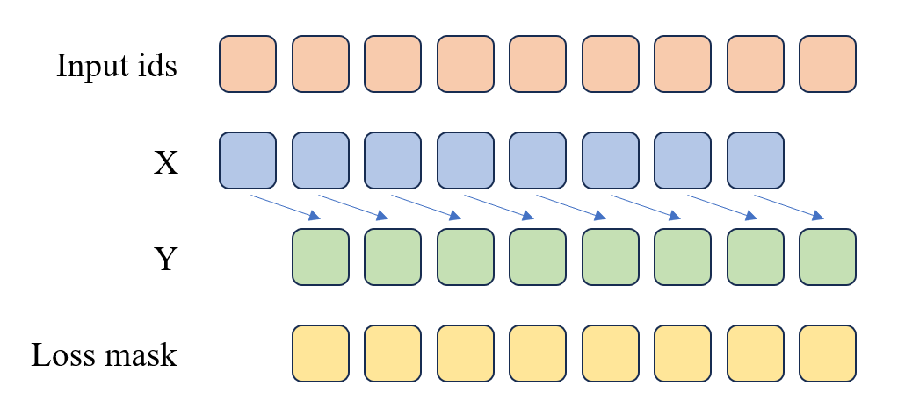

# 第五章 动手搭建大模型

## 5.1 动手实现一个 LLaMA2 大模型

Meta（原Facebook）于2023年2月发布第一款基于Transformer结构的大型语言模型LLaMA，并于同年7月发布同系列模型LLaMA2。我们在第四章已经学习了解的了LLM，记忆如何训练LLM等等。那本小节我们就来学习，如何动手写一个LLaMA2模型。

### 5.1.1 定义超参数

首先我们需要定义一些超参数，这些超参数包括模型的大小、层数、头数、词嵌入维度、隐藏层维度等等。这些超参数可以根据实际情况进行调整。

这里我们自定义一个`ModelConfig`类，来存储和记录我们的超参数，这里我们继承了`PretrainedConfig`类，这是`transformers`库中的参数类，我们可以通过继承这个类来方便的使用`transformers`库中的一些功能，也方便在后续导出Hugging Face模型。

```python
from transformers import PretrainedConfig

class ModelConfig(PretrainedConfig):
    model_type = "Tiny-K"
    def __init__(
            self,
            dim: int = 768, # 模型维度
            n_layers: int = 12, # Transformer的层数
            n_heads: int = 16, # 注意力机制的头数
            n_kv_heads: int = 8, # 键值头的数量
            vocab_size: int = 6144, # 词汇表大小
            hidden_dim: int = None, # 隐藏层维度
            multiple_of: int = 64, 
            norm_eps: float = 1e-5, # 归一化层的eps
            max_seq_len: int = 512, # 最大序列长度
            dropout: float = 0.0, # dropout概率
            flash_attn: bool = True, # 是否使用Flash Attention
            **kwargs,
    ):
        self.dim = dim
        self.n_layers = n_layers
        self.n_heads = n_heads
        self.n_kv_heads = n_kv_heads
        self.vocab_size = vocab_size
        self.hidden_dim = hidden_dim
        self.multiple_of = multiple_of
        self.norm_eps = norm_eps
        self.max_seq_len = max_seq_len
        self.dropout = dropout
        self.flash_attn = flash_attn
        super().__init__(**kwargs)
```

我们来看一下其中的一些超参数的含义，比如`dim`是模型维度，`n_layers`是Transformer的层数，`n_heads`是注意力机制的头数，`vocab_size`是词汇表大小，`max_seq_len`是输入的最大序列长度等等。上面的代码中也对每一个参数做了详细的注释，在后面的代码中我们会根据这些超参数来构建我们的模型。

### 5.1.2 构建 RMSNorm

`RMSNorm`可以用如下的数学公式表示：

$$
\text{RMSNorm}(x) = \frac{x}{\sqrt{\frac{1}{n}\sum_{i=1}^{n}x_i^2 + \epsilon}} \cdot \gamma
$$

其中：
- $x_i$ 是输入向量的第 $i$ 个元素
- $\gamma$ 是可学习的缩放参数（对应代码中的 `self.weight`）
- $n$ 是输入向量的维度数量
- $\epsilon$ 是一个小常数，用于数值稳定性（以避免除以零的情况）

这种归一化有助于通过确保权重的规模不会变得过大或过小来稳定学习过程，这在具有许多层的深度学习模型中特别有用。

我们可以通过如下代码实现`RMSNorm`：

```python
class RMSNorm(nn.Module):
    def __init__(self, dim: int, eps: float):
        super().__init__()
        # eps是为了防止除以0的情况
        self.eps = eps
        # weight是一个可学习的参数，全部初始化为1
        self.weight = nn.Parameter(torch.ones(dim))

    def _norm(self, x):
        # 计算RMSNorm的核心部分
        # x.pow(2).mean(-1, keepdim=True)计算了输入x的平方的均值
        # torch.rsqrt是平方根的倒数，这样就得到了RMSNorm的分母部分，再加上eps防止分母为0
        # 最后乘以x，得到RMSNorm的结果
        return x * torch.rsqrt(x.pow(2).mean(-1, keepdim=True) + self.eps)

    def forward(self, x):
        # forward函数是模型的前向传播
        # 首先将输入x转为float类型，然后进行RMSNorm，最后再转回原来的数据类型
        # 最后乘以weight，这是RMSNorm的一个可学习的缩放因子
        output = self._norm(x.float()).type_as(x)
        return output * self.weight
```

并且，我们可以用下面的代码来对`RMSNorm`模块进行测试，可以看到代码最终输出的形状为`torch.Size([1, 50, 288])`，与我们输入的形状一致，说明模块的实现是正确的，归一化并不会改变输入的形状。

```python
norm = RMSNorm(args.dim, args.norm_eps)
x = torch.randn(1, 50, args.dim)
output = norm(x)
print(output.shape)

out:
orch.Size([1, 50, 288])
```

### 5.1.3 构建 LLaMA2 Attention

在 LLaMA2 模型中，虽然只有 LLaMA2-70B模型使用了分组查询注意力机制（Grouped-Query Attention，GQA），但我们依然选择使用 GQA 来构建我们的 LLaMA Attention 模块，它可以提高模型的效率，并节省一些显存占用。

#### 5.1.3.1 repeat_kv

在 LLaMA2 模型中，我们需要将键和值的维度扩展到和查询的维度一样，这样才能进行注意力计算。我们可以通过如下代码实现`repeat_kv`：

```python
def repeat_kv(x: torch.Tensor, n_rep: int) -> torch.Tensor:
    # 获取输入张量的形状：批量大小、序列长度、键/值对头的数量、每个头的维度大小
    bs, slen, n_kv_heads, head_dim = x.shape
    
    # 如果重复次数为1，则不需要重复，直接返回原始张量
    if n_rep == 1:
        return x
    
    # 对张量进行扩展和重塑操作以重复键值对
    return (
        x[:, :, :, None, :]  # 在第四个维度（头的维度前）添加一个新的维度
        .expand(bs, slen, n_kv_heads, n_rep, head_dim)  # 将新添加的维度扩展到n_rep大小，实现重复的效果
        .reshape(bs, slen, n_kv_heads * n_rep, head_dim)  # 重新塑形，合并键/值对头的数量和重复次数的维度
    )
```

在上述代码中：

- 首先，获取输入张量的形状：首先，代码通过 x.shape 获取输入张量的形状，包括批量大小（bs）、序列长度（slen）、键/值对头的数量（n_kv_heads）以及每个头的维度大小（head_dim）。

- 然后，检查重复次数：接着，代码检查重复次数 n_rep 是否为1。如果是1，则说明不需要对键和值进行重复，直接返回原始张量 x。

- 最后，扩展和重塑张量：
  - 在第三个维度（即键/值对头的维度）之后添加一个新的维度，形成 `x[:, :, :, None, :]`。
  - 使用 `expand` 方法将新添加的维度扩展到 `n_rep` 大小，实现键/值对的重复效果。
  - 最后，通过 reshape 方法重新塑形，将扩展后的维度合并回键/值对头的数量中，即 `x.reshape(bs, slen, n_kv_heads * n_rep, head_dim)`，这样最终的张量形状就达到了与查询维度一致的效果。

#### 5.1.3.2 旋转嵌入

接着我们来实现旋转嵌入，旋转嵌入是 LLaMA2 模型中的一个重要组件，它可以为注意力机制提供更强的上下文信息，从而提高模型的性能。

首先，我们要构造获得旋转嵌入的实部和虚部的函数：

```python
# 注意：此处的dim应为 dim//n_head，因为我们是对每个head进行旋转嵌入
def precompute_freqs_cis(dim: int, end: int, theta: float = 10000.0):
    # torch.arange(0, dim, 2)[: (dim // 2)].float()生成了一个从0开始，步长为2的序列，长度为dim的一半
    # 然后每个元素除以dim，再取theta的倒数，得到频率
    freqs = 1.0 / (theta ** (torch.arange(0, dim, 2)[: (dim // 2)].float() / dim))
    # 生成一个从0到end的序列，长度为end
    t = torch.arange(end, device=freqs.device)
    # 计算外积，得到一个二维矩阵，每一行是t的元素乘以freqs的元素
    freqs = torch.outer(t, freqs).float()
    # 计算频率的余弦值，得到实部
    freqs_cos = torch.cos(freqs)
    # 计算频率的正弦值，得到虚部
    freqs_sin = torch.sin(freqs)
    return freqs_cos, freqs_sin
```

- 计算频率序列：
  - `torch.arange(0, dim, 2)[: (dim // 2)].float()` 生成了一个从0开始，步长为2的序列，其长度为`dim`的一半。
  - 每个元素除以`dim`后取`theta`的倒数，得到一个频率序列 `freqs`。这一步是为了生成适合旋转嵌入的频率。
- 生成时间序列：
  - `t = torch.arange(end, device=freqs.device)` 生成一个从`0`到`end`的序列，长度为`end`。`end`通常是序列的最大长度。
- 计算频率的外积
  - `freqs = torch.outer(t, freqs).float()` 计算时间序列 `t` 和频率序列 `freqs` 的外积，得到一个二维矩阵 `freqs`。每一行是时间序列 `t` 的元素乘以频率序列 `freqs` 的元素。
- 计算实部和虚部
  - `freqs_cos = torch.cos(freqs)` 计算频率矩阵 `freqs` 的余弦值，得到旋转嵌入的实部。
  - `freqs_sin = torch.sin(freqs)` 计算频率矩阵 `freqs` 的正弦值，得到旋转嵌入的虚部。

最终，该函数返回两个矩阵 `freqs_cos` 和 `freqs_sin`，分别表示旋转嵌入的实部和虚部，用于后续的计算。

接着，我们来构造调整张量形状的`reshape_for_broadcast`函数，这个函数的主要目的是调整 `freqs_cis` 的形状，使其在进行广播操作时与 `x` 的维度对齐，从而能够进行正确的张量运算。

```python
def reshape_for_broadcast(freqs_cis: torch.Tensor, x: torch.Tensor):
    # 获取x的维度数
    ndim = x.ndim
    
    # 断言，确保1在x的维度范围内
    assert 0 <= 1 < ndim
    
    # 断言，确保freqs_cis的形状与x的第二维和最后一维相同
    assert freqs_cis.shape == (x.shape[1], x.shape[-1])
    
    # 构造一个新的形状，除了第二维和最后一维，其他维度都为1，这样做是为了能够将freqs_cis与x进行广播操作
    shape = [d if i == 1 or i == ndim - 1 else 1 for i, d in enumerate(x.shape)]
    
    # 将freqs_cis调整为新的形状，并返回
    return freqs_cis.view(shape)
```

最后，我们可以通过如下代码实现旋转嵌入：

```python
def apply_rotary_emb(
    xq: torch.Tensor,
    xk: torch.Tensor,
    freqs_cos: torch.Tensor,
    freqs_sin: torch.Tensor
) -> Tuple[torch.Tensor, torch.Tensor]:

    # 将查询和键张量转换为浮点数，并重塑形状以分离实部和虚部
    xq_r, xq_i = xq.float().reshape(xq.shape[:-1] + (-1, 2)).unbind(-1)
    xk_r, xk_i = xk.float().reshape(xk.shape[:-1] + (-1, 2)).unbind(-1)

    # 重新塑形频率张量以进行广播
    freqs_cos = reshape_for_broadcast(freqs_cos, xq_r)
    freqs_sin = reshape_for_broadcast(freqs_sin, xq_r)

    # 应用旋转，分别计算旋转后的实部和虚部
    xq_out_r = xq_r * freqs_cos - xq_i * freqs_sin
    xq_out_i = xq_r * freqs_sin + xq_i * freqs_cos
    xk_out_r = xk_r * freqs_cos - xk_i * freqs_sin
    xk_out_i = xk_r * freqs_sin + xk_i * freqs_cos

    # 将最后两个维度合并，并还原为原始张量的形状
    xq_out = torch.stack([xq_out_r, xq_out_i], dim=-1).flatten(3)
    xk_out = torch.stack([xk_out_r, xk_out_i], dim=-1).flatten(3)

    return xq_out.type_as(xq), xk_out.type_as(xk)
```

这里我们给出可以测试`apply_rotary_emb`函数的代码，大家也可以尝试在代码中添加断点，来查看每一步的计算结果。

```python
xq = torch.randn(1, 50, 6, 48) # bs, seq_len, dim//n_head, n_head_dim
xk = torch.randn(1, 50, 6, 48) # bs, seq_len, dim//n_head, n_head_dim

# 使用 precompute_freqs_cis 函数获取 sin和cos
cos, sin = precompute_freqs_cis(288//6, 50)
print(cos.shape, sin.shape)
xq_out, xk_out = apply_rotary_emb(xq, xk, cos, sin)

xq_out.shape, xk_out.shape
```

OUT:
```
torch.Size([50, 24]) torch.Size([50, 24])

(torch.Size([1, 50, 6, 48]), torch.Size([1, 50, 6, 48]))
```

#### 5.1.3.3 组装 LLaMA2 Attention

在上面我们已经完成了旋转嵌入的实现，接下来我们就可以构建 LLaMA2 Attention 模块了。

```python
class Attention(nn.Module):
    def __init__(self, args: ModelConfig):
        super().__init__()
        # 根据是否指定n_kv_heads，确定用于键（key）和值（value）的头的数量。
        self.n_kv_heads = args.n_heads if args.n_kv_heads is None else args.n_kv_heads
        # 确保总头数可以被键值头数整除。
        assert args.n_heads % self.n_kv_heads == 0

        # 模型并行处理大小，默认为1。
        model_parallel_size = 1
        # 本地计算头数，等于总头数除以模型并行处理大小。
        self.n_local_heads = args.n_heads // model_parallel_size
        # 本地键值头数，等于键值头数除以模型并行处理大小。
        self.n_local_kv_heads = self.n_kv_heads // model_parallel_size
        # 重复次数，用于扩展键和值的尺寸。
        self.n_rep = self.n_local_heads // self.n_local_kv_heads
        # 每个头的维度，等于模型维度除以头的总数。
        self.head_dim = args.dim // args.n_heads

        # 定义权重矩阵。
        self.wq = nn.Linear(args.dim, args.n_heads * self.head_dim, bias=False)
        self.wk = nn.Linear(args.dim, self.n_kv_heads * self.head_dim, bias=False)
        self.wv = nn.Linear(args.dim, self.n_kv_heads * self.head_dim, bias=False)
        # 输出权重矩阵。
        self.wo = nn.Linear(args.n_heads * self.head_dim, args.dim, bias=False)

        # 定义dropout。
        self.attn_dropout = nn.Dropout(args.dropout)
        self.resid_dropout = nn.Dropout(args.dropout)
        # 保存dropout概率。
        self.dropout = args.dropout

        # 检查是否使用Flash Attention（需要PyTorch >= 2.0）。
        self.flash = hasattr(torch.nn.functional, 'scaled_dot_product_attention')
        if not self.flash:
            # 若不支持Flash Attention，则使用手动实现的注意力机制，并设置mask。
            print("WARNING: using slow attention. Flash Attention requires PyTorch >= 2.0")
            # 创建一个上三角矩阵，用于遮蔽未来信息。
            mask = torch.full((1, 1, args.max_seq_len, args.max_seq_len), float("-inf"))
            mask = torch.triu(mask, diagonal=1)
            # 注册为模型的缓冲区
            self.register_buffer("mask", mask)

    def forward(self, x: torch.Tensor, freqs_cos: torch.Tensor, freqs_sin: torch.Tensor):
        # 获取批次大小和序列长度，[batch_size, seq_len, dim]
        bsz, seqlen, _ = x.shape

        # 计算查询（Q）、键（K）、值（V）。
        xq, xk, xv = self.wq(x), self.wk(x), self.wv(x)
        # 调整形状以适应头的维度。
        xq = xq.view(bsz, seqlen, self.n_local_heads, self.head_dim)
        xk = xk.view(bsz, seqlen, self.n_local_kv_heads, self.head_dim)
        xv = xv.view(bsz, seqlen, self.n_local_kv_heads, self.head_dim)

        # 应用旋转位置嵌入（RoPE）。
        xq, xk = apply_rotary_emb(xq, xk, freqs_cos, freqs_sin)

        # 对键和值进行扩展以适应重复次数。
        xk = repeat_kv(xk, self.n_rep)
        xv = repeat_kv(xv, self.n_rep)

        # 将头作为批次维度处理。
        xq = xq.transpose(1, 2)
        xk = xk.transpose(1, 2)
        xv = xv.transpose(1, 2)

        # 根据是否支持Flash Attention，选择实现方式。
        if self.flash:
            # 使用Flash Attention。
            output = torch.nn.functional.scaled_dot_product_attention(xq, xk, xv, attn_mask=None, dropout_p=self.dropout if self.training else 0.0, is_causal=True)
        else:
            # 使用手动实现的注意力机制。
            scores = torch.matmul(xq, xk.transpose(2, 3)) / math.sqrt(self.head_dim)
            assert hasattr(self, 'mask')
            scores = scores + self.mask[:, :, :seqlen, :seqlen]
            scores = F.softmax(scores.float(), dim=-1).type_as(xq)
            scores = self.attn_dropout(scores)
            output = torch.matmul(scores, xv)

        # 恢复时间维度并合并头。
        output = output.transpose(1, 2).contiguous().view(bsz, seqlen, -1)

        # 最终投影回残差流。
        output = self.wo(output)
        output = self.resid_dropout(output)
        return output
```

同样大家可以使用下面的代码来对注意力模块进行测试，可以看到代码最终输出的形状为`torch.Size([1, 50, 768])`，与我们输入的形状一致，说明模块的实现是正确的。

```python
# 创建Attention实例
attention_model = Attention(args)

# 模拟输入数据
batch_size = 1
seq_len = 50  # 假设实际使用的序列长度为50
dim = args.dim
x = torch.rand(batch_size, seq_len, dim)  # 随机生成输入张量
# freqs_cos = torch.rand(seq_len, dim // 2)  # 模拟cos频率，用于RoPE
# freqs_sin = torch.rand(seq_len, dim // 2)  # 模拟sin频率，用于RoPE

freqs_cos, freqs_sin = precompute_freqs_cis(dim//args.n_heads, seq_len)

# 运行Attention模型
output = attention_model(x, freqs_cos, freqs_sin)

# attention出来之后的形状 依然是[batch_size, seq_len, dim]
print("Output shape:", output.shape)
```

OUT:
```
Output shape: torch.Size([1, 50, 768])
```

### 5.1.4 构建 LLaMA2 MLP模块

相对于前面我们实现的LLaMA2 Attention模块，LLaMA2 MLP模块的实现要简单一些。我们可以通过如下代码实现`MLP`：

```python
class MLP(nn.Module):
    def __init__(self, dim: int, hidden_dim: int, multiple_of: int, dropout: float):
        super().__init__()
        # 如果没有指定隐藏层的维度，我们将其设置为输入维度的4倍
        # 然后将其减少到2/3，最后确保它是multiple_of的倍数
        if hidden_dim is None:
            hidden_dim = 4 * dim
            hidden_dim = int(2 * hidden_dim / 3)
            hidden_dim = multiple_of * ((hidden_dim + multiple_of - 1) // multiple_of)
        # 定义第一层线性变换，从输入维度到隐藏维度
        self.w1 = nn.Linear(dim, hidden_dim, bias=False)
        # 定义第二层线性变换，从隐藏维度到输入维度
        self.w2 = nn.Linear(hidden_dim, dim, bias=False)
        # 定义第三层线性变换，从输入维度到隐藏维度
        self.w3 = nn.Linear(dim, hidden_dim, bias=False)
        # 定义dropout层，用于防止过拟合
        self.dropout = nn.Dropout(dropout)

    def forward(self, x):
        # 前向传播函数
        # 首先，输入x通过第一层线性变换和SILU激活函数
        # 然后，结果乘以输入x通过第三层线性变换的结果
        # 最后，通过第二层线性变换和dropout层
        return self.dropout(self.w2(F.silu(self.w1(x)) * self.w3(x)))
```

我们着重观察一下`forward`函数的实现，首先，输入 `x` 通过第一层线性变换 `self.w1` 和 `SILU` 激活函数，然后，结果乘以输入 `x` 通过第三层线性变换 `self.w3` 的结果，最后，通过第二层线性变换 `self.w2` 和 `dropout` 层，得到最终输出。

同样大家可以使用下面的代码来对`LLaMAMLP`模块进行测试，可以看到代码最终输出的形状为`torch.Size([1, 50, 768])`，与我们输入的形状一致，说明模块的实现是正确的。

```python
# 创建MLP实例
mlp = MLP(args.dim, args.hidden_dim, args.multiple_of, args.dropout)
# 随机生成数据
x = torch.randn(1, 50, args.dim)
# 运行MLP模型
output = mlp(x)
print(output.shape)
```

OUT:
```
torch.Size([1, 50, 768])
```

### 5.1.5 LLaMA2 Decoder Layer

到这里，我们已经实现了`LLaMA2`模型的`Attention`模块和`MLP`模块，接下来我们就可以构建`LLaMA2`的`Decoder Layer`了。

```python
class DecoderLayer(nn.Module):
    def __init__(self, layer_id: int, args: ModelConfig):
        super().__init__()
        # 定义多头注意力的头数
        self.n_heads = args.n_heads
        # 定义输入维度
        self.dim = args.dim
        # 定义每个头的维度，等于输入维度除以头数
        self.head_dim = args.dim // args.n_heads
        # 定义LLaMA2Attention对象，用于进行多头注意力计算
        self.attention = Attention(args)
        # 定义LLaMAMLP对象，用于进行前馈神经网络计算
        self.feed_forward = MLP(
            dim=args.dim,
            hidden_dim=args.hidden_dim,
            multiple_of=args.multiple_of,
            dropout=args.dropout,
        )
        # 定义层的ID
        self.layer_id = layer_id
        # 定义注意力计算的归一化层
        self.attention_norm = RMSNorm(args.dim, eps=args.norm_eps)
        # 定义前馈神经网络计算的归一化层
        self.ffn_norm = RMSNorm(args.dim, eps=args.norm_eps)

    def forward(self, x, freqs_cos, freqs_sin):
        # 前向传播函数
        # 首先，输入x经过注意力归一化层，然后进行注意力计算，结果与输入x相加得到h
        # 然后，h经过前馈神经网络归一化层，然后进行前馈神经网络计算，结果与h相加得到输出
        h = x + self.attention.forward(self.attention_norm(x), freqs_cos, freqs_sin)
        out = h + self.feed_forward.forward(self.ffn_norm(h))
        return out
```

`DecoderLayer`就是把我们上面完成的`Attention`模块和`MLP`模块组合在一起，实现了一个完整的`Transformer`模块。

同样大家可以使用下面的代码来对`DecoderLayer`模块进行测试，可以看到代码最终输出的形状为`torch.Size([1, 50, 768])`，与我们输入的形状一致，说明模块的实现是正确的。

```python
# 创建LLaMADecoderLayer实例
decoderlayer = DecoderLayer(0, args)

# 模拟输入数据
dim = args.dim
seq_len = 50

x = torch.randn(1, seq_len, dim) # [bs, seq_len, dim]

freqs_cos, freqs_sin = precompute_freqs_cis(dim//args.n_heads, seq_len)

out = decoderlayer(x, freqs_cos, freqs_sin)

print(out.shape) # 形状和输入的x一样 [batch_size, seq_len, dim]
```

OUT:
```
torch.Size([1, 50, 768])
```

### 5.1.6 构建 LLaMA2 模型

好了，我们已经完了上述所有的模块的实现，接下来就是激动人心的时刻，我们可以构建`LLaMA2`模型了。，`LLaMA2`模型就是将`DecoderLayer`模块堆叠起来，构成一个完整的`Transformer`模型。

```python
class Transformer(PreTrainedModel):
    config_class = ModelConfig  # 配置类
    last_loss: Optional[torch.Tensor] # 记录最后一次计算的损失

    def __init__(self, args: ModelConfig = None):
        super().__init__(args)
        # 初始化模型参数
        self.args = args
        # 词汇表大小
        self.vocab_size = args.vocab_size
        # 层数
        self.n_layers = args.n_layers

        # 词嵌入层
        self.tok_embeddings = nn.Embedding(args.vocab_size, args.dim)
        # Dropout层
        self.dropout = nn.Dropout(args.dropout)
        # Decoder层
        self.layers = torch.nn.ModuleList()
        for layer_id in range(args.n_layers):
            self.layers.append(DecoderLayer(layer_id, args))
        # 归一化层
        self.norm = RMSNorm(args.dim, eps=args.norm_eps)
        # 输出层
        self.output = nn.Linear(args.dim, args.vocab_size, bias=False)

        # 将词嵌入层的权重与输出层的权重共享
        self.tok_embeddings.weight = self.output.weight 

        # 预计算相对位置嵌入的频率
        freqs_cos, freqs_sin = precompute_freqs_cis(self.args.dim // self.args.n_heads, self.args.max_seq_len)
        self.register_buffer("freqs_cos", freqs_cos, persistent=False)
        self.register_buffer("freqs_sin", freqs_sin, persistent=False)

        # 初始化所有权重
        self.apply(self._init_weights)
        # 对残差投影进行特殊的缩放初始化
        for pn, p in self.named_parameters():
            if pn.endswith('w3.weight') or pn.endswith('wo.weight'):
                torch.nn.init.normal_(p, mean=0.0, std=0.02/math.sqrt(2 * args.n_layers))

        # 初始化最后一次前向传播的损失属性
        self.last_loss = None
        self.OUT = CausalLMOutputWithPast()  # 输出容器
        self._no_split_modules = [name for name, _ in self.named_modules()]  # 不分割的模块列表

    def _init_weights(self, module):
        # 初始化权重的函数
        if isinstance(module, nn.Linear):
            torch.nn.init.normal_(module.weight, mean=0.0, std=0.02)
            if module.bias is not None:
                torch.nn.init.zeros_(module.bias)
        elif isinstance(module, nn.Embedding):
            torch.nn.init.normal_(module.weight, mean=0.0, std=0.02)
    
    def forward(self, tokens: torch.Tensor, targets: Optional[torch.Tensor] = None, **keyargs) -> torch.Tensor:
        """
        - tokens: Optional[torch.Tensor], 输入 token 张量。
        - targets: Optional[torch.Tensor], 目标 token 张量。
        - kv_cache: bool, 是否使用键值缓存。
        - keyargs: 其他关键字参数。

        - self.OUT: CausalLMOutputWithPast, 包含 logits 和损失。
        """

        if 'input_ids' in keyargs:
            tokens = keyargs['input_ids']
        if 'attention_mask' in keyargs:
            targets = keyargs['attention_mask']

        # 前向传播函数
        _bsz, seqlen = tokens.shape
        # 通过词嵌入层和Dropout层
        h = self.tok_embeddings(tokens)
        h = self.dropout(h)
        # 获取相对位置嵌入的频率
        freqs_cos = self.freqs_cos[:seqlen]
        freqs_sin = self.freqs_sin[:seqlen]

        # 通过Decoder层
        for layer in self.layers:
            h = layer(h, freqs_cos, freqs_sin)
        # 通过归一化层
        h = self.norm(h)

        if targets is not None:
            # 如果给定了目标，计算损失
            logits = self.output(h)
            self.last_loss = F.cross_entropy(logits.view(-1, logits.size(-1)), targets.view(-1), ignore_index=0, reduction='none')
        else:
            # 推理时的小优化：只对最后一个位置的输出进行前向传播
            logits = self.output(h[:, [-1], :]) 
            self.last_loss = None

        # 设置输出
        self.OUT.__setitem__('logits', logits)
        self.OUT.__setitem__('last_loss', self.last_loss)
        return self.OUT

    
    @torch.inference_mode()
    def generate(self, idx, stop_id=None, max_new_tokens=256, temperature=1.0, top_k=None):
        """
        给定输入序列 idx（形状为 (bz,seq_len) 的长整型张量），通过多次生成新 token 来完成序列。
        在 model.eval() 模式下运行。效率较低的采样版本，没有使用键k/v cache。
        """
        index = idx.shape[1]
        for _ in range(max_new_tokens):
            # 如果序列上下文过长，截断它到最大长度
            idx_cond = idx if idx.size(1) <= self.args.max_seq_len else idx[:, -self.args.max_seq_len:]
            
            # 前向传播获取序列中最后一个位置的 logits
            logits = self(idx_cond).logits
            logits = logits[:, -1, :] # 只保留最后一个时间步的输出
            
            if temperature == 0.0:
                # 选择最有可能的索引
                _, idx_next = torch.topk(logits, k=1, dim=-1)
            else:
                # 缩放 logits 并应用 softmax
                logits = logits / temperature
                if top_k is not None:
                    v, _ = torch.topk(logits, min(top_k, logits.size(-1)))
                    logits[logits < v[:, [-1]]] = -float('Inf')
                probs = F.softmax(logits, dim=-1)
                idx_next = torch.multinomial(probs, num_samples=1)
            

            if idx_next == stop_id:
                break

            # 将采样的索引添加到序列中并继续
            idx = torch.cat((idx, idx_next), dim=1)

        return idx[:, index:] # 只返回生成的token
```

同样大家可以使用下面的代码来对`Transformer`模块进行测试，可以看到代码最终输出的形状为`torch.Size([1, 1, 6144])`，与我们输入的形状一致，说明模块的实现是正确的。

```python
# LLaMA2Model.forward 接受两个参数，tokens和targets，其中tokens是输入的张量, 应为int类型
x = torch.randint(0, 6144, (1, 50)) # [bs, seq_len]
# 实例化LLaMA2Model
model = Transformer(args=args)
# 计算model的全部参数
num_params = sum(p.numel() for p in model.parameters())
print('Number of parameters:', num_params)

out = model(x)
print(out.logits.shape) # [batch_size, 1, vocab_size]
```

OUT:
```
Number of parameters: 82594560
torch.Size([1, 1, 6144])
```

## 5.2 训练 Tokenizer

在自然语言处理 (NLP) 中，Tokenizer 是一种将文本分解为较小单位（称为 token）的工具。这些 token 可以是词、子词、字符，甚至是特定的符号。Tokenization 是 NLP 中的第一步，直接影响后续处理和分析的效果。不同类型的 tokenizer 适用于不同的应用场景，以下是几种常见的 tokenizer 及其特点。

### 5.3.1 Word-based Tokenizer

**Word-based Tokenizer** 是最简单和直观的一种分词方法。它将文本按空格和标点符号分割成单词。这种方法的优点在于其简单和直接，易于实现，且与人类对语言的直觉相符。然而，它也存在一些明显的缺点，如无法处理未登录词（OOV，out-of-vocabulary）和罕见词，对复合词（如“New York”）或缩略词（如“don't”）的处理也不够精细。此外，Word-based Tokenizer 在处理不同语言时也会遇到挑战，因为一些语言（如中文、日文）没有显式的单词分隔符。

示例：
```
Input: "Hello, world! There is Datawhale."
Output: ["Hello", ",", "world", "!", "There", "is", "Datawhale", "."]
```

在这个例子中，输入的句子被分割成一系列单词和标点符号，每个单词或标点符号都作为一个独立的 token。

### 5.2.2 Character-based Tokenizer

**Character-based Tokenizer** 将文本中的每个字符视为一个独立的 token。这种方法能非常精细地处理文本，适用于处理拼写错误、未登录词或新词。由于每个字符都是一个独立的 token，因此这种方法可以捕捉到非常细微的语言特征。这对于一些特定的应用场景，如生成式任务或需要处理大量未登录词的任务，特别有用。但是，这种方法也会导致 token 序列变得非常长，增加了模型的计算复杂度和训练时间。此外，字符级的分割可能会丢失一些词级别的语义信息，使得模型难以理解上下文。

示例：
```
Input: "Hello"
Output: ["H", "e", "l", "l", "o"]
```

在这个例子中，单词“Hello”被分割成单个字符，每个字符作为一个独立的 token。这种方法能够处理任何语言和字符集，具有极大的灵活性。

### 5.2.3 Subword Tokenizer

**Subword Tokenizer** 介于词和字符之间，能够更好地平衡分词的细粒度和处理未登录词的能力。Subword Tokenizer 的关键思想是将文本分割成比单词更小的单位，但又比字符更大，这样既能处理未知词，又能保持一定的语义信息。常见的子词分词方法包括 BPE、WordPiece 和 Unigram。

#### （1）Byte Pair Encoding (BPE)

**BPE** 是一种基于统计方法，通过反复合并频率最高的字符或字符序列对来生成子词词典。这种方法的优点在于其简单和高效，能够有效地处理未知词和罕见词，同时保持较低的词典大小。BPE 的合并过程是自底向上的，逐步将频率最高的字符对合并成新的子词，直到达到预定的词典大小或不再有高频的字符对。

示例：
```
Input: "lower"
Output: ["low", "er"]

Input: "newest"
Output: ["new", "est"]
```

在这个例子中，单词“lower”被分割成子词“low”和“er”，而“newest”被分割成“new”和“est”。这种方法有效地处理了词干和词缀，保持了单词的基本语义结构。

#### （2）WordPiece

**WordPiece** 是另一种基于子词的分词方法，最初用于谷歌的 BERT 模型。与 BPE 类似，WordPiece 通过最大化子词序列的似然函数来生成词典，但在合并子词时更注重语言模型的优化。WordPiece 会优先选择能够最大化整体句子概率的子词，使得分词结果在语言模型中具有更高的概率。

示例：
```
Input: "unhappiness"
Output: ["un", "##happiness"]
```

在这个例子中，单词“unhappiness”被分割成子词“un”和“##happiness”，其中“##”表示这是一个后缀子词。通过这种方式，WordPiece 能够更好地处理复合词和派生词，保留更多的语义信息。

#### （3）Unigram

**Unigram** 分词方法基于概率模型，通过选择具有最高概率的子词来分割文本。Unigram 词典是通过训练语言模型生成的，可以处理多种语言和不同类型的文本。Unigram 模型会为每个子词分配一个概率，然后根据这些概率进行最优分割。

示例：
```
Input: "unhappiness"
Output: ["un", "happiness"]

Input: "newest"
Output: ["new", "est"]
```

在这个例子中，单词“unhappiness”被分割成子词“un”和“happiness”，而“newest”被分割成“new”和“est”。这种方法通过概率模型有效地处理了子词分割，使得分割结果更符合语言使用习惯。

每种 Tokenizer 方法都有其特定的应用场景和优缺点，选择适合的 Tokenizer 对于自然语言处理任务的成功至关重要。

### 5.2.4 训练一个 Tokenizer

这里我们选择使用 BPE 算法来训练一个 Subword Tokenizer。BPE 是一种简单而有效的分词方法，能够处理未登录词和罕见词，同时保持较小的词典大小。我们将使用 Hugging Face 的 `tokenizers` 库来训练一个 BPE Tokenizer。


#### Step 1: 安装和导入依赖库

首先，我们需要安装 `tokenizers` 库，除此之外还需要安装 `datasets` 和 `transformers` 库，用于加载训练数据和加载训练完成后的 Tokenizer。

```bash
pip install tokenizers datasets transformers
```

然后，导入所需的库。

```python
import random
import json
import os
from transformers import AutoTokenizer, PreTrainedTokenizerFast
from tokenizers import (
    decoders,
    models,
    pre_tokenizers,
    trainers,
    Tokenizer,
)
from tokenizers.normalizers import NFKC
from typing import Generator
```

#### Step 2: 加载训练数据

我们使用 `datasets.load_dataset()` 库加载一个英文文本数据集，用于训练 BPE Tokenizer。这里我们使用 `wikitext` 数据集，包含了维基百科的文章文本。

```python
dataset = load_dataset("wikitext", "wikitext-103-v1", split="train")

# 准备训练数据
def batch_iterator(batch_size=1000):
    for i in range(0, len(dataset), batch_size):
        yield dataset[i:i + batch_size]["text"]
```

如果你使用本地的文本数据集，可以将数据加载到一个列表中，然后传入 `batch_iterator()` 函数中。如下所示：

```python
def load_text_from_files(path_list):
    text_data = []
    for file_path in path_list:
        with open(file_path, 'r', encoding='utf-8') as file:
            text_data.extend(file.readlines())
    return text_data

def batch_iterator(text_data, batch_size=1000):
    for i in range(0, len(text_data), batch_size):
        yield text_data[i:i + batch_size]

# 假设你的文件路径列表是
path_list = ['text_data1.txt', 'text_data2.txt', 'text_data3.txt']
text_data = load_text_from_files(path_list)
```

#### Step 3: 创建配置文件

在训练 BPE Tokenizer 之前，我们需要创建一个完整的 `Tokenizer` 配置文件，包括 `tokenizer_config.json` 和 `special_tokens_map.json`。这些配置文件定义了 `Tokenizer` 的参数和特殊标记，用于训练和加载 `Tokenizer`。此处的`chat_template`我们与`Qwen2.5`模型保持一致。

```python
def create_tokenizer_config(save_dir: str) -> None:
    """创建完整的tokenizer配置文件"""
    config = {
        "add_bos_token": False,
        "add_eos_token": False,
        "add_prefix_space": True,
        "bos_token": "<|im_start|>",
        "eos_token": "<|im_end|>",
        "pad_token": "<|im_end|>",
        "unk_token": "<unk>",
        "model_max_length": 1000000000000000019884624838656,
        "clean_up_tokenization_spaces": False,
        "tokenizer_class": "PreTrainedTokenizerFast",
        "chat_template": (
            ""
            ""
            "<|im_start|>system\n{{ message['content'] }}<|im_end|>\n"
            ""
            "<|im_start|>user\n{{ message['content'] }}<|im_end|>\n"
            ""
            "<|im_start|>assistant\n{{ message['content'] }}<|im_end|>\n"
            ""
            ""
            ""
            "{{ '<|im_start|>assistant\n' }}"
            ""
        )
    }

    # 保存主配置文件
    with open(os.path.join(save_dir, "tokenizer_config.json"), "w", encoding="utf-8") as f:
        json.dump(config, f, ensure_ascii=False, indent=4)

    # 创建special_tokens_map.json
    special_tokens_map = {
        "bos_token": "<|im_start|>",
        "eos_token": "<|im_end|>",
        "unk_token": "<unk>",
        "pad_token": "<|im_end|>",
        "additional_special_tokens": ["<s>", "</s>"]
    }
    with open(os.path.join(save_dir, "special_tokens_map.json"), "w", encoding="utf-8") as f:
        json.dump(special_tokens_map, f, ensure_ascii=False, indent=4)
```

#### Step 4: 训练 BPE Tokenizer

在训练 BPE Tokenizer 之前，我们需要定义一个训练函数，用于训练 Tokenizer 并保存训练好的 Tokenizer 文件。这里我们使用 `tokenizers` 库中的 `Tokenizer` 类来训练 BPE Tokenizer。

可以看到我们在训练 Tokenizer 时，配置了一些特殊的 token，如 `<unk>`、`<s>`、`</s>`、`<|im_start|>` 和 `<|im_end|>`。这些 token 用于标记未知词、句子的开始和结束，以及对话的开始和结束。这些特殊 token 可以帮助模型更好地理解文本数据，提高模型的泛化能力和效果。

```python
def train_tokenizer(data_path: str, save_dir: str, vocab_size: int = 8192) -> None:
    """训练并保存自定义tokenizer"""
    os.makedirs(save_dir, exist_ok=True)
    
    # 初始化tokenizer
    tokenizer = Tokenizer(models.BPE(unk_token="<unk>"))
    tokenizer.normalizer = NFKC()  # 添加文本规范化
    tokenizer.pre_tokenizer = pre_tokenizers.ByteLevel(add_prefix_space=False)
    tokenizer.decoder = decoders.ByteLevel()

    # 配置特殊token
    special_tokens = [
        "<unk>", 
        "<s>", 
        "</s>", 
        "<|im_start|>", 
        "<|im_end|>"
    ]

    # 配置训练器
    trainer = trainers.BpeTrainer(
        vocab_size=vocab_size,
        special_tokens=special_tokens,
        min_frequency=2,  # 提高低频词过滤
        show_progress=True,
        initial_alphabet=pre_tokenizers.ByteLevel.alphabet()
    )

    # 训练tokenizer
    print(f"Training tokenizer with data from {data_path}")
    texts = read_texts_from_jsonl(data_path)
    tokenizer.train_from_iterator(texts, trainer=trainer, length=os.path.getsize(data_path))

    # 验证特殊token映射
    try:
        assert tokenizer.token_to_id("<unk>") == 0
        assert tokenizer.token_to_id("<s>") == 1
        assert tokenizer.token_to_id("</s>") == 2
        assert tokenizer.token_to_id("<|im_start|>") == 3
        assert tokenizer.token_to_id("<|im_end|>") == 4
    except AssertionError as e:
        print("Special tokens mapping error:", e)
        raise

    # 保存tokenizer文件
    tokenizer.save(os.path.join(save_dir, "tokenizer.json"))
    
    # 创建配置文件
    create_tokenizer_config(save_dir)
    print(f"Tokenizer saved to {save_dir}")
```


#### Step 5: 使用训练好的 Tokenizer

我们可以使用训练好的 Tokenizer 来处理文本数据，如编码、解码、生成对话等。下面是一个简单的示例，展示了如何使用训练好的 Tokenizer 来处理文本数据。

```python
def eval_tokenizer(tokenizer_path: str) -> None:
    """评估tokenizer功能"""
    try:
        tokenizer = AutoTokenizer.from_pretrained(tokenizer_path)
    except Exception as e:
        print(f"Error loading tokenizer: {e}")
        return

    # 测试基本属性
    print("\n=== Tokenizer基本信息 ===")
    print(f"Vocab size: {len(tokenizer)}")
    print(f"Special tokens: {tokenizer.all_special_tokens}")
    print(f"Special token IDs: {tokenizer.all_special_ids}")

    # 测试聊天模板
    messages = [
        {"role": "system", "content": "你是一个AI助手。"},
        {"role": "user", "content": "How are you?"},
        {"role": "assistant", "content": "I'm fine, thank you. and you?"},
        {"role": "user", "content": "I'm good too."},
        {"role": "assistant", "content": "That's great to hear!"},
    ]
    
    print("\n=== 聊天模板测试 ===")
    prompt = tokenizer.apply_chat_template(
        messages, 
        tokenize=False, 
        # add_generation_prompt=True
    )
    print("Generated prompt:\n", prompt, sep="")

    # 测试编码解码
    print("\n=== 编码解码测试 ===")
    encoded = tokenizer(prompt, truncation=True, max_length=256)
    decoded = tokenizer.decode(encoded["input_ids"], skip_special_tokens=False)
    print("Decoded text matches original:", decoded == prompt)

    # 测试特殊token处理
    print("\n=== 特殊token处理 ===")
    test_text = "<|im_start|>user\nHello<|im_end|>"
    encoded = tokenizer(test_text).input_ids
    decoded = tokenizer.decode(encoded)
    print(f"Original: {test_text}")
    print(f"Decoded:  {decoded}")
    print("Special tokens preserved:", decoded == test_text)
```

```python
eval_tokenizer('your tokenizer path')
```

OUT:
```
=== Tokenizer基本信息 ===
Vocab size: 6144
Special tokens: ['<|im_start|>', '<|im_end|>', '<unk>', '<s>', '</s>']
Special token IDs: [3, 4, 0, 1, 2]

=== 聊天模板测试 ===
Generated prompt:
<|im_start|>system
你是一个AI助手。<|im_end|>
<|im_start|>user
How are you?<|im_end|>
<|im_start|>assistant
I'm fine, thank you. and you?<|im_end|>
<|im_start|>user
I'm good too.<|im_end|>
<|im_start|>assistant
That's great to hear!<|im_end|>


=== 编码解码测试 ===
Decoded text matches original: False

=== 特殊token处理 ===
Original: <|im_start|>user
Hello<|im_end|>
Decoded:  <|im_start|> user
Hello<|im_end|>
Special tokens preserved: False
```

## 5.3 预训练一个小型LLM

在前面的章节中，我们熟悉了各种大模型的模型结构，以及如如何训练Tokenizer。在本节中，我们将动手训练一个八千万参数的LLM。

### 5.3.0 数据下载

首先，我们需要下载预训练数据集。在这里，我们使用两个开源的数据集，包含了大量的中文对话数据，可以用于训练对话生成模型。

- 出门问问序列猴子开源数据集：出门问问序列猴子通用文本数据集由来自网页、百科、博客、问答、开源代码、书籍、报刊、专利、教材、考题等多种公开可获取的数据进行汇总清洗之后而形成的大语言模型预训练语料。总量大概在 10B Token。

- BelleGroup：350万条中文对话数据集，包含了人机对话、人人对话、人物对话等多种对话数据，可以用于训练对话生成模型。


```python
# 下载预训练数据集
os.system("modelscope download --dataset ddzhu123/seq-monkey mobvoi_seq_monkey_general_open_corpus.jsonl.tar.bz2 --local_dir your_local_dir")
# 解压预训练数据集
os.system("tar -xvf your_local_dir/mobvoi_seq_monkey_general_open_corpus.jsonl.tar.bz2")

# 下载SFT数据集
os.system(f'huggingface-cli download --repo-type dataset --resume-download BelleGroup/train_3.5M_CN --local-dir BelleGroup')


# 1 处理预训练数据
def split_text(text, chunk_size=512):
    """将文本按指定长度切分成块"""
    return [text[i:i+chunk_size] for i in range(0, len(text), chunk_size)]

input_file = 'mobvoi_seq_monkey_general_open_corpus.jsonl'

with open('seq_monkey_datawhale.jsonl', 'a', encoding='utf-8') as pretrain:
    with open(input_file, 'r', encoding='utf-8') as f:
        data = f.readlines()
        for line in tqdm(data, desc=f"Processing lines in {input_file}", leave=False):  # 添加行级别的进度条
            line = json.loads(line)
            text = line['text']
            chunks = split_text(text)
            for chunk in chunks:
                pretrain.write(json.dumps({'text': chunk}, ensure_ascii=False) + '\n')

# 2 处理SFT数据

def convert_message(data):
    """
    将原始数据转换为标准格式
    """
    message = [
        {"role": "system", "content": "你是一个AI助手"},
    ]
    for item in data:
        if item['from'] == 'human':
            message.append({'role': 'user', 'content': item['value']})
        elif item['from'] == 'assistant':
            message.append({'role': 'assistant', 'content': item['value']})
    return message

with open('BelleGroup_sft.jsonl', 'a', encoding='utf-8') as sft:
    with open('BelleGroup/train_3.5M_CN.json', 'r') as f:
        data = f.readlines()
        for item in tqdm(data, desc="Processing", unit="lines"):
            item = json.loads(item)
            message = convert_message(item['conversations'])
            sft.write(json.dumps(message, ensure_ascii=False) + '\n')
```

### 5.3.1 训练Tokenize

首先，我们需要为文本处理训练一个Tokenizer。Tokenizer的作用是将文本转换为数字序列，以便模型能够理解和处理。我们使用的数据集是 [出门问问序列猴子开源数据集](https://www.modelscope.cn/datasets/ddzhu123/seq-monkey/files) ，这个数据集包含了大量的中文文本数据，可以用于训练Tokenizer。

> 注：由于数据集较大，如果大家在自己本地电脑训练的话进度比较慢，所以在这里我们提供了一个已经训练好的Tokenizer，大家可以直接使用。如果大家想要自己训练的话，可以参考下面的代码。

```bash
python code/train_tokenizer.py
```

```python
import random
import json
import os
from transformers import AutoTokenizer, PreTrainedTokenizerFast
from tokenizers import (
    decoders,
    models,
    pre_tokenizers,
    trainers,
    Tokenizer,
)
from tokenizers.normalizers import NFKC
from typing import Generator

random.seed(42)

def read_texts_from_jsonl(file_path: str) -> Generator[str, None, None]:
    """读取JSONL文件并安全提取文本数据"""
    with open(file_path, 'r', encoding='utf-8') as f:
        for line_num, line in enumerate(f, 1):
            try:
                data = json.loads(line)
                if 'text' not in data:
                    raise KeyError(f"Missing 'text' field in line {line_num}")
                yield data['text']
            except json.JSONDecodeError:
                print(f"Error decoding JSON in line {line_num}")
                continue
            except KeyError as e:
                print(e)
                continue

def create_tokenizer_config(save_dir: str) -> None:
    """创建完整的tokenizer配置文件"""
    config = {
        "add_bos_token": False,
        "add_eos_token": False,
        "add_prefix_space": True,
        "bos_token": "<|im_start|>",
        "eos_token": "<|im_end|>",
        "pad_token": "<|im_end|>",
        "unk_token": "<unk>",
        "model_max_length": 1000000000000000019884624838656,
        "clean_up_tokenization_spaces": False,
        "tokenizer_class": "PreTrainedTokenizerFast",
        "chat_template": (
            ""
            ""
            "<|im_start|>system\n{{ message['content'] }}<|im_end|>\n"
            ""
            "<|im_start|>user\n{{ message['content'] }}<|im_end|>\n"
            ""
            "<|im_start|>assistant\n{{ message['content'] }}<|im_end|>\n"
            ""
            ""
            ""
            "{{ '<|im_start|>assistant\n' }}"
            ""
        )
    }

    # 保存主配置文件
    with open(os.path.join(save_dir, "tokenizer_config.json"), "w", encoding="utf-8") as f:
        json.dump(config, f, ensure_ascii=False, indent=4)

    # 创建special_tokens_map.json
    special_tokens_map = {
        "bos_token": "<|im_start|>",
        "eos_token": "<|im_end|>",
        "unk_token": "<unk>",
        "pad_token": "<|im_end|>",
        "additional_special_tokens": ["<s>", "</s>"]
    }
    with open(os.path.join(save_dir, "special_tokens_map.json"), "w", encoding="utf-8") as f:
        json.dump(special_tokens_map, f, ensure_ascii=False, indent=4)

def train_tokenizer(data_path: str, save_dir: str, vocab_size: int = 8192) -> None:
    """训练并保存自定义tokenizer"""
    os.makedirs(save_dir, exist_ok=True)
    
    # 初始化tokenizer
    tokenizer = Tokenizer(models.BPE(unk_token="<unk>"))
    tokenizer.normalizer = NFKC()  # 添加文本规范化
    tokenizer.pre_tokenizer = pre_tokenizers.ByteLevel(add_prefix_space=False)
    tokenizer.decoder = decoders.ByteLevel()

    # 配置特殊token
    special_tokens = [
        "<unk>", 
        "<s>", 
        "</s>", 
        "<|im_start|>", 
        "<|im_end|>"
    ]

    # 配置训练器
    trainer = trainers.BpeTrainer(
        vocab_size=vocab_size,
        special_tokens=special_tokens,
        min_frequency=2,  # 提高低频词过滤
        show_progress=True,
        initial_alphabet=pre_tokenizers.ByteLevel.alphabet()
    )

    # 训练tokenizer
    print(f"Training tokenizer with data from {data_path}")
    texts = read_texts_from_jsonl(data_path)
    tokenizer.train_from_iterator(texts, trainer=trainer, length=os.path.getsize(data_path))

    # 验证特殊token映射
    try:
        assert tokenizer.token_to_id("<unk>") == 0
        assert tokenizer.token_to_id("<s>") == 1
        assert tokenizer.token_to_id("</s>") == 2
        assert tokenizer.token_to_id("<|im_start|>") == 3
        assert tokenizer.token_to_id("<|im_end|>") == 4
    except AssertionError as e:
        print("Special tokens mapping error:", e)
        raise

    # 保存tokenizer文件
    tokenizer.save(os.path.join(save_dir, "tokenizer.json"))
    
    # 创建配置文件
    create_tokenizer_config(save_dir)
    print(f"Tokenizer saved to {save_dir}")

def eval_tokenizer(tokenizer_path: str) -> None:
    """评估tokenizer功能"""
    try:
        tokenizer = AutoTokenizer.from_pretrained(tokenizer_path)
    except Exception as e:
        print(f"Error loading tokenizer: {e}")
        return

    # 测试基本属性
    print("\n=== Tokenizer基本信息 ===")
    print(f"Vocab size: {len(tokenizer)}")
    print(f"Special tokens: {tokenizer.all_special_tokens}")
    print(f"Special token IDs: {tokenizer.all_special_ids}")

    # 测试聊天模板
    messages = [
        {"role": "system", "content": "你是一个AI助手。"},
        {"role": "user", "content": "How are you?"},
        {"role": "assistant", "content": "I'm fine, thank you. and you?"},
        {"role": "user", "content": "I'm good too."},
        {"role": "assistant", "content": "That's great to hear!"},
    ]
    
    print("\n=== 聊天模板测试 ===")
    prompt = tokenizer.apply_chat_template(
        messages, 
        tokenize=False, 
        # add_generation_prompt=True
    )
    print("Generated prompt:\n", prompt, sep="")

    # 测试编码解码
    print("\n=== 编码解码测试 ===")
    encoded = tokenizer(prompt, truncation=True, max_length=256)
    decoded = tokenizer.decode(encoded["input_ids"], skip_special_tokens=False)
    print("Decoded text matches original:", decoded == prompt)

    # 测试特殊token处理
    print("\n=== 特殊token处理 ===")
    test_text = "<|im_start|>user\nHello<|im_end|>"
    encoded = tokenizer(test_text).input_ids
    decoded = tokenizer.decode(encoded)
    print(f"Original: {test_text}")
    print(f"Decoded:  {decoded}")
    print("Special tokens preserved:", decoded == test_text)

def main():
    # 配置路径
    data_path = "your data path"
    save_dir = "tokenizer_k"

    # 训练tokenizer
    train_tokenizer(
        data_path=data_path,
        save_dir=save_dir,
        vocab_size=6144
    )

    # 评估tokenizer
    eval_tokenizer(save_dir)

if __name__ == '__main__':
    main()
```

训练完成之后可以可以使用 `eval_tokenizer()` 测试 Tokenizer 的功能，确保 Tokenizer 正常工作。在这个函数中，我们首先加载训练好的 Tokenizer，然后测试了 Tokenizer 的基本属性、聊天模板、编码解码等功能。这些测试可以帮助我们验证 Tokenizer 的正确性，确保它能够正常工作。正确的输出为：

OUT:
```
=== Tokenizer基本信息 ===
Vocab size: 6144
Special tokens: ['<|im_start|>', '<|im_end|>', '<unk>', '<s>', '</s>']
Special token IDs: [3, 4, 0, 1, 2]

=== 聊天模板测试 ===
Generated prompt:
<|im_start|>system
你是一个AI助手。<|im_end|>
<|im_start|>user
How are you?<|im_end|>
<|im_start|>assistant
I'm fine, thank you. and you?<|im_end|>
<|im_start|>user
I'm good too.<|im_end|>
<|im_start|>assistant
That's great to hear!<|im_end|>


=== 编码解码测试 ===
Decoded text matches original: False

=== 特殊token处理 ===
Original: <|im_start|>user
Hello<|im_end|>
Decoded:  <|im_start|> user
Hello<|im_end|>
Special tokens preserved: False
```

### 5.3.2 Dataset

#### PretrainDataset

在将数据送入到模型之前，我们还需要进行一些处理用于将文本数据转化为模型能够理解的Token。在这里我们使用的是Pytorch的Dataset类，用于加载数据集。我们定义了一个`PretrainDataset`类，用于加载已预处理好的数据集。我们继承了`torch.utils.data.IterableDataset`来定义该数据集，这使得我们可以更灵活、高效地处理数据。

```python
from torch.utils.data import Dataset

class PretrainDataset(Dataset):
    def __init__(self, data_path, tokenizer, max_length=512):
        super().__init__()
        self.data_path = data_path
        self.tokenizer = tokenizer
        self.max_length = max_length
        self.padding = 0
        with open(data_path, 'r', encoding='utf-8') as f:
            self.data = f.readlines()

    def __len__(self):
        return len(self.data)

    def __getitem__(self, index: int):
        sample = json.loads(self.data[index])
        text = f"{self.tokenizer.bos_token}{sample['text']}"
        input_id = self.tokenizer(text).data['input_ids'][:self.max_length]
        text_len = len(input_id)
        # 没满最大长度的剩余部分
        padding_len = self.max_length - text_len
        input_id = input_id + [self.padding] * padding_len
        # 0表示不计算损失
        loss_mask = [1] * text_len + [0] * padding_len

        input_id = np.array(input_id)
        X = np.array(input_id[:-1]).astype(np.int64)
        Y = np.array(input_id[1:]).astype(np.int64)
        loss_mask = np.array(loss_mask[1:]).astype(np.int64)
        return torch.from_numpy(X), torch.from_numpy(Y), torch.from_numpy(loss_mask)
```

在以上代码和图5.1可以看出，`Pretrain Dataset` 主要是将 `text` 通过 `tokenizer` 转换成 `input_id`，然后将 `input_id` 拆分成 `X` 和 `Y`，其中 `X` 为 `input_id` 的前 n-1 个元素，`Y` 为 `input_id` 的后 n-1 `个元素。loss_mask` 主要是用来标记哪些位置需要计算损失，哪些位置不需要计算损失。

<div align='center'>
    
    <p>图5.1 预训练损失函数计算</p>
</div>

图中示例展示了当`max_length=9`时的处理过程：
- **输入序列**：`[BOS, T1, T2, T3, T4, T5, T6, T7, EOS]`
- **样本拆分**：
  - X：`[BOS, T1, T2, T3, T4, T5, T6, T7]` → 模型输入上下文
  - Y：`[T1, T2, T3, T4, T5, T6, T7, EOS]` → 模型预测目标
- **损失掩码**：
  - 有效位置：`[0, 1, 1, 1, 1, 1, 1, 1, 1]` → 仅对T1-EOS计算损失

#### SFTDataset

`SFTDataset` 其实是一个多轮对话数据集，我们的目标是让模型学会如何进行多轮对话。在这个阶段我们的输入是上一轮的对话内容，输出是当前轮的对话内容。

```python
class SFTDataset(Dataset):
    def __init__(self, data_path, tokenizer, max_length=512):
        super().__init__()
        self.data_path = data_path
        self.tokenizer = tokenizer
        self.max_length = max_length
        self.padding = 0
        with open(data_path, 'r', encoding='utf-8') as f:
            self.data = f.readlines()

    def __len__(self):
        return len(self.data)

    def generate_loss_mask(self, input_ids):
        # 生成 loss mask, 0 表示不计算损失, 1 表示计算损失
        mask = [0] * len(input_ids)
        a_sequence = [3, 1074, 537, 500, 203]  # <|im_start|>assistant\n
        a_length = len(a_sequence)
        n = len(input_ids)
        i = 0
        
        while i <= n - a_length:
            # 检查当前位置是否匹配目标子序列
            match = True
            for k in range(a_length):
                if input_ids[i + k] != a_sequence[k]:
                    match = False
                    break
            if match:
                # 从子序列结束的位置开始查找第一个4, 4 为 <|im_end|> EOS id
                j = None
                for idx in range(i + a_length, n):
                    if input_ids[idx] == 4:
                        j = idx
                        break
                if j is not None:
                    start = i + a_length
                    end = j  # 结束位置设为j（包含4）
                    # 标记区间为1（包括start到end）
                    if start <= end:
                        for pos in range(start, end + 1):
                            if pos < len(mask):
                                mask[pos] = 1
                # 跳过当前子序列，避免重叠匹配
                i += a_length
            else:
                i += 1
        return mask

    def __getitem__(self, index: int):
        sample = json.loads(self.data[index])
        text = self.tokenizer.apply_chat_template(sample, tokenize=False, add_generation_prompt=False)
        input_id = self.tokenizer(text).data['input_ids'][:self.max_length]
        text_len = len(input_id)
        # 没满最大长度的剩余部分
        padding_len = self.max_length - text_len
        input_id = input_id + [self.padding] * padding_len
        # 0表示不计算损失
        loss_mask = self.generate_loss_mask(input_id)

        input_id = np.array(input_id)
        X = np.array(input_id[:-1]).astype(np.int64)
        Y = np.array(input_id[1:]).astype(np.int64)
        loss_mask = np.array(loss_mask[1:]).astype(np.int64)
        return torch.from_numpy(X), torch.from_numpy(Y), torch.from_numpy(loss_mask)
```

在 SFT 阶段，这里使用的是多轮对话数据集，所以就需要区分哪些位置需要计算损失，哪些位置不需要计算损失。在上面的代码中，我使用了一个 `generate_loss_mask` 函数来生成 `loss_mask`。这个函数主要是用来生成 `loss_mask`，其中 `loss_mask` 的生成规则是：当遇到 `|<im_start|>assistant\n` 时，就开始计算损失，直到遇到 `|<im_end|>` 为止。这样就可以保证我们的模型在 SFT 阶段只计算当前轮的对话内容，如图5.2所示。

<div align='center'>
    
    <p>图5.2 SFT 损失函数计算</p>
</div>

可以看到，其实 SFT Dataset 和 Pretrain Dataset 的 `X` 和 `Y` 是一样的，只是在 SFT Dataset 中我们需要生成一个 `loss_mask` 来标记哪些位置需要计算损失，哪些位置不需要计算损失。 图中 `Input ids` 中的蓝色小方格就是AI的回答，所以是需要模型学习的地方。所以在 `loss_mask` 中，蓝色小方格对应的位置是黄色，其他位置是灰色。在代码 `loss_mask` 中的 1 对应的位置计算损失，0 对应的位置不计算损失。


### 5.3.3 预训练

在数据预处理完成后，我们就可以开始训练模型了。我们使用的模型是一个和LLama2结构一样的 Decoder only Transformer模型，使用Pytorch实现。相关代码在`code/k_model.py`文件中。此处不再赘述，源码中有详细的中文注释，且我们在之前的文章中也有详细的介绍。

在模型这一部分可以重点看一下生成式模型是如何实现生成token的，可以查看`k_model.py`文件中的`Transforerm`类中的`generate`方法。

```python
@torch.inference_mode()
    def generate(self, idx, stop_id=None, max_new_tokens=256, temperature=1.0, top_k=None):
        """
        给定输入序列 idx（形状为 (bz,seq_len) 的长整型张量），通过多次生成新 token 来完成序列。
        在 model.eval() 模式下运行。效率较低的采样版本，没有使用键k/v cache。
        """
        index = idx.shape[1]
        for _ in range(max_new_tokens):
            # 如果序列上下文过长，截断它到最大长度
            idx_cond = idx if idx.size(1) <= self.args.max_seq_len else idx[:, -self.args.max_seq_len:]
            
            # 前向传播获取序列中最后一个位置的 logits
            logits = self(idx_cond).logits
            logits = logits[:, -1, :] # 只保留最后一个时间步的输出
            
            if temperature == 0.0:
                # 选择最有可能的索引
                _, idx_next = torch.topk(logits, k=1, dim=-1)
            else:
                # 缩放 logits 并应用 softmax
                logits = logits / temperature
                if top_k is not None:
                    v, _ = torch.topk(logits, min(top_k, logits.size(-1)))
                    logits[logits < v[:, [-1]]] = -float('Inf')
                probs = F.softmax(logits, dim=-1)
                idx_next = torch.multinomial(probs, num_samples=1)
            

            if idx_next == stop_id:
                break

            # 将采样的索引添加到序列中并继续
            idx = torch.cat((idx, idx_next), dim=1)

        return idx[:, index:] # 只返回生成的token

```

在 `generate` 方法中，我们首先获取序列中最后一个位置的 `logits`，然后基于这些 `logits` 生成新的 `token`。接着，生成的新 `token` 会被添加到序列中，模型随后会继续生成下一个 `token`。通过这种迭代过程，我们能够生成完整的文本。

接下来就是最重要的部分，训练模型!

> 注：在使用下面代码进行模型训练时，需要指定 `--data_path` 参数为预处理好的数据集路径，例如 `--data_path seq_monkey_datawhale.jsonl`，也需要指定要用哪几张GPU进行训练，例如 `--gpus 0,1`。

```python
def get_lr(it, all):
    warmup_iters = args.warmup_iters
    lr_decay_iters = all
    min_lr = args.learning_rate / 10

    if it < warmup_iters:
        return args.learning_rate * it / warmup_iters
    
    if it > lr_decay_iters:
        return min_lr
    
    decay_ratio = (it - warmup_iters) / (lr_decay_iters - warmup_iters)
    assert 0 <= decay_ratio <= 1
    coeff = 0.5 * (1.0 + math.cos(math.pi * decay_ratio))
    return min_lr + coeff * (args.learning_rate - min_lr)

def train_epoch(epoch):
    start_time = time.time()
    for step, (X, Y, loss_mask) in enumerate(train_loader):
        X = X.to(args.device)
        Y = Y.to(args.device)
        loss_mask = loss_mask.to(args.device)

        lr = get_lr(epoch * iter_per_epoch + step, args.epochs * iter_per_epoch)
        for param_group in optimizer.param_groups:
            param_group['lr'] = lr

        with ctx:
            out = model(X, Y)
            loss = out.last_loss / args.accumulation_steps
            loss_mask = loss_mask.view(-1)
            loss = torch.sum(loss * loss_mask) / loss_mask.sum()

        scaler.scale(loss).backward()

        if (step + 1) % args.accumulation_steps == 0:
            scaler.unscale_(optimizer)
            torch.nn.utils.clip_grad_norm_(model.parameters(), args.grad_clip)

            scaler.step(optimizer)
            scaler.update()

            optimizer.zero_grad(set_to_none=True)

        if step % args.log_interval == 0:
            spend_time = time.time() - start_time
            Logger(
                'Epoch:[{}/{}]({}/{}) loss:{:.3f} lr:{:.7f} epoch_Time:{}min:'.format(
                    epoch + 1,
                    args.epochs,
                    step,
                    iter_per_epoch,
                    loss.item() * args.accumulation_steps,
                    optimizer.param_groups[-1]['lr'],
                    spend_time / (step + 1) * iter_per_epoch // 60 - spend_time // 60))
            if args.use_swanlab:
                swanlab.log({
                    "loss": loss.item() * args.accumulation_steps,
                    "lr": optimizer.param_groups[-1]['lr']
                })

        if (step + 1) % args.save_interval == 0:
            model.eval()
            ckp = f'{args.save_dir}/pretrain_{lm_config.dim}_{lm_config.n_layers}_{lm_config.vocab_size}.pth'

            # 处理多卡保存
            state_dict = model.module.state_dict() if isinstance(model, torch.nn.DataParallel) else model.state_dict()
            torch.save(state_dict, ckp)
            model.train()
        
        if (step + 1) % 20000 == 0:
            model.eval()
            ckp = f'{args.save_dir}/pretrain_{lm_config.dim}_{lm_config.n_layers}_{lm_config.vocab_size}_step{step+1}.pth'

            state_dict = model.module.state_dict() if isinstance(model, torch.nn.DataParallel) else model.state_dict()
            torch.save(state_dict, ckp)
            model.train()


def init_model():
    def count_parameters(model):
        return sum(p.numel() for p in model.parameters() if p.requires_grad)

    tokenizer = AutoTokenizer.from_pretrained('./tokenizer_k/')

    model = Transformer(lm_config)
    
    # 多卡初始化
    num_gpus = torch.cuda.device_count()
    if num_gpus > 1:
        Logger(f"Using {num_gpus} GPUs with DataParallel!")
        model = torch.nn.DataParallel(model)
    
    model = model.to(args.device)
    Logger(f'LLM总参数量：{count_parameters(model) / 1e6:.3f} 百万')
    return model, tokenizer

if __name__ == "__main__":
    parser = argparse.ArgumentParser(description="Tiny-LLM Pretraining")
    parser.add_argument("--out_dir", type=str, default="output", help="Output directory")
    parser.add_argument("--epochs", type=int, default=1, help="Number of epochs")
    parser.add_argument("--batch_size", type=int, default=64, help="Batch size")
    parser.add_argument("--learning_rate", type=float, default=2e-4, help="Learning rate")
    parser.add_argument("--device", type=str, default="cuda:0" if torch.cuda.is_available() else "cpu", help="Device to use")
    parser.add_argument("--dtype", type=str, default="bfloat16", help="Data type")
    parser.add_argument("--use_swanlab", type=bool, default=True, help="Use Weights & Biases")
    parser.add_argument("--num_workers", type=int, default=8, help="Number of workers for data loading")
    parser.add_argument("--data_path", type=str, default="", help="Path to training data")
    parser.add_argument("--accumulation_steps", type=int, default=8, help="Gradient accumulation steps")
    parser.add_argument("--grad_clip", type=float, default=1.0, help="Gradient clipping threshold")
    parser.add_argument("--warmup_iters", type=int, default=0, help="Number of warmup iterations")
    parser.add_argument("--log_interval", type=int, default=100, help="Logging interval")
    parser.add_argument("--save_interval", type=int, default=1000, help="Model saving interval")
    # 添加多卡参数
    parser.add_argument("--gpus", type=str, default='0,1', help="Comma-separated GPU IDs (e.g. '0,1,2')")

    args = parser.parse_args()

    # 设置可见GPU
    if args.gpus is not None:
        os.environ["CUDA_VISIBLE_DEVICES"] = args.gpus
        # 自动设置主设备为第一个GPU
        if torch.cuda.is_available():
            args.device = "cuda:0"
        else:
            args.device = "cpu"

    if args.use_swanlab:
        swanlab.login(api_key='your key')
        run = swanlab.init(
            project="Tiny-LLM",
            experiment_name="Pretrain-215M",
            config=args,
        )

    lm_config = ModelConfig(
        dim=1024,
        n_layers=18,
    )
    max_seq_len = lm_config.max_seq_len
    args.save_dir = os.path.join(args.out_dir)
    os.makedirs(args.save_dir, exist_ok=True)
    os.makedirs(args.out_dir, exist_ok=True)
    torch.manual_seed(42)
    device_type = "cuda" if "cuda" in args.device else "cpu"

    ctx = nullcontext() if device_type == "cpu" else torch.cuda.amp.autocast()

    model, tokenizer = init_model()
    
    train_ds = PretrainDataset(args.data_path, tokenizer, max_length=max_seq_len)
    train_loader = DataLoader(
        train_ds,
        batch_size=args.batch_size,
        pin_memory=True,
        drop_last=False,
        shuffle=True,
        num_workers=args.num_workers
    )

    scaler = torch.cuda.amp.GradScaler(enabled=(args.dtype in ['float16', 'bfloat16']))
    optimizer = optim.Adam(model.parameters(), lr=args.learning_rate)

    iter_per_epoch = len(train_loader)
    for epoch in range(args.epochs):
        train_epoch(epoch)
```

### 5.3.4 SFT 训练

SFT 训练和预训练的代码基本一样，只是导入的 Dataset 不一样。在这里我们使用的是 SFTDataset，用于多轮对话的训练。

```python
import os
import platform
import argparse
import time
import warnings
import math
import pandas as pd
import torch
from torch import optim
from torch.utils.data import DataLoader
from contextlib import nullcontext

from transformers import AutoTokenizer

from k_model import ModelConfig, Transformer
from dataset import SFTDataset

import swanlab

warnings.filterwarnings('ignore')


def Logger(content):
    print(content)

def get_lr(it, all):
    warmup_iters = args.warmup_iters
    lr_decay_iters = all
    min_lr = args.learning_rate / 10

    if it < warmup_iters:
        return args.learning_rate * it / warmup_iters
    
    if it > lr_decay_iters:
        return min_lr
    
    decay_ratio = (it - warmup_iters) / (lr_decay_iters - warmup_iters)
    assert 0 <= decay_ratio <= 1
    coeff = 0.5 * (1.0 + math.cos(math.pi * decay_ratio))
    return min_lr + coeff * (args.learning_rate - min_lr)

def train_epoch(epoch):
    start_time = time.time()
    for step, (X, Y, loss_mask) in enumerate(train_loader):
        X = X.to(args.device)
        Y = Y.to(args.device)
        loss_mask = loss_mask.to(args.device)

        lr = get_lr(epoch * iter_per_epoch + step, args.epochs * iter_per_epoch)
        for param_group in optimizer.param_groups:
            param_group['lr'] = lr

        with ctx:
            out = model(X, Y)
            loss = out.last_loss / args.accumulation_steps
            loss_mask = loss_mask.view(-1)
            loss = torch.sum(loss * loss_mask) / loss_mask.sum()

        scaler.scale(loss).backward()

        if (step + 1) % args.accumulation_steps == 0:
            scaler.unscale_(optimizer)
            torch.nn.utils.clip_grad_norm_(model.parameters(), args.grad_clip)

            scaler.step(optimizer)
            scaler.update()

            optimizer.zero_grad(set_to_none=True)

        if step % args.log_interval == 0:
            spend_time = time.time() - start_time
            Logger(
                'Epoch:[{}/{}]({}/{}) loss:{:.3f} lr:{:.7f} epoch_Time:{}min:'.format(
                    epoch + 1,
                    args.epochs,
                    step,
                    iter_per_epoch,
                    loss.item() * args.accumulation_steps,
                    optimizer.param_groups[-1]['lr'],
                    spend_time / (step + 1) * iter_per_epoch // 60 - spend_time // 60))
            if args.use_swanlab:
                swanlab.log({
                    "loss": loss.item() * args.accumulation_steps,
                    "lr": optimizer.param_groups[-1]['lr']
                })

        if (step + 1) % args.save_interval == 0:
            model.eval()
            ckp = f'{args.save_dir}/sft_dim{lm_config.dim}_layers{lm_config.n_layers}_vocab_size{lm_config.vocab_size}.pth'

            # 处理多卡保存
            state_dict = model.module.state_dict() if isinstance(model, torch.nn.DataParallel) else model.state_dict()
            torch.save(state_dict, ckp)
            model.train()
        
        if (step + 1) % 20000 == 0:
            model.eval()
            ckp = f'{args.save_dir}/sft_dim{lm_config.dim}_layers{lm_config.n_layers}_vocab_size{lm_config.vocab_size}_step{step+1}.pth'

            state_dict = model.module.state_dict() if isinstance(model, torch.nn.DataParallel) else model.state_dict()
            torch.save(state_dict, ckp)
            model.train()


def init_model():
    def count_parameters(model):
        return sum(p.numel() for p in model.parameters() if p.requires_grad)

    tokenizer = AutoTokenizer.from_pretrained('./tokenizer_k/')

    model = Transformer(lm_config)

    ckp = './base_monkey_215M/pretrain_1024_18_6144.pth'
    state_dict = torch.load(ckp, map_location=args.device)
    unwanted_prefix = '_orig_mod.'
    for k, v in list(state_dict.items()):
        if k.startswith(unwanted_prefix):
            state_dict[k[len(unwanted_prefix):]] = state_dict.pop(k)
    model.load_state_dict(state_dict, strict=False)
    
    # 多卡初始化
    num_gpus = torch.cuda.device_count()
    if num_gpus > 1:
        Logger(f"Using {num_gpus} GPUs with DataParallel!")
        model = torch.nn.DataParallel(model)
    
    model = model.to(args.device)
    Logger(f'LLM总参数量：{count_parameters(model) / 1e6:.3f} 百万')
    return model, tokenizer


if __name__ == "__main__":
    parser = argparse.ArgumentParser(description="Tiny-LLM Pretraining")
    parser.add_argument("--out_dir", type=str, default="output", help="Output directory")
    parser.add_argument("--epochs", type=int, default=1, help="Number of epochs")
    parser.add_argument("--batch_size", type=int, default=64, help="Batch size")
    parser.add_argument("--learning_rate", type=float, default=2e-4, help="Learning rate")
    parser.add_argument("--device", type=str, default="cuda:0" if torch.cuda.is_available() else "cpu", help="Device to use")
    parser.add_argument("--dtype", type=str, default="bfloat16", help="Data type")
    parser.add_argument("--use_swanlab", type=bool, default=True, help="Use Weights & Biases")
    parser.add_argument("--num_workers", type=int, default=4, help="Number of workers for data loading")
    parser.add_argument("--data_path", type=str, default="", help="Path to training data")
    parser.add_argument("--accumulation_steps", type=int, default=4, help="Gradient accumulation steps")
    parser.add_argument("--grad_clip", type=float, default=1.0, help="Gradient clipping threshold")
    parser.add_argument("--warmup_iters", type=int, default=0, help="Number of warmup iterations")
    parser.add_argument("--log_interval", type=int, default=100, help="Logging interval")
    parser.add_argument("--save_interval", type=int, default=1000, help="Model saving interval")
    # 添加多卡参数
    parser.add_argument("--gpus", type=str, default='0,1', help="Comma-separated GPU IDs (e.g. '0,1,2')")

    args = parser.parse_args()

    # 设置可见GPU
    if args.gpus is not None:
        os.environ["CUDA_VISIBLE_DEVICES"] = args.gpus
        # 自动设置主设备为第一个GPU
        if torch.cuda.is_available():
            args.device = "cuda:0"
        else:
            args.device = "cpu"

    if args.use_swanlab:
        swanlab.login(api_key='your key')
        run = swanlab.init(
            project="Tiny-LLM",
            experiment_name="BelleGropu-sft-215M",
            config=args,
        )

    lm_config = ModelConfig(
        dim=1024,
        n_layers=18,
    )
    max_seq_len = lm_config.max_seq_len
    args.save_dir = os.path.join(args.out_dir)
    os.makedirs(args.save_dir, exist_ok=True)
    os.makedirs(args.out_dir, exist_ok=True)
    torch.manual_seed(42)
    device_type = "cuda" if "cuda" in args.device else "cpu"

    ctx = nullcontext() if device_type == "cpu" else torch.cuda.amp.autocast()

    model, tokenizer = init_model()
    
    train_ds = SFTDataset(args.data_path, tokenizer, max_length=max_seq_len)
    train_loader = DataLoader(
        train_ds,
        batch_size=args.batch_size,
        pin_memory=True,
        drop_last=False,
        shuffle=True,
        num_workers=args.num_workers
    )

    scaler = torch.cuda.amp.GradScaler(enabled=(args.dtype in ['float16', 'bfloat16']))
    optimizer = optim.Adam(model.parameters(), lr=args.learning_rate)

    iter_per_epoch = len(train_loader)
    for epoch in range(args.epochs):
        train_epoch(epoch)
```


### 5.3.4 使用模型生成文本

在模型训练完成后，会在`output`目录下生成模型文件，这个文件就是我们训练好的模型。我们可以使用以下命令生成文本。

```bash
python model_sample.py
```

我们来看下`model_sample.py`文件中的代码，这个文件中定义了一个`TextGenerator`类，用于生成文本。

```python
class TextGenerator:
    def __init__(self, 
                 checkpoint='out/SkyWork_pretrain_768_12_6144.pth',  # 模型检查点路径
                 tokenizer_model_path='./tokenizer_k/',  # 分词器模型路径
                 seed=42,  # 随机种子，确保可重复性
                 device=None,  # 设备，优先使用 CUDA，如果没有可用的 CUDA，则使用 CPU
                 dtype="bfloat16"):  # 数据类型，默认为 float32，可以选择 float16 或 bfloat16
        """
        初始化 TextGenerator 类，加载模型、设置设备和分词器等。
        """
        # 模型加载配置
        self.checkpoint = checkpoint  # 保存的模型检查点路径
        self.tokenizer_model_path = tokenizer_model_path  # 分词器模型文件路径
        self.seed = seed  # 随机数种子，用于生成的可重复性
        self.device = device or ('cuda:0' if torch.cuda.is_available() else 'cpu')  # 根据硬件条件选择设备
        self.dtype = dtype  # 模型的浮点数类型
        self.device_type = 'cuda' if 'cuda' in self.device else 'cpu'  # 判断当前设备是否为 CUDA
        
        # 设置随机种子，确保生成的可重复性
        torch.manual_seed(seed)  # 设置 CPU 随机种子
        torch.cuda.manual_seed(seed)  # 设置 CUDA 随机种子
        torch.backends.cuda.matmul.allow_tf32 = True  # 允许 CUDA 使用 TF32 精度进行矩阵乘法运算
        torch.backends.cudnn.allow_tf32 = True  # 允许 cuDNN 使用 TF32 精度加速
        
        # 根据 dtype 选择适当的自动混合精度上下文
        ptdtype = {'float32': torch.float32, 'bfloat16': torch.bfloat16, 'float16': torch.float16}[self.dtype]
        self.ctx = nullcontext() if self.device_type == 'cpu' else torch.amp.autocast(device_type=self.device_type, dtype=ptdtype)
        
        # 加载模型检查点文件
        checkpoint_dict = torch.load(self.checkpoint, map_location=self.device)  # 加载模型参数 # 初始化模型参数
        self.model = Transformer(ModelConfig(dim=1024, n_layers=18))  # 实例化 Transformer 模型
        sunwanted_prefix = '_orig_mod.'
        for k, v in list(checkpoint_dict.items()):
            if k.startswith(sunwanted_prefix):
                checkpoint_dict[k[len(sunwanted_prefix):]] = checkpoint_dict.pop(k)
        self.model.load_state_dict(checkpoint_dict, strict=False)
        
        # 计算模型参数量
        num_params = sum(p.numel() for p in self.model.parameters() if p.requires_grad)
        print(f"Model has {num_params / 1e6:.3f} M parameters.")
        # 设置模型为评估模式（evaluation mode），防止训练模式下的 dropout 等操作影响结果
        self.model.eval()
        # 将模型放置到正确的设备上（GPU 或 CPU）
        self.model.to(self.device)
        # 初始化分词器
        self.tokenizer = AutoTokenizer.from_pretrained(self.tokenizer_model_path)  # 根据指定的路径加载分词器

    def chat_template(self, prompt):
        message = [
            {"role": "system", "content": "你是一个AI助手。"},
            {"role": "user", "content": prompt}
        ]
        return self.tokenizer.apply_chat_template(message, tokenize=False, add_generation_prompt=True)

    def sft_sample(self, 
               start="Hello!",  # 生成文本的起始提示词，可以是任意字符串
               num_samples=3,  # 生成样本的数量，默认生成 3 个样本
               max_new_tokens=256,  # 每个样本生成的最大 token 数，默认最多生成 256 个 token
               temperature=0.7,  # 控制生成的随机性，1.0 为标准，值越大越随机
               top_k=300):  # 保留概率最高的 top_k 个 token，限制生成时的选择范围
        """
        根据给定的起始文本生成样本。
        
        :param start: 生成文本的起始提示词
        :param num_samples: 要生成的文本样本数
        :param max_new_tokens: 每个样本生成的最大 token 数
        :param temperature: 控制生成的随机性，值越小生成越确定，值越大生成越随机
        :param top_k: 限制生成时选择的 token 范围
        :return: 生成的文本样本列表
        """
        start = self.chat_template(start)
        # 将起始文本编码为 token id 序列
        start_ids = self.tokenizer(start).data['input_ids']
        # print('start_ids:', start_ids)
        x = (torch.tensor(start_ids, dtype=torch.long, device=self.device)[None, ...])  # 将编码后的 token id 转为 PyTorch 张量
        generated_texts = []  # 用于保存生成的文本样本
        with torch.no_grad():  # 禁用梯度计算，提升效率
            with self.ctx:  # 进入自动混合精度的上下文（如果是 GPU 并使用 float16 时）
                for k in range(num_samples):  # 循环生成指定数量的样本
                    y = self.model.generate(x, self.tokenizer.eos_token_id, max_new_tokens, temperature=temperature, top_k=top_k)  # 生成文本
                    generated_texts.append(self.tokenizer.decode(y[0].tolist()))  # 解码生成的 token 序列为可读文本
        return generated_texts  # 返回生成的文本样本


    def pretrain_sample(self, 
               start="Hello!",  # 生成文本的起始提示词，可以是任意字符串
               num_samples=3,  # 生成样本的数量，默认生成 3 个样本
               max_new_tokens=256,  # 每个样本生成的最大 token 数，默认最多生成 256 个 token
               temperature=0.7,  # 控制生成的随机性，1.0 为标准，值越大越随机
               top_k=300):  # 保留概率最高的 top_k 个 token，限制生成时的选择范围
        """
        根据给定的起始文本生成样本。
        
        :param start: 生成文本的起始提示词
        :param num_samples: 要生成的文本样本数
        :param max_new_tokens: 每个样本生成的最大 token 数
        :param temperature: 控制生成的随机性，值越小生成越确定，值越大生成越随机
        :param top_k: 限制生成时选择的 token 范围
        :return: 生成的文本样本列表
        """
        # 如果 start 是以 'FILE:' 开头，表示从文件中读取起始文本
        if start.startswith('FILE:'):
            with open(start[5:], 'r', encoding='utf-8') as f:
                start = f.read()  # 读取文件内容作为起始文本
        
        # 将起始文本编码为 token id 序列
        start_ids = self.tokenizer(start).data['input_ids']
        # print('start_ids:', start_ids)
        x = (torch.tensor(start_ids, dtype=torch.long, device=self.device)[None, ...])  # 将编码后的 token id 转为 PyTorch 张量
        # print(x.shape)
        generated_texts = []  # 用于保存生成的文本样本
        with torch.no_grad():  # 禁用梯度计算，提升效率
            with self.ctx:  # 进入自动混合精度的上下文（如果是 GPU 并使用 float16 时）
                for k in range(num_samples):  # 循环生成指定数量的样本
                    y = self.model.generate(x, max_new_tokens=max_new_tokens, temperature=temperature, top_k=top_k)  # 生成文本
                    generated_texts.append(self.tokenizer.decode(y[0].tolist()))  # 解码生成的 token 序列为可读文本
        
        return generated_texts  # 返回生成的文本样本
```

最后我们来看一下模型输出的结果：

```
------------------- SFT Sample ------------------- 

Model has 215.127 M parameters.

Sample 1:
Question: 你好呀 
AI answer: 你好!有什么我可以帮你的吗?
--------------------

Sample 2:
Question: 中国的首都是哪里？ 
AI answer: 中国的首都是北京。
--------------------

Sample 3:
Question: 1+1等于多少？ 
AI answer: 1+1等于2。
--------------------
------------------- Pretrain Sample ------------------- 

Model has 215.127 M parameters.

Sample 1:
<|im_start|>北京大学是中国最早建立的研究型大学之一,是我国最早设置研究生院的高校之一,是第一、二国教育委员会师资培训基地;北京大学是第一、二所国立大学,其校名与北京大学相同。
北京大学录取标准:本科三批1万元,本科一批1万元,本科一批2000元,专科一批2000元,高中起点:非本科一批
--------------------

Sample 2:
<|im_start|>中国矿业大学（北京）地球科学与测绘工程学院副教授黄河流域地质学科带头人古建平教授为大家介绍世界地质变化的概念及工作经验。
古建平教授介绍了最近几年的植物学和地质学的基本概念,尤其是树都黄河、松涛、暗河等都有地质学工作者的身影,其中树都黄河以分布面积最大,是树都黄河中华砂岩公园的主景区。
黄河内蒙古
--------------------
```

到这里，我们的模型就训绽完成了，恭喜你训练了一个属于你自己的大模型。

> 大家在训练的时候可以将 batch 调的低一些，这样可以减少显存的占用，避免显存不足的问题。当然这样会增加训练时间，可以根据自己的显卡显存大小来调整 batch 的大小。实测 Pretrain batch 为 4 的情况下只需要 7G 显存，训练时长预计 533 小时。作者是在 4卡A100上进行训练的，预训练一共耗时26小时，SFT 阶段在 BelleGroup 350万条中文指令训练 4 小时。

**参考资料**

[1] Andrej Karpathy. (2023). *llama2.c: Fullstack Llama 2 LLM solution in pure C*. GitHub repository. https://github.com/karpathy/llama2.c  

[2] Andrej Karpathy. (2023). *llm.c: GPT-2/GPT-3 pretraining in C/CUDA*. GitHub repository. https://github.com/karpathy/llm.c  

[3] Hugging Face. (2023). *Tokenizers documentation*. https://huggingface.co/docs/tokenizers/index  

[4] Skywork Team. (2023). *SkyPile-150B: A large-scale bilingual dataset*. Hugging Face dataset. https://huggingface.co/datasets/Skywork/SkyPile-150B  

[5] BelleGroup. (2022). *train_3.5M_CN: Chinese dialogue dataset*. Hugging Face dataset. https://huggingface.co/datasets/BelleGroup/train_3.5M_CN  

[6] Jingyao Gong. (2023). *minimind: Minimalist LLM implementation*. GitHub repository. https://github.com/jingyaogong/minimind  

[7] Mobvoi. (2023). *seq-monkey-data: Llama2 training/inference data*. GitHub repository. https://github.com/mobvoi/seq-monkey-data