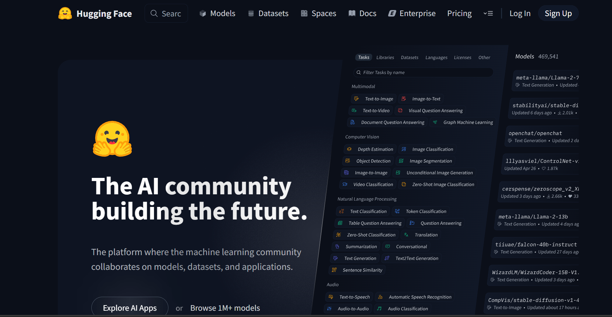
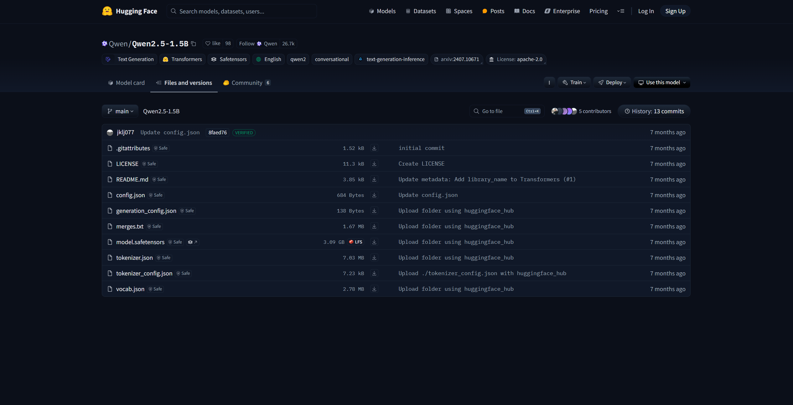
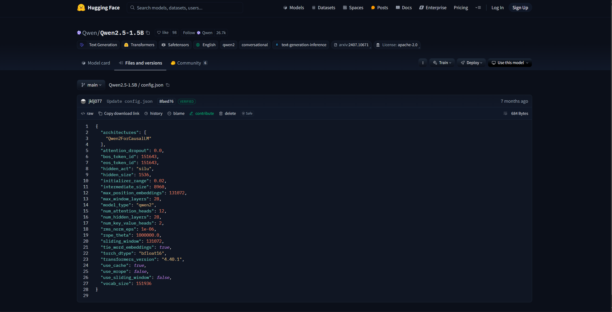
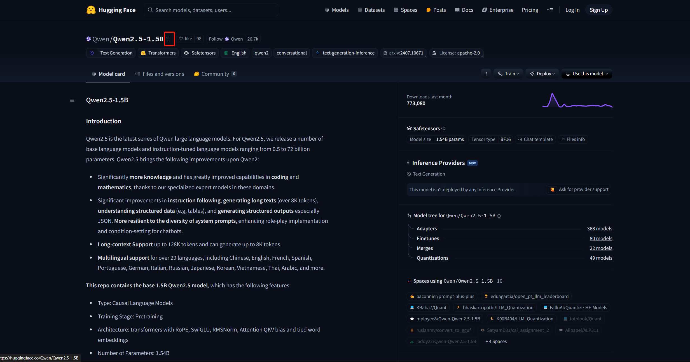
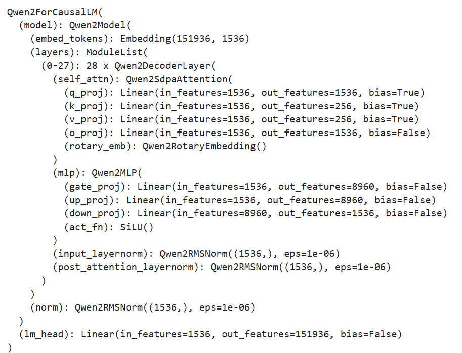

# 6.1 模型预训练

在上一章，我们逐步拆解了 LLM 的模型结构及训练过程，从零手写实现了 LLaMA 模型结构及 Pretrain、SFT 全流程，更深入地理解了 LLM 的模型原理及训练细节。但是，在实际应用中，手写实现的 LLM 训练存在以下问题：

- 手写实现 LLM 结构工作量大，难以实时跟进最新模型的结构创新；
- 从零实现的 LLM 训练无法较好地实现多卡分布式训练，训练效率较低；
- 和现有预训练 LLM 不兼容，无法使用预训练好的模型参数

因此，在本章中，我们将介绍目前 LLM 领域的主流训练框架 transformers，并结合分布式框架 deepspeed、高效微调框架 peft 等主流框架，实践使用 transformers 进行模型 Pretrain、SFT 全流程，更好地对接业界的主流 LLM 技术方案。

## 6.1.1 框架介绍

transformers 是由 Hugging Face 开发的 NLP 框架，通过模块化设计实现了对 BERT、GPT、LLaMA、T5、ViT 等上百种主流模型架构的统一支持。通过使用 transformers，开发者无需重复实现基础网络结构，通过 AutoModel 类即可一键加载任意预训练。


同时，框架内置的 Trainer 类封装了分布式训练的核心逻辑，支持 PyTorch 原生 DDP、DeepSpeed、Megatron-LM 等多种分布式训练策略。通过简单配置训练参数，即可实现数据并行、模型并行、流水线并行的混合并行训练，在 8 卡 A100 集群上可轻松支持百亿参数模型的高效训练。配合SavingPolicy和LoggingCallback等组件，实现了训练过程的自动化管理。其还支持与 Deepspeed、peft、wandb 等框架进行集成，直接通过参数设置即可无缝对接，从而快速、高效实现 LLM 训练。

对 LLM 时代的 NLP 研究者更为重要的是，HuggingFace 基于 transformers 框架搭建了其庞大的 AI 社区，开放了数亿个预训练模型参数、25万+不同类型数据集，通过 transformers、dataset、evaluate 等多个框架实现对预训练模型、数据集及评估函数的集成，从而帮助开发者可以便捷地使用任一预训练模型，在开源模型及数据集的基础上便捷地实现个人模型的开发与应用。



在 LLM 时代，模型结构的调整和重新预训练越来越少，开发者更多的业务应用在于使用预训练好的 LLM 进行 Post Train 和 SFT，来支持自己的下游业务应用。且由于预训练模型体量大，便捷集成 deepspeed 等分布式训练框架逐渐成为 LLM 时代 NLP 模型训练的必备技能。因此，transformers 已逐步成为学界、业界 NLP 技术的主流框架，不管是企业业务开发还是科研研究，都逐渐首选 transformers 进行模型实现。同时，新发布的开源 LLM 如 DeepSeek、Qwen 也都会第一时间在 transformers 社区开放其预训练权重与模型调用 Demo。通过使用 transformers 框架，可以高效、便捷地完成 LLM 训练及开发，实现工业级的产出交付。接下来，我们就会以 transformers 框架为基础，介绍如何通过 transformers 框架实现 LLM 的 Pretrain 及 SFT。

## 6.1.2 初始化 LLM

我们可以使用 transformers 的 AutoModel 类来直接初始化已经实现好的模型。对于任意预训练模型，其参数中都包含有模型的配置信息。如果是想要从头训练一个 LLM，可以使用一个已有的模型架构来直接初始化。这里，我们以 Qwen-2.5-1.5B （https://huggingface.co/Qwen/Qwen2.5-1.5B/tree/main）的模型架构为例：



该界面即为 HuggingFace 社区中的 Qwen-2.5-1.5B 模型参数，其中的 config.json 文件即是模型的配置信息，包括了模型的架构、隐藏层大小、模型层数等：



我们可以沿用该模型的配置信息，初始化一个 Qwen-2.5-1.5B 模型来进行训练，也可以在该配置信息的基础上进行更改，如修改隐藏层大小、注意力头数等，来定制一个模型结构。HuggingFace 提供了 python 工具来便捷下载想使用的模型参数：

```python
import os
# 设置环境变量，此处使用 HuggingFace 镜像网站
os.environ['HF_ENDPOINT'] = 'https://hf-mirror.com'
# 下载模型
os.system('huggingface-cli download --resume-download Qwen/Qwen2.5-1.5B --local-dir your_local_dir')
```

此处的 “Qwen/Qwen2.5-1.5B”即为要下载模型的标识符，对于其他模型，可以直接复制 HuggingFace 上的模型名即可：



下载完成后，可以使用 AutoConfig 类直接加载下载好的配置文件：

```python
# 加载定义好的模型参数-此处以 Qwen-2.5-1.5B 为例
# 使用 transforemrs 的 Config 类进行加载
from transformers import AutoConfig

# 下载参数的本地路径
model_path = "qwen-1.5b"
config = AutoConfig.from_pretrained(model_name_or_path)
```

也可以对配置文件进行自定义，然后以同样的方式加载即可。可以使用 AutoModel 类基于加载好的配置对象生成对应的模型：

```python
# 使用该配置生成一个定义好的模型
from transformers import AutoModelForCausalLM

model = AutoModelForCausalLM.from_config(config,trust_remote_code=True)
```

由于 LLM 一般都是 CausalLM 架构，此处使用了 AutoModelForCausalLM 类进行加载。如果是用于分类任务训练，可使用 AutoModelForSequenceClassification 类来加载。查看该 model，可以看到其架构和定义的配置文件相同：



该 model 就是一个从零初始化的 Qwen-2.5-1.5B 模型了。一般情况下，我们很少从零初始化 LLM 进行预训练，较多的做法是继承一个预训练好的 LLM ，在自己的语料上进行后训练。这里，我们也介绍如何从下载好的模型参数中初始化一个预训练好的模型。

```python
from transformers import AutoModelForCausalLM

model = AutoModelForCausalLM.from_pretrained(model_name_or_path,trust_remote_code=True)
```

类似的，直接使用 from_pretrained 方法加载即可，此处的 model_name_or_path 即为下载好的参数的本地路径。

我们还需要初始化一个 tokenizer。此处，我们直接使用 Qwen-2.5-1.5B 对应的 tokenzier 参数即可：

```python
# 加载一个预训练好的 tokenizer
from transformers import AutoTokenizer

tokenizer = AutoTokenizer.from_pretrained(model_name_or_path)
```

加载好的 tokenizer 即可直接使用，对任意文本进行分词处理。

## 6.1.3 预训练数据处理

与第五章类似，我们使用出门问问序列猴子开源数据集作为预训练数据集，可以用与第五章一致的方式进行数据集的下载和解压。HuggingFace 的 datasets 库是和 transformers 框架配套的、用于数据下载和处理的第三方库。我们可以直接使用 datasets 的 load_dataset 函数来加载预训练数据：

```python
# 加载预训练数据
from datasets import load_dataset

ds = load_dataset('json', data_files='/mobvoi_seq_monkey_general_open_corpus.jsonl')
```

注意，由于数据集较大，加载可能会出现时间较长或内存不够的情况，建议前期测试时将预训练数据集拆分一部分出来进行测试。加载出来的 ds 是一个 DatasetDict 对象，加载的数据会默认保存在 train 键对应的值中，可以通过以下代码查看：

```python
ds["train"][0]
```


可以通过 feature 属性查看数据集的特征（也就是列），这里需要保存一下数据集的列名，因为后续数据处理时，再将文本 tokenize 之后，需要移除原先的文本：

```python
# 查看特征
column_names = list(ds["train"].features)
# columnes_name:["text"]
```

接着使用加载好的 tokenizer 对数据集进行处理，此处使用 map 函数来进行批量处理：

```python
# 对数据集进行 tokenize
def tokenize_function(examples):
    # 使用预先加载的 tokenizer 进行分词
    output = tokenizer([item for item in examples["text"]])
    return output

# 批量处理
tokenized_datasets = ds.map(
    tokenize_function,
    batched=True,
    num_proc=10,
    remove_columns=column_names,
    load_from_cache_file=True,
    desc="Running tokenizer on dataset",
)
```

处理完成后的数据集会包括'input_ids', 'attention_mask'两列，分别是文本 tokenize 之后的数值序列和注意力掩码（标识是否 padding）。map 方法会通过 remove_columns 参数将原先的‘text’移除，训练中不再使用。

由于预训练一般为 CLM 任务，一次性学习多个样本的序列语义不影响模型性能，且训练数据量大、训练时间长，对训练效率要求比较高。在预训练过程中，一般会把多个文本段拼接在一起，处理成统一长度的文本块，再对每个文本块进行训练。在这里，我们实现一个拼接函数将文本块拼接到 2048个 token 长度，再通过 map 方法来进行批量处理：

```python
# 预训练一般将文本拼接成固定长度的文本段
from itertools import chain

# 这里我们取块长为 2048
block_size = 2048

def group_texts(examples):
    # 将文本段拼接起来
    concatenated_examples = {k: list(chain(*examples[k])) for k in examples.keys()}
    # 计算拼起来的整体长度
    total_length = len(concatenated_examples[list(examples.keys())[0]])
    # 如果长度太长，进行分块
    if total_length >= block_size:
        total_length = (total_length // block_size) * block_size
    # 按 block_size 进行切分
    result = {
        k: [t[i : i + block_size] for i in range(0, total_length, block_size)]
        for k, t in concatenated_examples.items()
    }
    # CLM 任务，labels 和 input 是相同的
    result["labels"] = result["input_ids"].copy()
    return result

# 批量处理
lm_datasets = tokenized_datasets.map(
    group_texts,
    batched=True,
    num_proc=10,
    load_from_cache_file=True,
    desc=f"Grouping texts in chunks of {block_size}",
    batch_size = 40000,
)
train_dataset = lm_datasets["train"]
```

处理得到的 train_dataset 就是一个可直接用于 CLM Pretrain 的预训练数据集了，其每个样本长度为 2048个 token。

## 6.1.4 使用 Trainer 进行训练

接下来，我们使用 transformers 提供的 Trainer 类进行训练。Trainer 封装了模型的训练逻辑，且做了较好的效率优化、可视化等工作，可以高效、便捷地完成 LLM 的训练。

首先我们需要配置训练的超参数，使用 TrainingArguments 类来实例化一个参数对象：

```python
from transformers import TrainingArguments
# 配置训练参数

training_args = TrainingArguments(
    output_dir="output",# 训练参数输出路径
    per_device_train_batch_size=4,# 训练的 batch_size
    gradient_accumulation_steps=4,# 梯度累计步数，实际 bs = 设置的 bs * 累计步数
    logging_steps=10,# 打印 loss 的步数间隔
    num_train_epochs=1,# 训练的 epoch 数
    save_steps=100, # 保存模型参数的步数间隔
    learning_rate=1e-4,# 学习率
    gradient_checkpointing=True# 开启梯度检查点
)
```

然后基于初始化的 model、tokenzier 和 training_args，并传入处理好的训练数据集，实例化一个 trainer 对象：

```python
from transformers import Trainer, default_data_collator
from torchdata.datapipes.iter import IterableWrapper

# 训练器
trainer = Trainer(
    model=model,
    args=training_args,
    train_dataset= IterableWrapper(train_dataset),
    eval_dataset= None,
    tokenizer=tokenizer,
    # 默认为 MLM 的 collator，使用 CLM 的 collater
    data_collator=default_data_collator
)
```

再使用 train 方法，即会按照配置好的训练超参进行训练和保存：

```python
trainer.train()
```

注：上述代码存放于 ./code/pretrian.ipynb 文件中。

## 6.1.5 使用 DeepSpeed 实现分布式训练

由于预训练规模大、时间长，一般不推荐使用 Jupyter Notebook 来运行，容易发生中断。且由于预训练规模大，一般需要使用多卡进行分布式训练，否则训练时间太长。在这里，我们介绍如何基于上述代码，使用 DeepSpeed 框架实现分布式训练，从而完成业界可用的 LLM Pretrain。

长时间训练一般使用 sh 脚本设定超参，再启动写好的 python 脚本实现训练。我们使用一个 python 脚本（./code/pretrain.py）来实现训练全流程。

先导入所需第三方库：

```python
import logging
import math
import os
import sys
from dataclasses import dataclass, field
from torchdata.datapipes.iter import IterableWrapper
from itertools import chain
import deepspeed
from typing import Optional,List

import datasets
import pandas as pd
import torch
from datasets import load_dataset
import transformers
from transformers import (
    AutoConfig,
    AutoModelForCausalLM,
    AutoTokenizer,
    HfArgumentParser,
    Trainer,
    TrainingArguments,
    default_data_collator,
    set_seed,
)
import datetime
from transformers.testing_utils import CaptureLogger
from transformers.trainer_utils import get_last_checkpoint
import wandb
```

首先需要定义几个超参的类型，用于处理 sh 脚本中设定的超参值。由于 transformers 本身有 TraingingArguments 类，其中包括了训练的一些必备超参数。我们这里只需定义 TrainingArguments 中未包含的超参即可，主要包括模型相关的超参（定义在 ModelArguments）和数据相关的超参（定义在 DataTrainingArguments）：

```python
# 超参类
@dataclass
class ModelArguments:
    """
    关于模型的参数
    """

    model_name_or_path: Optional[str] = field(
        default=None,
        metadata={
            "help": (
                "后训练使用，为预训练模型参数地址"
            )
        },
    )
    config_name: Optional[str] = field(
        default=None, metadata={"help": "预训练使用，Config 文件地址"}
    )
    tokenizer_name: Optional[str] = field(
        default=None, metadata={"help": "预训练 Tokenizer 地址"}
    )
    torch_dtype: Optional[str] = field(
        default=None,
        metadata={
            "help": (
                "模型训练使用的数据类型，推荐 bfloat16"
            ),
            "choices": ["auto", "bfloat16", "float16", "float32"],
        },
    )


@dataclass
class DataTrainingArguments:
    """
    关于训练的参数
    """

    train_files: Optional[List[str]]  = field(default=None, metadata={"help": "训练数据路径"})
    block_size: Optional[int] = field(
        default=None,
        metadata={
            "help": (
                "设置的文本块长度"
            )
        },
    )
    preprocessing_num_workers: Optional[int] = field(
        default=None,
        metadata={"help": "预处理使用线程数."},
    )
```

然后即可定义一个主函数实现上述训练过程的封装。首先通过 transformers 提供的 HfArgumentParser 工具来加载 sh 脚本中设定的超参：

```python
# 加载脚本参数
parser = HfArgumentParser((ModelArguments, DataTrainingArguments, TrainingArguments))
model_args, data_args, training_args = parser.parse_args_into_dataclasses()
```

在大规模的训练中，一般使用 log 来保存训练过程的信息，一般不推荐使用 print 直接打印，容易发生关键训练信息的丢失。这里，我们直接使用 python 自带的 logging 库来实现日志记录。首先需要进行 log 的设置：

```python
# 设置日志
logging.basicConfig(
    format="%(asctime)s - %(levelname)s - %(name)s - %(message)s",
    datefmt="%m/%d/%Y %H:%M:%S",
    handlers=[logging.StreamHandler(sys.stdout)],
)

# 将日志级别设置为 INFO
transformers.utils.logging.set_verbosity_info()
log_level = training_args.get_process_log_level()
logger.setLevel(log_level)
datasets.utils.logging.set_verbosity(log_level)
transformers.utils.logging.set_verbosity(log_level)
transformers.utils.logging.enable_default_handler()
transformers.utils.logging.enable_explicit_format()
```

这里将日志的级别设置为 INFO。logging 的日志共有 DEBUG、INFO、WARNING、ERROR 以及 CRITICAL 五个级别，将日志设置为哪个级别，就会只输出该级别及该级别之上的信息。设置完成后，在需要记录日志的地方，直接使用 logger 即可，记录时会指定记录日志的级别，例如：

```python
# 训练整体情况记录
logger.warning(
    f"Process rank: {training_args.local_rank}, device: {training_args.device}, n_gpu: {training_args.n_gpu}"
    + f"distributed training: {bool(training_args.local_rank != -1)}, 16-bits training: {training_args.fp16}"
)
logger.info(f"Training/evaluation parameters {training_args}")
```

后续就不再赘述脚本中的日志记录。

在大规模训练中，发生中断是往往难以避免的，训练一般会固定间隔保存 checkpoint，中断之后基于最近的 checkpoint 恢复训练即可。因此，我们需要首先检测是否存在旧的 checkpoint 并从 checkpoint 恢复训练：

```python
# 检查 checkpoint
last_checkpoint = None
if os.path.isdir(training_args.output_dir):
    # 使用 transformers 自带的 get_last_checkpoint 自动检测
    last_checkpoint = get_last_checkpoint(training_args.output_dir)
    if last_checkpoint is None and len(os.listdir(training_args.output_dir)) > 0:
        raise ValueError(
            f"输出路径 ({training_args.output_dir}) 非空 "
        )
    elif last_checkpoint is not None and training_args.resume_from_checkpoint is None:
        logger.info(
            f"从 {last_checkpoint}恢复训练"
        )
```

接着以上文介绍过的方式初始化模型，此处将从零初始化和基于已有预训练模型初始化包装在一起：

```python
# 初始化模型
if model_args.config_name is not None:
    # from scrach
    config = AutoConfig.from_pretrained(model_args.config_name)
    logger.warning("你正在从零初始化一个模型")
    logger.info(f"模型参数配置地址：{model_args.config_name}")
    logger.info(f"模型参数：{config}")
    model = AutoModelForCausalLM.from_config(config,trust_remote_code=True)
    n_params = sum({p.data_ptr(): p.numel() for p in model.parameters()}.values())
    logger.info(f"预训练一个新模型 - Total size={n_params/2**20:.2f}M params")
elif model_args.model_name_or_path is not None:
    logger.warning("你正在初始化一个预训练模型")
    logger.info(f"模型参数地址：{model_args.model_name_or_path}")
    model = AutoModelForCausalLM.from_pretrained(model_args.model_name_or_path,trust_remote_code=True)
    n_params = sum({p.data_ptr(): p.numel() for p in model.parameters()}.values())
    logger.info(f"继承一个预训练模型 - Total size={n_params/2**20:.2f}M params")
else:
    logger.error("config_name 和 model_name_or_path 不能均为空")
    raise ValueError("config_name 和 model_name_or_path 不能均为空")
```

再类似的进行 tokenizer 的加载和预训练数据的处理。该部分和上文完全一致，此处不再赘述，读者可以在代码中详细查看细节。类似的，使用 Trainer 进行训练：

```python
logger.info("初始化 Trainer")
trainer = Trainer(
    model=model,
    args=training_args,
    train_dataset= IterableWrapper(train_dataset),
    tokenizer=tokenizer,
    data_collator=default_data_collator
)

# 从 checkpoint 加载
checkpoint = None
if training_args.resume_from_checkpoint is not None:
    checkpoint = training_args.resume_from_checkpoint
elif last_checkpoint is not None:
        checkpoint = last_checkpoint

logger.info("开始训练")
train_result = trainer.train(resume_from_checkpoint=checkpoint)
trainer.save_model() 
```
注意，由于上文检测了是否存在 checkpoint，此处使用 resume_from_checkpoint 来实现从 checkpoint 恢复训练的功能。

由于在大规模训练中监测训练进度、loss 下降趋势尤为重要，在脚本中，我们使用了 wandb 作为训练检测的工具。在脚本开始进行了 wandb 的初始化：

```python
# 初始化 WandB
wandb.init(project="pretrain", name="from_scrach")
```

在启动训练后，终端会输出 wandb 监测的 url，点击即可观察训练进度。此处不再赘述 wandb 的使用细节，欢迎读者查阅相关的资料说明。

完成上述代码后，我们使用一个 sh 脚本（./code/pretrain.sh）定义超参数的值，并通过 deepspeed 启动训练，从而实现高效的多卡分布式训练：

```bash
# 设置可见显卡
CUDA_VISIBLE_DEVICES=0,1

deepspeed pretrain.py \
    --config_name autodl-tmp/qwen-1.5b \
    --tokenizer_name autodl-tmp/qwen-1.5b \
    --train_files autodl-tmp/dataset/pretrain_data/mobvoi_seq_monkey_general_open_corpus_small.jsonl \
    --per_device_train_batch_size 16 \
    --gradient_accumulation_steps 4 \
    --do_train \
    --output_dir autodl-tmp/output/pretrain \
    --evaluation_strategy  no \
    --learning_rate 1e-4 \
    --num_train_epochs 1 \
    --warmup_steps 200 \
    --logging_dir autodl-tmp/output/pretrain/logs \
    --logging_strategy steps \
    --logging_steps 5 \
    --save_strategy steps \
    --save_steps 100 \
    --preprocessing_num_workers 10 \
    --save_total_limit 1 \
    --seed 12 \
    --block_size 2048 \
    --bf16 \
    --gradient_checkpointing \
    --deepspeed ./ds_config_zero2.json \
    --report_to wandb
    # --resume_from_checkpoint ${output_model}/checkpoint-20400 \
```
在安装了 deepspeed 第三方库后，可以直接通过 deepspeed 命令来启动多卡训练。上述脚本命令主要是定义了各种超参数的值，可参考使用。在第四章中，我们介绍了 DeepSpeed 分布式训练的原理和 ZeRO 阶段设置，在这里，我们使用 ZeRO-2 进行训练。此处加载了 ds_config_zero.json 作为 DeepSpeed 的配置参数：

```json
{
    "fp16": {
        "enabled": "auto",
        "loss_scale": 0,
        "loss_scale_window": 1000,
        "initial_scale_power": 16,
        "hysteresis": 2,
        "min_loss_scale": 1
    },
    "bf16": {
        "enabled": "auto"
    },
    "optimizer": {
        "type": "AdamW",
        "params": {
            "lr": "auto",
            "betas": "auto",
            "eps": "auto",
            "weight_decay": "auto"
        }
    },

    "scheduler": {
        "type": "WarmupLR",
        "params": {
            "warmup_min_lr": "auto",
            "warmup_max_lr": "auto",
            "warmup_num_steps": "auto"
        }
    },

    "zero_optimization": {
        "stage": 2,
        "offload_optimizer": {
            "device": "none",
            "pin_memory": true
        },
        "allgather_partitions": true,
        "allgather_bucket_size": 2e8,
        "overlap_comm": true,
        "reduce_scatter": true,
        "reduce_bucket_size": 2e8,
        "contiguous_gradients": true
    },

    "gradient_accumulation_steps": "auto",
    "gradient_clipping": "auto",
    "steps_per_print": 100,
    "train_batch_size": "auto",
    "train_micro_batch_size_per_gpu": "auto",
    "wall_clock_breakdown": false
}
```

最后，在终端 sh 运行该 pretrain.sh 脚本即可开始训练。
