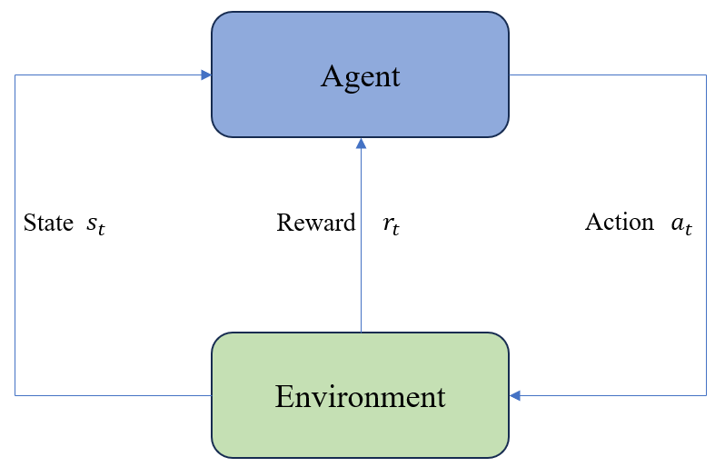

# 6.4 通过强化学习进行偏好对齐

在我们进入强化学习的细节之前，让我们先看看它的起源。强化学习（Reinforcement Learning，简称RL）其实并不是什么新鲜事物。它的理论基础可以追溯到20世纪初的行为心理学，尤其是Edward Thorndike和B.F. Skinner对于动物学习的研究。Thorndike提出了“效果律”，即如果一个行为带来积极的结果，那么这种行为重复发生的概率会增加。Skinner则进一步发展了这种思想，提出操作性条件作用学说，通过奖励和惩罚来塑造行为。

计算机科学领域的强化学习是从这些心理学原理生发出来的。在20世纪80年代，随着计算能力的提升和数学理论的发展，人们开始尝试将这些生物心理学的学习概念应用于机器和计算机程序，从而发展出了现代意义上的强化学习。

## 6.4.1 强化学习的基本原理

现在，我们进入核心部分——强化学习的基本原理。

- 状态（State） ：这是一个系统在某一时刻的具体状况。比如在一个棋盘游戏中，状态可以表示棋盘上所有棋子的当前排列情况。对于一个自动驾驶汽车来说，状态可能包括汽车的速度、位置，以及周围障碍物的位置等。
- 动作（Action） ：动作是智能体在给定状态下可执行的操作。以自行车为例，动作可能包括前进、停止、转弯等。在一个复杂的系统中，动作集可以非常庞大。
- 奖励（Reward） ：这是智能体在执行某个动作后获得的反馈，通常是一个数值。奖励可以是立即的，也可以是延后的。一个好的动作可能会得到正奖励，而不好的动作可能会得到负奖励。
- 策略（Policy） ：策略是一套指导智能体如何选择动作的规则。简单来说，策略就是告诉智能体在每个状态下应该做什么。
- 价值函数（Value Function） ：这是一种对策略的评估工具，旨在预测从当前状态出发，长期来看能够获得的总奖励。值函数帮助智能体不仅考虑当前步骤的奖励，而且能更好地权衡短期和长期的收益。
- 模型（Model） ：在有些强化学习系统中，我们会建立一个环境模型，帮助智能体预见其动作的结果。这在很多复杂计算情况下非常有用。



这些元素共同作用，帮助智能体通过不断地在虚拟环境中试错来学习最佳的行动策略。在强化学习中，智能体是学习和决策的主体。它通过以下步骤与环境进行交互：

1. 观察状态 ：智能体首先观察当前的状态（State）。
2. 选择动作 ：根据观察到的状态和预先确定的策略，智能体选择一个动作（Action）。
3. 执行动作 ：智能体执行所选的动作。
4. 接收奖励和新状态 ：执行动作后，智能体从环境中接收到相应的奖励（Reward）和更新后的新状态（State）。
5. 更新策略 ：智能体使用获得的奖励信息来调整策略，以便在未来获得更好的结果。

将这个过程不断重复，智能体在反复的交互中不断优化其策略，目标是让它在给定的任务中表现得越来越好。

## 6.4.2 强化学习的目标

强化学习的目标十分明确：***通过在给定环境中反复试探和学习，使得智能体能够选择一系列动作从而最大化其总累计奖励。*** 这听起来可能有些抽象，我们可以用玩游戏来比喻。在游戏中，玩家的目标是通过一系列操作（比如走路、跳跃、打怪）来赢得高分数或完成关卡。在强化学习中，这种高分或成功通过关卡的概念对应于“最大化奖励”。

在数学上，这个目标可以表示为训练一个策略 $\pi$，使得在所有状态 $s$ 下，智能体选择的动作能够使得回报 $R(\tau)$ 的期望值最大化。具体来说，我们希望最大化以下期望值：

$$
E(R(\tau))_{\tau \sim P_{\theta}(\tau)} = \sum_{\tau} R(\tau) P_{\theta}(\tau)
$$

其中：
- $E(R(\tau))_{\tau \sim P_{\theta}(\tau)}$：表示在策略 $P_{\theta}(\tau)$ 下轨迹 $\tau$ 的回报 $R(\tau)$ 的期望值。
- $R(\tau)$：轨迹 $\tau$ 的回报，即从起始状态到终止状态获得的所有奖励的总和。
- $\tau$：表示一条轨迹，即智能体在环境中的状态和动作序列。
- $P_{\theta}(\tau)$：在参数 $\theta$ 下生成轨迹 $\tau$ 的概率，通常由策略或策略网络确定。
- $\theta$：策略的参数，控制着策略 $P_{\theta}$ 的行为。

为了找到这个策略，我们使用梯度上升的方法，不断更新策略参数 $\theta$，使得 $E(R(\tau))_{\tau \sim P_{\theta}(\tau)}$ 不断增大。

这种学习方式非常有效，因为它不依赖于大量的标注数据，而是通过对环境直接进行交互和反馈进行学习。这使得强化学习在许多需要适应和决策的复杂任务中，比如机器人控制、自动驾驶、金融交易乃至游戏中，都展现出了巨大的潜力。

而强化学习在大模型中的应用，比如 AlphaGo、AlphaZero 等，更是让人们看到了强化学习在复杂任务中的强大能力。这些模型通过强化学习的方法，不断优化策略，最终在围棋、象棋等游戏中击败了人类顶尖选手，展现出了强化学习在复杂任务中的巨大潜力。

强化学习也可以用于偏好对齐问题，比如可以让大模型学习模仿人类的交流方式，也会用于自动驾驶等领域。强化学习的应用领域非常广泛，未来也会有更多的应用场景。

## 6.4.3 奖励模型

在自然语言处理领域，大语言模型（如Llama 系列、Qwen系列等）已经展现了强大的文本理解和生成能力。然而，这些预训练模型并不总是能直接满足特定的业务需求和人类价值观。为此，人们通常需要对预训练模型进行“指令微调”（Instruction Tuning），即向模型提供特定的指令（prompts）和示例，使其在对话、问答、文本生成等任务中表现得更符合人类期望。

在完成初步的指令微调后，我们还想要使模型的回答不仅正确，还能最大程度上满足人类的审美、价值观和安全标准。为此，引入了强化学习与人类反馈（Reinforcement Learning from Human Feedback, RLHF）的概念。在 RLHF 中，我们会先从人类标注者那里获得对模型回答的偏好（例如，给出多个模型回答，让人类标注者对它们进行排名），然后通过这些反馈来指导模型学习，从而不断提高模型生成内容与人类偏好的契合度。

为了在 RLHF 流程中自动对模型的回答进行“打分”（赋予奖励），我们需要构建一个专门的奖励模型（Reward Model）。这个奖励模型会根据人类标注的数据进行训练，并在实际部署中独立对模型输出进行自动评分，从而减少持续人工参与的成本和延迟。

## 6.4.4 数据集构建

在构建奖励模型（Reward Model）之前，我们首先需要准备高质量的人类反馈数据集。此数据集的核心目标是为每条给定的提示（prompt）提供多个候选回答（completion），并由人类标注者对这些回答进行细致的评定与排序。通过对回答的对比和筛选，我们得以为机器模型提供明确的参考标准，帮助其进一步学习在给定任务下如何生成更符合人类期望的输出。

可以按照以下步骤进行数据收集：

1. 收集初始回答：首先，我们需要从一个已经过基本微调的“大模型”（往往是具有一定指令理解和生成能力的预训练模型）中，为一组精心设计的提示生成多条回答。这些回答将作为后续人类标注工作的基础。


2. 人工标注与评估：拥有多条候选回答后，我们邀请专业标注人员或众包标注者对每条回答的质量进行评价。这些评估通常会基于一系列预先设计的评价标准，如回答的准确性、完整性、上下文相关性、语言流畅度以及是否遵循道德与安全准则。对不同回答的比较与排序帮助我们识别最佳和最差的回答，从而形成有价值的训练数据。

3. 数据格式化与整理：标注完成后，我们将数据进行整理与格式化，通常采用 JSON、CSV 或其他便于计算机处理的结构化数据格式。数据集中需明确标识每个问题（prompt）、其对应的多个回答（completions），以及人类标注者对这些回答的选择（如标记为 "chosen" 的最佳答案与 "rejected" 的较差答案）。这些标记信息可直接作为奖励模型学习的监督信号，使其在训练中自动倾向于生成高质量回答。

下面是一个简单的数据示例，其中展示了两个问题（question）及其对应的回答和人类评价结果。通过 "chosen" 与 "rejected" 字段的对比，我们可以直观地看出哪条回答更为优质。

```json
[
    {
        "question": "Python中的列表是什么？",
        "chosen": "Python中的列表是一种有序的可变容器，允许存储多个元素，并且可以通过索引访问。",
        "rejected": "Python中的列表用于存储数据。"
    },
    {
        "question": "Python中的元组是什么？",
        "chosen": "Python中的元组是一种有序的不可变容器，允许存储多个元素，并且一旦创建就不能修改。",
        "rejected": "Python中的元组用于存储数据。"
    }
]
```

在上述示例中，人类标注者认为 "chosen" 字段下的回答相对于对应的 "rejected" 回答在描述、准确性和信息量等方面都更为优质。例如，对于列表的定义，"chosen" 答复更清晰地解释了列表的特征（有序、可变、支持索引访问），而非仅仅停留在“用于存储数据”这种笼统描述。


## 7.2.2 奖励模型训练

我们可以借助大模型强化学习框架 TRL（Transformer Reinforcement Learning）来训练奖励模型。TRL 是一个基于强化学习的训练框架，旨在通过人类反馈指导模型生成更符合人类期望的回答。在 TRL 中，我们会将奖励模型作为一个独立的组件，用于评估模型生成的回答，并根据评估结果给予奖励或惩罚。

