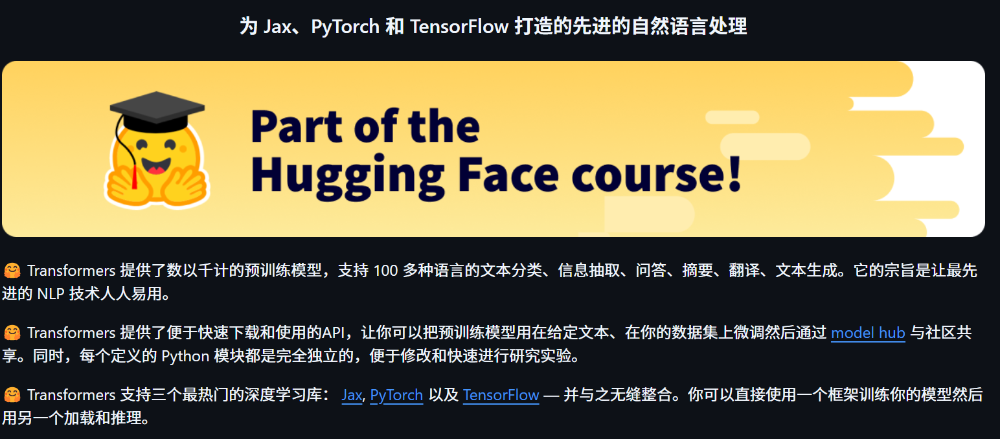
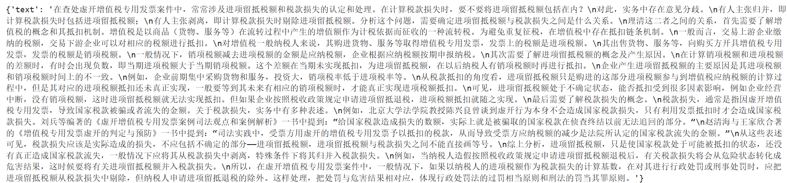
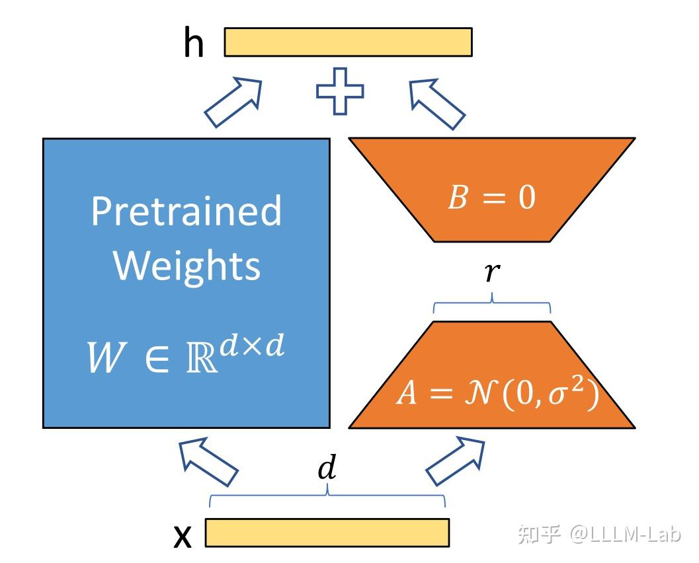

# 第六章 大模型训练流程实践

## 6.1 模型预训练

在上一章，我们逐步拆解了 LLM 的模型结构及训练过程，从零手写实现了 LLaMA 模型结构及 Pretrain、SFT 全流程，更深入地理解了 LLM 的模型原理及训练细节。但是，在实际应用中，手写实现的 LLM 训练存在以下问题：

- 手写实现 LLM 结构工作量大，难以实时跟进最新模型的结构创新；
- 从零实现的 LLM 训练无法较好地实现多卡分布式训练，训练效率较低；
- 和现有预训练 LLM 不兼容，无法使用预训练好的模型参数

因此，在本章中，我们将介绍目前 LLM 领域的主流训练框架 Transformers，并结合分布式框架 deepspeed、高效微调框架 peft 等主流框架，实践使用 transformers 进行模型 Pretrain、SFT 全流程，更好地对接业界的主流 LLM 技术方案。

### 6.1.1 框架介绍

Transformers 是由 Hugging Face 开发的 NLP 框架，通过模块化设计实现了对 BERT、GPT、LLaMA、T5、ViT 等上百种主流模型架构的统一支持。通过使用 Transformers，开发者无需重复实现基础网络结构，通过 AutoModel 类即可一键加载任意预训练，图6.1 为 Hugging Face Transformers 课程首页：

<div align='center'>
    
    <p>图6.1 Hugging Face Transformers</p>
</div>

同时，框架内置的 Trainer 类封装了分布式训练的核心逻辑，支持 PyTorch 原生 DDP、DeepSpeed、Megatron-LM 等多种分布式训练策略。通过简单配置训练参数，即可实现数据并行、模型并行、流水线并行的混合并行训练，在 8 卡 A100 集群上可轻松支持百亿参数模型的高效训练。配合 SavingPolicy 和 LoggingCallback 等组件，实现了训练过程的自动化管理。其还支持与 Deepspeed、peft、wandb、Swanlab 等框架进行集成，直接通过参数设置即可无缝对接，从而快速、高效实现 LLM 训练。

对 LLM 时代的 NLP 研究者更为重要的是，HuggingFace 基于 Transformers 框架搭建了其庞大的 AI 社区，开放了数亿个预训练模型参数、25万+不同类型数据集，通过 Transformers、Dataset、Evaluate 等多个框架实现对预训练模型、数据集及评估函数的集成，从而帮助开发者可以便捷地使用任一预训练模型，在开源模型及数据集的基础上便捷地实现个人模型的开发与应用。

<div align='center'>
    
    <p>图6.2 Hugging Face Transformers 模型社区</p>
</div>

在 LLM 时代，模型结构的调整和重新预训练越来越少，开发者更多的业务应用在于使用预训练好的 LLM 进行 Post Train 和 SFT，来支持自己的下游业务应用。且由于预训练模型体量大，便捷集成 deepspeed 等分布式训练框架逐渐成为 LLM 时代 NLP 模型训练的必备技能。因此，Transformers 已逐步成为学界、业界 NLP 技术的主流框架，不管是企业业务开发还是科研研究，都逐渐首选 Transformers 进行模型实现。同时，新发布的开源 LLM 如 DeepSeek、Qwen 也都会第一时间在 Transformers 社区开放其预训练权重与模型调用 Demo。通过使用 Transformers 框架，可以高效、便捷地完成 LLM 训练及开发，实现工业级的产出交付。接下来，我们就会以 Transformers 框架为基础，介绍如何通过 Transformers 框架实现 LLM 的 Pretrain 及 SFT。

### 6.1.2 初始化 LLM

我们可以使用 transformers 的 AutoModel 类来直接初始化已经实现好的模型。对于任意预训练模型，其参数中都包含有模型的配置信息。如果是想要从头训练一个 LLM，可以使用一个已有的模型架构来直接初始化。这里，我们以 [Qwen-2.5-1.5B](https://huggingface.co/Qwen/Qwen2.5-1.5B/tree/main)的模型架构为例：

<div align='center'>
    
    <p>图6.3 Qwen-2.5-1.5B</p>
</div>

该界面即为 HuggingFace 社区中的 Qwen-2.5-1.5B 模型参数，其中的 `config.json` 文件即是模型的配置信息，包括了模型的架构、隐藏层大小、模型层数等，如图6.4所示：

<div align='center'>
    
    <p>图6.4 Qwen-2.5-1.5B config.json 文件</p>
</div>

我们可以沿用该模型的配置信息，初始化一个 Qwen-2.5-1.5B 模型来进行训练，也可以在该配置信息的基础上进行更改，如修改隐藏层大小、注意力头数等，来定制一个模型结构。HuggingFace 提供了 Python 工具来便捷下载想使用的模型参数：

```python
import os
# 设置环境变量，此处使用 HuggingFace 镜像网站
os.environ['HF_ENDPOINT'] = 'https://hf-mirror.com'
# 下载模型
os.system('huggingface-cli download --resume-download Qwen/Qwen2.5-1.5B --local-dir your_local_dir')
```

如图6.5，此处的 “Qwen/Qwen2.5-1.5B”即为要下载模型的标识符，对于其他模型，可以直接复制 HuggingFace 上的模型名即可：

<div align='center'>
    
    <p>图6.5 模型下载标识</p>
</div>

下载完成后，可以使用 AutoConfig 类直接加载下载好的配置文件：

```python
# 加载定义好的模型参数-此处以 Qwen-2.5-1.5B 为例
# 使用 transforemrs 的 Config 类进行加载
from transformers import AutoConfig

# 下载参数的本地路径
model_path = "qwen-1.5b"
config = AutoConfig.from_pretrained(model_name_or_path)
```

也可以对配置文件进行自定义，然后以同样的方式加载即可。可以使用 AutoModel 类基于加载好的配置对象生成对应的模型：

```python
# 使用该配置生成一个定义好的模型
from transformers import AutoModelForCausalLM

model = AutoModelForCausalLM.from_config(config,trust_remote_code=True)
```

由于 LLM 一般都是 CausalLM 架构，此处使用了 AutoModelForCausalLM 类进行加载。如果是用于分类任务训练，可使用 AutoModelForSequenceClassification 类来加载。查看该 model，图6.6可以看到其架构和定义的配置文件相同：

<div align='center'>
    
    <p>图6.6 模型结构输出结果</p>
</div>

该 model 就是一个从零初始化的 Qwen-2.5-1.5B 模型了。一般情况下，我们很少从零初始化 LLM 进行预训练，较多的做法是加载一个预训练好的 LLM 权重，在自己的语料上进行后训练。这里，我们也介绍如何从下载好的模型参数中初始化一个预训练好的模型。

```python
from transformers import AutoModelForCausalLM

model = AutoModelForCausalLM.from_pretrained(model_name_or_path,trust_remote_code=True)
```

类似的，直接使用 from_pretrained 方法加载即可，此处的 model_name_or_path 即为下载好的参数的本地路径。

我们还需要初始化一个 tokenizer。此处，我们直接使用 Qwen-2.5-1.5B 对应的 tokenzier 参数即可：

```python
# 加载一个预训练好的 tokenizer
from transformers import AutoTokenizer

tokenizer = AutoTokenizer.from_pretrained(model_name_or_path)
```

加载好的 tokenizer 即可直接使用，对任意文本进行分词处理。

### 6.1.3 预训练数据处理

与第五章类似，我们使用出门问问序列猴子开源数据集作为预训练数据集，可以用与第五章一致的方式进行数据集的下载和解压。HuggingFace 的 datasets 库是和 transformers 框架配套的、用于数据下载和处理的第三方库。我们可以直接使用 datasets 的 load_dataset 函数来加载预训练数据：

```python
# 加载预训练数据
from datasets import load_dataset

ds = load_dataset('json', data_files='/mobvoi_seq_monkey_general_open_corpus.jsonl')
```

注意，由于数据集较大，加载可能会出现时间较长或内存不够的情况，建议前期测试时将预训练数据集拆分一部分出来进行测试。加载出来的 ds 是一个 DatasetDict 对象，加载的数据会默认保存在 `train` 键对应的值中，可以通过以下代码查看：

```python
ds["train"][0]
```

<div align='center'>
    
    <p>图6.7 数据集展示</p>
</div>

可以通过 feature 属性查看数据集的特征（也就是列），这里需要保存一下数据集的列名，因为后续数据处理时，再将文本 tokenize 之后，需要移除原先的文本：

```python
# 查看特征
column_names = list(ds["train"].features)
# columnes_name:["text"]
```

接着使用加载好的 tokenizer 对数据集进行处理，此处使用 map 函数来进行批量处理：

```python
# 对数据集进行 tokenize
def tokenize_function(examples):
    # 使用预先加载的 tokenizer 进行分词
    output = tokenizer([item for item in examples["text"]])
    return output

# 批量处理
tokenized_datasets = ds.map(
    tokenize_function,
    batched=True,
    num_proc=10,
    remove_columns=column_names,
    load_from_cache_file=True,
    desc="Running tokenizer on dataset",
)
```

处理完成后的数据集会包括'input_ids', 'attention_mask'两列，分别是文本 tokenize 之后的数值序列和注意力掩码（标识是否 padding）。map 方法会通过 remove_columns 参数将原先的‘text’移除，训练中不再使用。

由于预训练一般为 CLM 任务，一次性学习多个样本的序列语义不影响模型性能，且训练数据量大、训练时间长，对训练效率要求比较高。在预训练过程中，一般会把多个文本段拼接在一起，处理成统一长度的文本块，再对每个文本块进行训练。在这里，我们实现一个拼接函数将文本块拼接到 2048个 token 长度，再通过 map 方法来进行批量处理：

```python
# 预训练一般将文本拼接成固定长度的文本段
from itertools import chain

# 这里我们取块长为 2048
block_size = 2048

def group_texts(examples):
    # 将文本段拼接起来
    concatenated_examples = {k: list(chain(*examples[k])) for k in examples.keys()}
    # 计算拼起来的整体长度
    total_length = len(concatenated_examples[list(examples.keys())[0]])
    # 如果长度太长，进行分块
    if total_length >= block_size:
        total_length = (total_length // block_size) * block_size
    # 按 block_size 进行切分
    result = {
        k: [t[i : i + block_size] for i in range(0, total_length, block_size)]
        for k, t in concatenated_examples.items()
    }
    # CLM 任务，labels 和 input 是相同的
    result["labels"] = result["input_ids"].copy()
    return result

# 批量处理
lm_datasets = tokenized_datasets.map(
    group_texts,
    batched=True,
    num_proc=10,
    load_from_cache_file=True,
    desc=f"Grouping texts in chunks of {block_size}",
    batch_size = 40000,
)
train_dataset = lm_datasets["train"]
```

处理得到的 train_dataset 就是一个可直接用于 CLM Pretrain 的预训练数据集了，其每个样本长度为 2048个 token。

### 6.1.4 使用 Trainer 进行训练

接下来，我们使用 transformers 提供的 Trainer 类进行训练。Trainer 封装了模型的训练逻辑，且做了较好的效率优化、可视化等工作，可以高效、便捷地完成 LLM 的训练。

首先我们需要配置训练的超参数，使用 TrainingArguments 类来实例化一个参数对象：

```python
from transformers import TrainingArguments
# 配置训练参数

training_args = TrainingArguments(
    output_dir="output",# 训练参数输出路径
    per_device_train_batch_size=4,# 训练的 batch_size
    gradient_accumulation_steps=4,# 梯度累计步数，实际 bs = 设置的 bs * 累计步数
    logging_steps=10,# 打印 loss 的步数间隔
    num_train_epochs=1,# 训练的 epoch 数
    save_steps=100, # 保存模型参数的步数间隔
    learning_rate=1e-4,# 学习率
    gradient_checkpointing=True# 开启梯度检查点
)
```

然后基于初始化的 model、tokenzier 和 training_args，并传入处理好的训练数据集，实例化一个 trainer 对象：

```python
from transformers import Trainer, default_data_collator
from torchdata.datapipes.iter import IterableWrapper

# 训练器
trainer = Trainer(
    model=model,
    args=training_args,
    train_dataset= IterableWrapper(train_dataset),
    eval_dataset= None,
    tokenizer=tokenizer,
    # 默认为 MLM 的 collator，使用 CLM 的 collater
    data_collator=default_data_collator
)
```

再使用 train 方法，即会按照配置好的训练超参进行训练和保存：

```python
trainer.train()
```

> 注：上述代码存放于 `./code/pretrian.ipynb` 文件中。

### 6.1.5 使用 DeepSpeed 实现分布式训练

由于预训练规模大、时间长，一般不推荐使用 Jupyter Notebook 来运行，容易发生中断。且由于预训练规模大，一般需要使用多卡进行分布式训练，否则训练时间太长。在这里，我们介绍如何基于上述代码，使用 DeepSpeed 框架实现分布式训练，从而完成业界可用的 LLM Pretrain。

长时间训练一般使用 bash 脚本设定超参，再启动写好的 python 脚本实现训练。我们使用一个 Python 脚本（`./code/pretrain.py`）来实现训练全流程。

先导入所需第三方库：

```python
import logging
import math
import os
import sys
from dataclasses import dataclass, field
from torchdata.datapipes.iter import IterableWrapper
from itertools import chain
import deepspeed
from typing import Optional,List

import datasets
import pandas as pd
import torch
from datasets import load_dataset
import transformers
from transformers import (
    AutoConfig,
    AutoModelForCausalLM,
    AutoTokenizer,
    HfArgumentParser,
    Trainer,
    TrainingArguments,
    default_data_collator,
    set_seed,
)
import datetime
from transformers.testing_utils import CaptureLogger
from transformers.trainer_utils import get_last_checkpoint
import wandb
```

首先需要定义几个超参的类型，用于处理 sh 脚本中设定的超参值。由于 transformers 本身有 TraingingArguments 类，其中包括了训练的一些必备超参数。我们这里只需定义 TrainingArguments 中未包含的超参即可，主要包括模型相关的超参（定义在 ModelArguments）和数据相关的超参（定义在 DataTrainingArguments）：

```python
# 超参类
@dataclass
class ModelArguments:
    """
    关于模型的参数
    """

    model_name_or_path: Optional[str] = field(
        default=None,
        metadata={
            "help": (
                "后训练使用，为预训练模型参数地址"
            )
        },
    )
    config_name: Optional[str] = field(
        default=None, metadata={"help": "预训练使用，Config 文件地址"}
    )
    tokenizer_name: Optional[str] = field(
        default=None, metadata={"help": "预训练 Tokenizer 地址"}
    )
    torch_dtype: Optional[str] = field(
        default=None,
        metadata={
            "help": (
                "模型训练使用的数据类型，推荐 bfloat16"
            ),
            "choices": ["auto", "bfloat16", "float16", "float32"],
        },
    )


@dataclass
class DataTrainingArguments:
    """
    关于训练的参数
    """

    train_files: Optional[List[str]]  = field(default=None, metadata={"help": "训练数据路径"})
    block_size: Optional[int] = field(
        default=None,
        metadata={
            "help": (
                "设置的文本块长度"
            )
        },
    )
    preprocessing_num_workers: Optional[int] = field(
        default=None,
        metadata={"help": "预处理使用线程数."},
    )
```

然后即可定义一个主函数实现上述训练过程的封装。首先通过 transformers 提供的 HfArgumentParser 工具来加载 sh 脚本中设定的超参：

```python
# 加载脚本参数
parser = HfArgumentParser((ModelArguments, DataTrainingArguments, TrainingArguments))
model_args, data_args, training_args = parser.parse_args_into_dataclasses()
```

在大规模的训练中，一般使用 log 来保存训练过程的信息，一般不推荐使用 print 直接打印，容易发生关键训练信息的丢失。这里，我们直接使用 python 自带的 logging 库来实现日志记录。首先需要进行 log 的设置：

```python
# 设置日志
logging.basicConfig(
    format="%(asctime)s - %(levelname)s - %(name)s - %(message)s",
    datefmt="%m/%d/%Y %H:%M:%S",
    handlers=[logging.StreamHandler(sys.stdout)],
)

# 将日志级别设置为 INFO
transformers.utils.logging.set_verbosity_info()
log_level = training_args.get_process_log_level()
logger.setLevel(log_level)
datasets.utils.logging.set_verbosity(log_level)
transformers.utils.logging.set_verbosity(log_level)
transformers.utils.logging.enable_default_handler()
transformers.utils.logging.enable_explicit_format()
```

这里将日志的级别设置为 INFO。logging 的日志共有 DEBUG、INFO、WARNING、ERROR 以及 CRITICAL 五个级别，将日志设置为哪个级别，就会只输出该级别及该级别之上的信息。设置完成后，在需要记录日志的地方，直接使用 logger 即可，记录时会指定记录日志的级别，例如：

```python
# 训练整体情况记录
logger.warning(
    f"Process rank: {training_args.local_rank}, device: {training_args.device}, n_gpu: {training_args.n_gpu}"
    + f"distributed training: {bool(training_args.local_rank != -1)}, 16-bits training: {training_args.fp16}"
)
logger.info(f"Training/evaluation parameters {training_args}")
```

后续就不再赘述脚本中的日志记录。

在大规模训练中，发生中断是往往难以避免的，训练一般会固定间隔保存 checkpoint，中断之后基于最近的 checkpoint 恢复训练即可。因此，我们需要首先检测是否存在旧的 checkpoint 并从 checkpoint 恢复训练：

```python
# 检查 checkpoint
last_checkpoint = None
if os.path.isdir(training_args.output_dir):
    # 使用 transformers 自带的 get_last_checkpoint 自动检测
    last_checkpoint = get_last_checkpoint(training_args.output_dir)
    if last_checkpoint is None and len(os.listdir(training_args.output_dir)) > 0:
        raise ValueError(
            f"输出路径 ({training_args.output_dir}) 非空 "
        )
    elif last_checkpoint is not None and training_args.resume_from_checkpoint is None:
        logger.info(
            f"从 {last_checkpoint}恢复训练"
        )
```

接着以上文介绍过的方式初始化模型，此处将从零初始化和基于已有预训练模型初始化包装在一起：

```python
# 初始化模型
if model_args.config_name is not None:
    # from scrach
    config = AutoConfig.from_pretrained(model_args.config_name)
    logger.warning("你正在从零初始化一个模型")
    logger.info(f"模型参数配置地址：{model_args.config_name}")
    logger.info(f"模型参数：{config}")
    model = AutoModelForCausalLM.from_config(config,trust_remote_code=True)
    n_params = sum({p.data_ptr(): p.numel() for p in model.parameters()}.values())
    logger.info(f"预训练一个新模型 - Total size={n_params/2**20:.2f}M params")
elif model_args.model_name_or_path is not None:
    logger.warning("你正在初始化一个预训练模型")
    logger.info(f"模型参数地址：{model_args.model_name_or_path}")
    model = AutoModelForCausalLM.from_pretrained(model_args.model_name_or_path,trust_remote_code=True)
    n_params = sum({p.data_ptr(): p.numel() for p in model.parameters()}.values())
    logger.info(f"继承一个预训练模型 - Total size={n_params/2**20:.2f}M params")
else:
    logger.error("config_name 和 model_name_or_path 不能均为空")
    raise ValueError("config_name 和 model_name_or_path 不能均为空")
```

再类似的进行 tokenizer 的加载和预训练数据的处理。该部分和上文完全一致，此处不再赘述，读者可以在代码中详细查看细节。类似的，使用 Trainer 进行训练：

```python
logger.info("初始化 Trainer")
trainer = Trainer(
    model=model,
    args=training_args,
    train_dataset= IterableWrapper(train_dataset),
    tokenizer=tokenizer,
    data_collator=default_data_collator
)

# 从 checkpoint 加载
checkpoint = None
if training_args.resume_from_checkpoint is not None:
    checkpoint = training_args.resume_from_checkpoint
elif last_checkpoint is not None:
        checkpoint = last_checkpoint

logger.info("开始训练")
train_result = trainer.train(resume_from_checkpoint=checkpoint)
trainer.save_model() 
```
注意，由于上文检测了是否存在 checkpoint，此处使用 resume_from_checkpoint 来实现从 checkpoint 恢复训练的功能。

由于在大规模训练中监测训练进度、loss 下降趋势尤为重要，在脚本中，我们使用了 wandb 作为训练检测的工具。在脚本开始进行了 wandb 的初始化：

```python
# 初始化 WandB
wandb.init(project="pretrain", name="from_scrach")
```

在启动训练后，终端会输出 wandb 监测的 url，点击即可观察训练进度。此处不再赘述 wandb 的使用细节，欢迎读者查阅相关的资料说明。

完成上述代码后，我们使用一个 sh 脚本（`./code/pretrain.sh`）定义超参数的值，并通过 Deepspeed 启动训练，从而实现高效的多卡分布式训练：

```bash
# 设置可见显卡
CUDA_VISIBLE_DEVICES=0,1

deepspeed pretrain.py \
    --config_name autodl-tmp/qwen-1.5b \
    --tokenizer_name autodl-tmp/qwen-1.5b \
    --train_files autodl-tmp/dataset/pretrain_data/mobvoi_seq_monkey_general_open_corpus_small.jsonl \
    --per_device_train_batch_size 16 \
    --gradient_accumulation_steps 4 \
    --do_train \
    --output_dir autodl-tmp/output/pretrain \
    --evaluation_strategy  no \
    --learning_rate 1e-4 \
    --num_train_epochs 1 \
    --warmup_steps 200 \
    --logging_dir autodl-tmp/output/pretrain/logs \
    --logging_strategy steps \
    --logging_steps 5 \
    --save_strategy steps \
    --save_steps 100 \
    --preprocessing_num_workers 10 \
    --save_total_limit 1 \
    --seed 12 \
    --block_size 2048 \
    --bf16 \
    --gradient_checkpointing \
    --deepspeed ./ds_config_zero2.json \
    --report_to wandb
    # --resume_from_checkpoint ${output_model}/checkpoint-20400 \
```
在安装了 Deepspeed 第三方库后，可以直接通过 Deepspeed 命令来启动多卡训练。上述脚本命令主要是定义了各种超参数的值，可参考使用。在第四章中，我们介绍了 DeepSpeed 分布式训练的原理和 ZeRO 阶段设置，在这里，我们使用 ZeRO-2 进行训练。此处加载了 `ds_config_zero.json` 作为 DeepSpeed 的配置参数：

```json
{
    "fp16": {
        "enabled": "auto",
        "loss_scale": 0,
        "loss_scale_window": 1000,
        "initial_scale_power": 16,
        "hysteresis": 2,
        "min_loss_scale": 1
    },
    "bf16": {
        "enabled": "auto"
    },
    "optimizer": {
        "type": "AdamW",
        "params": {
            "lr": "auto",
            "betas": "auto",
            "eps": "auto",
            "weight_decay": "auto"
        }
    },

    "scheduler": {
        "type": "WarmupLR",
        "params": {
            "warmup_min_lr": "auto",
            "warmup_max_lr": "auto",
            "warmup_num_steps": "auto"
        }
    },

    "zero_optimization": {
        "stage": 2,
        "offload_optimizer": {
            "device": "none",
            "pin_memory": true
        },
        "allgather_partitions": true,
        "allgather_bucket_size": 2e8,
        "overlap_comm": true,
        "reduce_scatter": true,
        "reduce_bucket_size": 2e8,
        "contiguous_gradients": true
    },

    "gradient_accumulation_steps": "auto",
    "gradient_clipping": "auto",
    "steps_per_print": 100,
    "train_batch_size": "auto",
    "train_micro_batch_size_per_gpu": "auto",
    "wall_clock_breakdown": false
}
```

最后，在终端 bash 运行该 `pretrain.sh` 脚本即可开始训练。

## 6.2 模型有监督微调

在上一节，我们介绍了如何使用 Transformers 框架快速、高效地进行模型预训练。在本部分，我们将基于上部分内容，介绍如何使用 Transformers 框架对预训练好的模型进行有监督微调。

### 6.2.1 Pretrain VS SFT

首先需要回顾一下，对 LLM 进行预训练和进行有监督微调的核心差异在于什么。在第四章中提到过，目前成型的 LLM 一般通过 Pretrain-SFT-RLHF 三个阶段来训练，在 Pretrain 阶段，会对海量无监督文本进行自监督建模，来学习文本语义规则和文本中的世界知识；在 SFT 阶段，一般通过对 Pretrain 好的模型进行指令微调，即训练模型根据用户指令完成对应任务，从而使模型能够遵循用户指令，根据用户指令进行规划、行动和输出。因此，Pretrain 和 SFT 均使用 CLM 建模，其核心差异在于，Pretrain 使用海量无监督文本进行训练，模型直接对文本执行“预测下一个 token”的任务；而 SFT 使用构建成对的指令对数据，模型根据输入的指令，建模后续的输出。反映到具体的训练实现上，Pretrain 会对全部 text 进行 loss 计算，要求模型对整个文本实现建模预测；而 SFT 仅对输出进行 loss 计算，不计算指令部分的 loss。

因此，相较于上一节完成的 Pretrain 代码，SFT 部分仅需要修改数据处理环节，实现对指令对数据转化为训练样本的构建，其余部分和 Pretrain 是完全一致的实现逻辑。本部分代码脚本为`./code/finetune.py`。

### 6.2.2 微调数据处理

同样与第五章类似，我们此处使用贝壳开源的 BelleGroup 数据集进行 SFT。

在 SFT 过程中，我们会定义一个 Chat Template，这个 Template 即表示了如何将对话数据转化为一个模型可以建模拟合的文本序列。当我们使用做过 SFT 的模型进行下游任务微调时，一般需要查看该模型的 Chat Template 并进行适配，即是为了不损伤其在 SFT 中学到的指令遵循能力。由于我们此处使用 Pretrain 模型进行 SFT，可以自定义一个 Chat Template。由于我们使用了 Qwen-2.5-1.5B 模型结构进行 Pretrain，此处我们沿承使用 Qwen-2.5 的 Chat Template。如果读者没有足够的资源进行上一部分模型的 Pretrain 的话，此处也可以使用官方的 Qwen-2.5-1.5B 模型作为 SFT 的基座模型。

我们首先定义几个特殊 token，特殊 token 在模型进行拟合中有特殊的作用，包括文本序列开始（BOS）、文本序列结束（EOS）、换行符等。定义特殊 token，有助于避免模型在拟合过程中的语义混淆：

```python

# 不同的 tokenizer 需要特别定义
# BOS
im_start = tokenizer("<|im_start|>").input_ids
# EOS
im_end = tokenizer("<|im_end|>").input_ids
# PAD
IGNORE_TOKEN_ID = tokenizer.pad_token_id
# 换行符
nl_tokens = tokenizer('\n').input_ids
# 角色标识符
_system = tokenizer('system').input_ids + nl_tokens
_user = tokenizer('human').input_ids + nl_tokens
_assistant = tokenizer('assistant').input_ids + nl_tokens
```

Qwen 系列的 Chat Template 一般有三个对话角色：System、User 和 Assistant。System 是系统提示词，负责激活模型的能力，默认为“You are a helpful assistant.”，一般不会在 SFT 过程中更改使用。User 即为用户给出的提示词，此处由于数据集中的对话角色为 “human”，我们将 “user” 修改为了“human”。Assistant 即为 LLM 给出的回复，也就是模型在 SFT 过程中需要拟合的文本。

接着，由于该数据集是一个多轮对话数据集，我们需要对多轮对话进行拼接处理，将多轮对话拼接到一个文本序列中：

```python
# 拼接多轮对话
input_ids, targets = [], []
# 多个样本
for i in tqdm(range(len(sources))):
    # source 为一个多轮对话样本
    source = sources[i]
    # 从 user 开始
    if source[0]["from"] != "human":
        source = source[1:]
    # 分别是输入和输出
    input_id, target = [], []
    # system: 【BOS】system\nYou are a helpful assistant.【EOS】\n
    system = im_start + _system + tokenizer(system_message).input_ids + im_end + nl_tokens
    input_id += system
    # system 不需要拟合
    target += im_start + [IGNORE_TOKEN_ID] * (len(system)-3) + im_end + nl_tokens
    assert len(input_id) == len(target)
    # 依次拼接
    for j, sentence in enumerate(source):
        # sentence 为一轮对话
        role = roles[sentence["from"]]
        # user：<|im_start|>human\ninstruction【EOS】\n
        # assistant：<|im_start|>assistant\nresponse【EOS】\n
        _input_id = tokenizer(role).input_ids + nl_tokens + \
            tokenizer(sentence["value"]).input_ids + im_end + nl_tokens
        input_id += _input_id
        if role == '<|im_start|>human':
            # user 不需要拟合
            _target = im_start + [IGNORE_TOKEN_ID] * (len(_input_id)-3) + im_end + nl_tokens
        elif role == '<|im_start|>assistant':
            # assistant 需要拟合
            _target = im_start + [IGNORE_TOKEN_ID] * len(tokenizer(role).input_ids) + \
                _input_id[len(tokenizer(role).input_ids)+1:-2] + im_end + nl_tokens
        else:
            print(role)
            raise NotImplementedError
        target += _target
    assert len(input_id) == len(target)
    # 最后进行 PAD
    input_id += [tokenizer.pad_token_id] * (max_len - len(input_id))
    target += [IGNORE_TOKEN_ID] * (max_len - len(target))
    input_ids.append(input_id[:max_len])
    targets.append(target[:max_len])
```
上述代码沿承了 Qwen 的 Chat Template 逻辑，读者也可以根据自己的偏好进行修改，其核心点在于 User 的文本不需要拟合，因此 targets 中 User 对应的文本内容是使用的 IGNORE_TOKEN_ID 进行遮蔽，而 Assistant 对应的文本内容则是文本原文，是需要计算 loss 的。目前主流 LLM IGNORE_TOKEN_ID 一般设置为 -100。

完成拼接后，将 tokenize 后的数值序列转化为 `Torch.tensor`，再拼接成 Dataset 所需的字典返回即可：

```python
input_ids = torch.tensor(input_ids)
targets = torch.tensor(targets)

return dict(
    input_ids=input_ids,
    labels=targets,
    attention_mask=input_ids.ne(tokenizer.pad_token_id),
)
```

完成上述处理逻辑后，需要自定义一个 Dataset 类，在该类中调用该逻辑进行数据的处理：

```python
class SupervisedDataset(Dataset):

    def __init__(self, raw_data, tokenizer, max_len: int):
        super(SupervisedDataset, self).__init__()
        # 加载并预处理数据
        sources = [example["conversations"] for example in raw_data]
        # preprocess 即上文定义的数据预处理逻辑
        data_dict = preprocess(sources, tokenizer, max_len)

        self.input_ids = data_dict["input_ids"]
        self.labels = data_dict["labels"]
        self.attention_mask = data_dict["attention_mask"]

    def __len__(self):
        return len(self.input_ids)

    def __getitem__(self, i) -> Dict[str, torch.Tensor]:
        return dict(
            input_ids=self.input_ids[i],
            labels=self.labels[i],
            attention_mask=self.attention_mask[i],
        )
```

该类继承自 Torch 的 Dataset 类，可以直接在 Trainer 中使用。完成数据处理后，基于上一节脚本，修改数据处理逻辑即可，后续模型训练等几乎完全一致，此处附上主函数逻辑：

```python
# 加载脚本参数
parser = HfArgumentParser((ModelArguments, DataTrainingArguments, TrainingArguments))
model_args, data_args, training_args = parser.parse_args_into_dataclasses()

# 初始化 WandB
wandb.init(project="sft", name="qwen-1.5b")

# 设置日志
logging.basicConfig(
    format="%(asctime)s - %(levelname)s - %(name)s - %(message)s",
    datefmt="%m/%d/%Y %H:%M:%S",
    handlers=[logging.StreamHandler(sys.stdout)],
)

# 将日志级别设置为 INFO
transformers.utils.logging.set_verbosity_info()
log_level = training_args.get_process_log_level()
logger.setLevel(log_level)
datasets.utils.logging.set_verbosity(log_level)
transformers.utils.logging.set_verbosity(log_level)
transformers.utils.logging.enable_default_handler()
transformers.utils.logging.enable_explicit_format()

# 训练整体情况记录
logger.warning(
    f"Process rank: {training_args.local_rank}, device: {training_args.device}, n_gpu: {training_args.n_gpu}"
    + f"distributed training: {bool(training_args.local_rank != -1)}, 16-bits training: {training_args.fp16}"
)
logger.info(f"Training/evaluation parameters {training_args}")

# 检查 checkpoint
last_checkpoint = None
if os.path.isdir(training_args.output_dir):
    last_checkpoint = get_last_checkpoint(training_args.output_dir)
    if last_checkpoint is None and len(os.listdir(training_args.output_dir)) > 0:
        raise ValueError(
            f"输出路径 ({training_args.output_dir}) 非空 "
        )
    elif last_checkpoint is not None and training_args.resume_from_checkpoint is None:
        logger.info(
            f"从 {last_checkpoint}恢复训练"
        )

# 设置随机数种子.
set_seed(training_args.seed)

# 初始化模型
logger.warning("加载预训练模型")
logger.info(f"模型参数地址：{model_args.model_name_or_path}")
model = AutoModelForCausalLM.from_pretrained(model_args.model_name_or_path,trust_remote_code=True)
n_params = sum({p.data_ptr(): p.numel() for p in model.parameters()}.values())
logger.info(f"继承一个预训练模型 - Total size={n_params/2**20:.2f}M params")

# 初始化 Tokenizer
tokenizer = AutoTokenizer.from_pretrained(model_args.model_name_or_path)
logger.info("完成 tokenzier 加载")

# 加载微调数据
with open(data_args.train_files) as f:
    lst = [json.loads(line) for line in f.readlines()[:10000]]
logger.info("完成训练集加载")
logger.info(f"训练集地址：{data_args.train_files}")
logger.info(f'训练样本总数:{len(lst)}')
# logger.info(f"训练集采样：{ds["train"][0]}")

train_dataset = SupervisedDataset(lst, tokenizer=tokenizer, max_len=2048)

logger.info("初始化 Trainer")
trainer = Trainer(
    model=model,
    args=training_args,
    train_dataset= IterableWrapper(train_dataset),
    tokenizer=tokenizer
)

# 从 checkpoint 加载
checkpoint = None
if training_args.resume_from_checkpoint is not None:
    checkpoint = training_args.resume_from_checkpoint
elif last_checkpoint is not None:
        checkpoint = last_checkpoint

logger.info("开始训练")
train_result = trainer.train(resume_from_checkpoint=checkpoint)
trainer.save_model() 
```

启动方式也同样在 sh 脚本中使用 deepspeed 启动即可，此处不再赘述，源码见 ./code/finetune.sh。

## 6.3 高效微调

在前面几节，我们详细介绍了基于 Transformers 框架对模型进行 Pretrain、SFT 以及 RLHF 的原理和实践细节。但是，由于 LLM 参数量大，训练数据多，通过上述方式对模型进行训练（主要指 SFT 及 RLHF）需要调整模型全部参数，资源压力非常大。对资源有限的企业或课题组来说，如何高效、快速对模型进行领域或任务的微调，以低成本地使用 LLM 完成目标任务，是非常重要的。

### 6.3.1 高效微调方案

针对全量微调的昂贵问题，目前主要有两种解决方案：

**Adapt Tuning**。即在模型中添加 Adapter 层，在微调时冻结原参数，仅更新 Adapter 层。

具体而言，其在预训练模型每层中插入用于下游任务的参数，即 Adapter 模块，在微调时冻结模型主体，仅训练特定于任务的参数，如图6.8所示。

<div align='center'>
    
    <p>图6.8 Adapt Tuning</p>
</div>

每个 Adapter 模块由两个前馈子层组成，第一个前馈子层将 Transformer 块的输出作为输入，将原始输入维度 $d$ 投影到 $m$，通过控制 $m$ 的大小来限制 Adapter 模块的参数量，通常情况下 $m << d$。在输出阶段，通过第二个前馈子层还原输入维度，将 $m$ 重新投影到 $d$，作为 Adapter 模块的输出(如上图右侧结构)。

LoRA 事实上就是一种改进的 Adapt Tuning 方法。但 Adapt Tuning 方法存在推理延迟问题，由于增加了额外参数和额外计算量，导致微调之后的模型计算速度相较原预训练模型更慢。

**Prefix Tuning**。该种方法固定预训练 LM，为 LM 添加可训练，任务特定的前缀，这样就可以为不同任务保存不同的前缀，微调成本也小。具体而言，在每一个输入 token 前构造一段与下游任务相关的 virtual tokens 作为 prefix，在微调时只更新 prefix 部分的参数，而其他参数冻结不变。

也是目前常用的微量微调方法的 Ptuning，其实就是 Prefix Tuning 的一种改进。但 Prefix Tuning 也存在固定的缺陷：模型可用序列长度减少。由于加入了 virtual tokens，占用了可用序列长度，因此越高的微调质量，模型可用序列长度就越低。

### 6.3.2 LoRA 微调

如果一个大模型是将数据映射到高维空间进行处理，这里假定在处理一个细分的小任务时，是不需要那么复杂的大模型的，可能只需要在某个子空间范围内就可以解决，那么也就不需要对全量参数进行优化了，我们可以定义当对某个子空间参数进行优化时，能够达到全量参数优化的性能的一定水平（如90%精度）时，那么这个子空间参数矩阵的秩就可以称为对应当前待解决问题的本征秩（intrinsic rank）。

预训练模型本身就隐式地降低了本征秩，当针对特定任务进行微调后，模型中权重矩阵其实具有更低的本征秩（intrinsic rank）。同时，越简单的下游任务，对应的本征秩越低。（[Intrinsic Dimensionality Explains the Effectiveness of Language Model Fine-Tuning](https://arxiv.org/abs/2012.13255)）因此，权重更新的那部分参数矩阵尽管随机投影到较小的子空间，仍然可以有效的学习，可以理解为针对特定的下游任务这些权重矩阵就不要求满秩。我们可以通过优化密集层在适应过程中变化的秩分解矩阵来间接训练神经网络中的一些密集层，从而实现仅优化密集层的秩分解矩阵来达到微调效果。

例如，假设预训练参数为 $\theta^D_0$，在特定下游任务上密集层权重参数矩阵对应的本征秩为 $\theta^d$，对应特定下游任务微调参数为 $\theta^D$，那么有：

$$\theta^D = \theta^D_0 + \theta^d M$$

这个 $M$ 即为 LoRA 优化的秩分解矩阵。

想对于其他高效微调方法，LoRA 存在以下优势：

1. 可以针对不同的下游任务构建小型 LoRA 模块，从而在共享预训练模型参数基础上有效地切换下游任务。
2. LoRA 使用自适应优化器（Adaptive Optimizer），不需要计算梯度或维护大多数参数的优化器状态，训练更有效、硬件门槛更低。
3. LoRA 使用简单的线性设计，在部署时将可训练矩阵与冻结权重合并，不存在推理延迟。
4. LoRA 与其他方法正交，可以组合。

因此，LoRA 成为目前高效微调 LLM 的主流方法，尤其是对于资源受限、有监督训练数据受限的情况下，LoRA 微调往往会成为 LLM 微调的首选方法。

### 6.3.3 LoRA 微调的原理

#### （1）低秩参数化更新矩阵

LoRA 假设权重更新的过程中也有一个较低的本征秩，对于预训练的权重参数矩阵 $W0 \in R^{d \times k}$ ($d$ 为上一层输出维度，$k$ 为下一层输入维度)，使用低秩分解来表示其更新：

$$W_0 + {\Delta}W = W_0 + BA \space\space  where \space B \in R^{d \times r}, A \in R^{r \times k}$$

在训练过程中，$W_0$ 冻结不更新，$A$、$B$ 包含可训练参数。

因此，LoRA 的前向传递函数为：

$$h = W_0 x + \Delta W x = W_0 x + B A x$$

在开始训练时，对 $A$ 使用随机高斯初始化，对 $B$ 使用零初始化，然后使用 Adam 进行优化。

训练思路如图6.9所示：

<div align='center'>
    
    <p>图6.9 LoRA</p>
</div>

#### （2）应用于 Transformer

在 Transformer 结构中，LoRA 技术主要应用在注意力模块的四个权重矩阵：$W_q$、$W_k$、$W_v$、$W_0$，而冻结 MLP 的权重矩阵。

通过消融实验发现同时调整 $W_q$ 和 $W_v$ 会产生最佳结果。

在上述条件下，可训练参数个数为：

$$\Theta = 2 \times L_{LoRA} \times d_{model} \times r$$

其中，$L_{LoRA}$ 为应用 LoRA 的权重矩阵的个数，$d_{model}$ 为 Transformer 的输入输出维度，$r$ 为设定的 LoRA 秩。

一般情况下，r 取到 4、8、16。

### 6.3.4 LoRA 的代码实现

目前一般通过 peft 库来实现模型的 LoRA 微调。peft 库是 huggingface 开发的第三方库，其中封装了包括 LoRA、Adapt Tuning、P-tuning 等多种高效微调方法，可以基于此便捷地实现模型的 LoRA 微调。

本文简单解析 peft 库中的 LoRA 微调代码，简单分析 LoRA 微调的代码实现。

#### （1）实现流程

LoRA 微调的内部实现流程主要包括以下几个步骤：

1. 确定要使用 LoRA 的层。peft 库目前支持调用 LoRA 的层包括：nn.Linear、nn.Embedding、nn.Conv2d 三种。

2. 对每一个要使用 LoRA 的层，替换为 LoRA 层。所谓 LoRA 层，实则是在该层原结果基础上增加了一个旁路，通过低秩分解（即矩阵 $A$ 和矩阵 $B$）来模拟参数更新。

3. 冻结原参数，进行微调，更新 LoRA 层参数。

#### （2）确定 LoRA 层

在进行 LoRA 微调时，首先需要确定 LoRA 微调参数，其中一个重要参数即是 target_modules。target_modules 一般是一个字符串列表，每一个字符串是需要进行 LoRA 的层名称，例如：

```python
target_modules = ["q_proj","v_proj"]
```

这里的 q_proj 即为注意力机制中的 $W_q$， v_proj 即为注意力机制中的 $W_v$。我们可以根据模型架构和任务要求自定义需要进行 LoRA 操作的层。

在创建 LoRA 模型时，会获取该参数，然后在原模型中找到对应的层，该操作主要通过使用 re 对层名进行正则匹配实现：

```python
# 找到模型的各个组件中，名字里带"q_proj"，"v_proj"的
target_module_found = re.fullmatch(self.peft_config.target_modules, key)
# 这里的 key，是模型的组件名
```

#### （3）替换 LoRA 层

对于找到的每一个目标层，会创建一个新的 LoRA 层进行替换。

LoRA 层在具体实现上，是定义了一个基于 Lora 基类的 Linear 类，该类同时继承了 nn.Linear 和 LoraLayer。LoraLayer 即是 Lora 基类，其主要构造了 LoRA 的各种超参：

```python
class LoraLayer:
    def __init__(
        self,
        r: int, # LoRA 的秩
        lora_alpha: int, # 归一化参数
        lora_dropout: float, # LoRA 层的 dropout 比例
        merge_weights: bool, # eval 模式中，是否将 LoRA 矩阵的值加到原权重矩阵上
    ):
        self.r = r
        self.lora_alpha = lora_alpha
        # Optional dropout
        if lora_dropout > 0.0:
            self.lora_dropout = nn.Dropout(p=lora_dropout)
        else:
            self.lora_dropout = lambda x: x
        # Mark the weight as unmerged
        self.merged = False
        self.merge_weights = merge_weights
        self.disable_adapters = False

```
nn.Linear 就是 Pytorch 的线性层实现。Linear 类就是具体的 LoRA 层，其主要实现如下：

```python
class Linear(nn.Linear, LoraLayer):
    # LoRA 层
    def __init__(
        self,
        in_features: int,
        out_features: int,
        r: int = 0,
        lora_alpha: int = 1,
        lora_dropout: float = 0.0,
        fan_in_fan_out: bool = False, 
        merge_weights: bool = True,
        **kwargs,
    ):
        # 继承两个基类的构造函数
        nn.Linear.__init__(self, in_features, out_features, **kwargs)
        LoraLayer.__init__(self, r=r, lora_alpha=lora_alpha, lora_dropout=lora_dropout, merge_weights=merge_weights)

        self.fan_in_fan_out = fan_in_fan_out
        # Actual trainable parameters
        if r > 0:
            # 参数矩阵 A
            self.lora_A = nn.Linear(in_features, r, bias=False)
            # 参数矩阵 B
            self.lora_B = nn.Linear(r, out_features, bias=False)
            # 归一化系数
            self.scaling = self.lora_alpha / self.r
            # 冻结原参数，仅更新 A 和 B
            self.weight.requires_grad = False
        # 初始化 A 和 B
        self.reset_parameters()
        if fan_in_fan_out:
            self.weight.data = self.weight.data.T

```

替换时，直接将原层的 weight 和 bias 复制给新的 LoRA 层，再将新的 LoRA 层分配到指定设备即可。

#### （4）训练

实现了 LoRA 层的替换后，进行微调训练即可。由于在 LoRA 层中已冻结原参数，在训练中只有 A 和 B 的参数会被更新，从而实现了高效微调。训练的整体过程与原 Fine-tune 类似，此处不再赘述。由于采用了 LoRA 方式，forward 函数也会对应调整：

```python
    def forward(self, x: torch.Tensor):
        if self.disable_adapters:
            if self.r > 0 and self.merged:
                self.weight.data -= (
                    transpose(self.lora_B.weight @ self.lora_A.weight, self.fan_in_fan_out) * self.scaling
                )
                self.merged = False

            return F.linear(x, transpose(self.weight, self.fan_in_fan_out), bias=self.bias)
        '''主要分支'''
        elif self.r > 0 and not self.merged:
            result = F.linear(x, transpose(self.weight, self.fan_in_fan_out), bias=self.bias)
            if self.r > 0:
                result += self.lora_B(self.lora_A(self.lora_dropout(x))) * self.scaling
            return result
        else:
            return F.linear(x, transpose(self.weight, self.fan_in_fan_out), bias=self.bias)

```
上述代码由于考虑到参数合并问题，有几个分支，此处我们仅阅读第二个分支即 elif 分支即可。基于 LoRA 的前向计算过程如前文公式所示，首先计算原参数与输入的乘积，再加上 A、B 分别与输入的乘积即可。

### 6.3.5 使用 peft 实现 LoRA 微调

peft 进行了很好的封装，支持我们便捷、高效地对大模型进行微调。此处以第二节的 LLM SFT 为例，简要介绍如何使用 peft 对大模型进行微调。如果是应用在 RLHF 上，整体思路是一致的。

首先加载所需使用库：

```python
import torch.nn as nn
from transformers import AutoTokenizer, AutoModel
from peft import get_peft_model, LoraConfig, TaskType, PeftModel
from transformers import Trainer
```

其次加载原模型与原 tokenizer，此处和第二节一致：

```python
# 加载基座模型
tokenizer = AutoTokenizer.from_pretrained(MODEL_PATH, trust_remote_code=True)
model = AutoModel.from_pretrained(
    MODEL_PATH, trust_remote_code=True
)
```

接着，设定 peft 参数：

```python
peft_config = LoraConfig(
            task_type=TaskType.CAUSAL_LM,
            inference_mode=False,
            r=8,
            lora_alpha=32,
            lora_dropout=0.1,
        )
```

注意，对不同的模型，LoRA 参数可能有所区别。例如，对于 ChatGLM，无需指定 target_modeules，peft 可以自行找到；对于 BaiChuan，就需要手动指定。task_type 是模型的任务类型，大模型一般都是 CAUSAL_LM 即传统语言模型。

然后获取 LoRA 模型：

```python
model = get_peft_model(model, peft_config)
```

此处的 get_peft_model 的底层操作，即为上文分析的具体实现。

最后使用 transformers 提供的 Trainer 进行训练即可，训练占用的显存就会有大幅度的降低：

```python
trainer = Trainer(
    model=model,
    args=training_args,
    train_dataset= IterableWrapper(train_dataset),
    tokenizer=tokenizer
)
trainer.train()
```

如果是应用在 DPO、KTO 上，则也相同的加入 LoRA 参数并通过 `get_peft_model` 获取一个 LoRA 模型即可，其他的不需要进行任何修改。但要注意的是，LoRA 微调能够大幅度降低显卡占用，且在下游任务适配上能够取得较好的效果，但如果是需要学习对应知识的任务，LoRA 由于只调整低秩矩阵，难以实现知识的注入，一般效果不佳，因此不推荐使用 LoRA 进行模型预训练或后训练。

**参考资料**

[1] Neil Houlsby, Andrei Giurgiu, Stanislaw Jastrzebski, Bruna Morrone, Quentin de Laroussilhe, Andrea Gesmundo, Mona Attariyan, and Sylvain Gelly. (2019). *Parameter-Efficient Transfer Learning for NLP.* arXiv preprint arXiv:1902.00751.

[2] Edward J. Hu, Yelong Shen, Phillip Wallis, Zeyuan Allen-Zhu, Yuanzhi Li, Shean Wang, Lu Wang, and Weizhu Chen. (2021). *LoRA: Low-Rank Adaptation of Large Language Models.* arXiv preprint arXiv:2106.09685.

[3] Armen Aghajanyan, Luke Zettlemoyer, and Sonal Gupta. (2020). *Intrinsic Dimensionality Explains the Effectiveness of Language Model Fine-Tuning.* arXiv preprint arXiv:2012.13255.

[4] Xiang Lisa Li 和 Percy Liang. (2021). *Prefix-Tuning: Optimizing Continuous Prompts for Generation.* arXiv preprint arXiv:2101.00190.