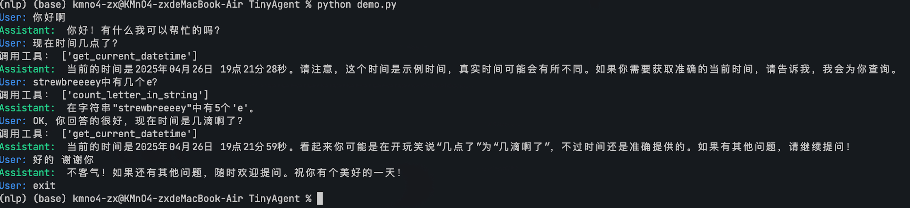

# 7.3 Agent

## 7.3.1 什么是 LLM Agent？

简单来说，大模型Agent是一个以LLM为核心“大脑”，并赋予其自主规划、记忆和使用工具能力的系统。 它不再仅仅是被动地响应用户的提示（Prompt），而是能够：

1. 理解目标（Goal Understanding）： 接收一个相对复杂或高层次的目标（例如，“帮我规划一个周末去北京的旅游行程并预订机票酒店”）。
2. 自主规划（Planning）： 将大目标分解成一系列可执行的小步骤（例如，“搜索北京景点”、“查询天气”、“比较机票价格”、“查找合适的酒店”、“调用预订API”等）。
3. 记忆（Memory）： 拥有短期记忆（记住当前任务的上下文）和长期记忆（从过去的交互或外部知识库中学习和检索信息）。
4. 工具使用（Tool Use）： 调用外部API、插件或代码执行环境来获取信息（如搜索引擎、数据库）、执行操作（如发送邮件、预订服务）或进行计算。
5. 反思与迭代（Reflection & Iteration）： （在更高级的Agent中）能够评估自己的行为和结果，从中学习并调整后续计划。

传统的LLM像一个知识渊博但只能纸上谈兵的图书馆员，而 LLM Agent 则更像一个全能的私人助理，不仅懂得多，还能跑腿办事，甚至能主动思考最优方案。


LLM Agent 通过将大型语言模型的强大语言理解和生成能力与规划、记忆和工具使用等关键模块相结合，实现了超越传统大模型的自主性和复杂任务处理能力，这种能力使得 LLM Agent 在许多垂直领域（如法律、医疗、金融等）都具有广泛的应用潜力。

## 7.3.2 LLM Agent 的类型

虽然LLM Agent的概念还在快速发展中，但根据其设计理念和能力侧重，我们可以大致将其分为几类：

任务导向型Agent（Task-Oriented Agents）：
- 特点： 专注于完成特定领域的、定义明确的任务，例如客户服务、代码生成、数据分析等。
- 工作方式： 通常有预设的流程和可调用的特定工具集。LLM主要负责理解用户意图、填充任务槽位、生成回应或调用合适- 的工具。
- 例子： 专门用于预订餐厅的聊天机器人、辅助编程的代码助手（如GitHub Copilot在某些高级功能上体现了Agent特性）。

规划与推理型Agent（Planning & Reasoning Agents）：
- 特点： 强调自主分解复杂任务、制定多步计划，并根据环境反馈进行调整的能力。它们通常需要更强的推理能力。
- 工作方式： 常采用特定的思维框架，如ReAct (Reason+Act)，让模型先进行“思考”（Reasoning）分析当前情况和所需行动，然后执行“行动”（Action）调用工具，再根据工具返回结果进行下一轮思考。Chain-of-Thought (CoT) 等提示工程技术也是其推理的基础。
- 例子： 需要整合网络搜索、计算器、数据库查询等多种工具来回答复杂问题的研究型Agent，或者能够自主完成“写一篇关于XX主题的报告，并配上相关数据图表”这类任务的Agent。

多Agent系统（Multi-Agent Systems）：
- 特点： 由多个具有不同角色或能力的Agent协同工作，共同完成一个更宏大的目标。
- 工作方式： Agent之间可以进行通信、协作、辩论甚至竞争。例如，一个Agent负责规划，一个负责执行，一个负责审查。
- 例子： 模拟软件开发团队（产品经理Agent、程序员Agent、测试员Agent）来自动生成和测试代码；模拟一个公司组织结构来完成商业策划。AutoGen、ChatDev等框架支持这类系统的构建。

探索与学习型Agent（Exploration & Learning Agents）：
- 特点： 这类Agent不仅执行任务，还能在与环境的交互中主动学习新知识、新技能或优化自身策略，类似于强化学习中的Agent概念。
- 工作方式： 可能包含更复杂的记忆和反思机制，能够根据成功或失败的经验调整未来的规划和行动。
- 例子： 能在未知软件环境中自主探索学习如何操作的Agent，或者在玩游戏时不断提升策略的Agent。

## 7.3.3 动手构造一个 Tiny-Agent

我们来基于 `openai` 库和其 `tool_calls` 功能，动手构造一个 Tiny-Agent，这个 Agent 是一个简单的任务导向型 Agent，它能够根据用户的输入，回答一些简单的问题。

最终的实现效果如下：

<div style="display: flex; justify-content: center;">
    
</div>

### Step 1 : 初始化客户端和模型

首先，我们需要一个能够调用大模型的客户端。这里我们使用 `openai` 库，并配置其指向一个兼容 OpenAI API 的服务终端，例如 [SiliconFlow](https://cloud.siliconflow.cn/i/ybUFvmqK)。同时，指定要使用的模型，如 `Qwen/Qwen2.5-32B-Instruct`。

```python
from openai import OpenAI

# 初始化 OpenAI 客户端
client = OpenAI(
    api_key="YOUR_API_KEY",  # 替换为你的 API Key
    base_url="https://api.siliconflow.cn/v1", # 使用 SiliconFlow 的 API 地址
)

# 指定模型名称
model_name = "Qwen/Qwen2.5-32B-Instruct"
```

> **注意:** 你需要将 `YOUR_API_KEY` 替换为你从 [SiliconFlow](https://cloud.siliconflow.cn/i/ybUFvmqK) 或其他服务商获取的有效 API Key。

### Step 2: 定义工具函数

我们在 `src/tools.py` 文件中定义 Agent 可以使用的工具函数。每个函数都需要有清晰的文档字符串（docstring），描述其功能和参数，因为这将用于自动生成工具的 JSON Schema。

```python
# src/tools.py
from datetime import datetime

# 获取当前日期和时间
def get_current_datetime() -> str:
    """
    获取当前日期和时间。
    :return: 当前日期和时间的字符串表示。
    """
    current_datetime = datetime.now()
    formatted_datetime = current_datetime.strftime("%Y-%m-%d %H:%M:%S")
    return formatted_datetime

def add(a: float, b: float):
    """
    计算两个浮点数的和。
    :param a: 第一个浮点数。
    :param b: 第二个浮点数。
    :return: 两个浮点数的和。
    """
    return a + b

def compare(a: float, b: float):
    """
    比较两个浮点数的大小。
    :param a: 第一个浮点数。
    :param b: 第二个浮点数。
    :return: 比较结果的字符串表示。
    """
    if a > b:
        return f'{a} is greater than {b}'
    elif a < b:
        return f'{b} is greater than {a}'
    else:
        return f'{a} is equal to {b}'

def count_letter_in_string(a: str, b: str):
    """
    统计字符串中某个字母的出现次数。
    :param a: 要搜索的字符串。
    :param b: 要统计的字母。
    :return: 字母在字符串中出现的次数。
    """
    return a.count(b)

# ... (可能还有其他工具函数)
```

为了让 OpenAI API 理解这些工具，我们需要将它们转换成特定的 JSON Schema 格式。这可以通过 `src/utils.py` 中的 `function_to_json` 辅助函数完成。

```python
# src/utils.py (部分)
import inspect

def function_to_json(func) -> dict:
    # ... (函数实现细节)
    # 返回符合 OpenAI tool schema 的字典
    return {
        "type": "function",
        "function": {
            "name": func.__name__,
            "description": inspect.getdoc(func),
            "parameters": {
                "type": "object",
                "properties": parameters,
                "required": required,
            },
        },
    }
```

### Step 3: 构造 Agent 类

我们在 `src/core.py` 文件中定义 `Agent` 类。这个类负责管理对话历史、调用 OpenAI API、处理工具调用请求以及执行工具函数。

```python
# src/core.py (部分)
from openai import OpenAI
import json
from typing import List, Dict, Any
from utils import function_to_json
# 导入定义好的工具函数
from tools import get_current_datetime, add, compare, count_letter_in_string

SYSREM_PROMPT = """
你是一个叫不要葱姜蒜的人工智能助手。你的输出应该与用户的语言保持一致。
当用户的问题需要调用工具时，你可以从提供的工具列表中调用适当的工具函数。
"""

class Agent:
    def __init__(self, client: OpenAI, model: str = "Qwen/Qwen2.5-32B-Instruct", tools: List=[], verbose : bool = True):
        self.client = client
        self.tools = tools # 存储可用的工具函数列表
        self.model = model
        self.messages = [
            {"role": "system", "content": SYSREM_PROMPT},
        ]
        self.verbose = verbose

    def get_tool_schema(self) -> List[Dict[str, Any]]:
        # 使用 utils.function_to_json 获取所有工具的 JSON Schema
        return [function_to_json(tool) for tool in self.tools]

    def handle_tool_call(self, tool_call):
        # 处理来自模型的工具调用请求
        function_name = tool_call.function.name
        function_args = tool_call.function.arguments
        function_id = tool_call.id

        # 动态执行工具函数
        # 注意：实际应用中应添加更严格的安全检查
        function_call_content = eval(f"{function_name}(**{function_args})")

        # 返回工具执行结果给模型
        return {
            "role": "tool",
            "content": function_call_content,
            "tool_call_id": function_id,
        }

    def get_completion(self, prompt) -> str:
        # 主对话逻辑
        self.messages.append({"role": "user", "content": prompt})

        # 第一次调用模型，传入工具 Schema
        response = self.client.chat.completions.create(
            model=self.model,
            messages=self.messages,
            tools=self.get_tool_schema(),
            stream=False,
        )

        # 检查模型是否请求调用工具
        if response.choices[0].message.tool_calls:
            tool_list = []
            # 处理所有工具调用请求
            for tool_call in response.choices[0].message.tool_calls:
                # 执行工具并将结果添加到消息历史中
                self.messages.append(self.handle_tool_call(tool_call))
                tool_list.append(tool_call.function.name)
            if self.verbose:
                print("调用工具：", tool_list)
            
            # 第二次调用模型，传入工具执行结果
            response = self.client.chat.completions.create(
                model=self.model,
                messages=self.messages,
                tools=self.get_tool_schema(), # 再次传入 Schema 可能有助于模型理解上下文
                stream=False,
            )

        # 将最终的助手回复添加到消息历史
        self.messages.append({"role": "assistant", "content": response.choices[0].message.content})
        return response.choices[0].message.content
```

这个 Agent 的工作流程如下：
1.  接收用户输入。
2.  调用大模型（如 Qwen），并告知其可用的工具及其 Schema。
3.  如果模型决定调用工具，Agent 会解析请求，执行相应的 Python 函数。
4.  Agent 将工具的执行结果返回给模型。
5.  模型根据工具结果生成最终回复。
6.  Agent 将最终回复返回给用户。

<div style="display: flex; justify-content: center;">
    
</div>

### Step 4: 运行 Agent

现在我们可以实例化并运行 Agent。在 `demo.py` 的 `if __name__ == "__main__":` 部分提供了一个简单的命令行交互示例。

```python
# demo.py (部分)
if __name__ == "__main__":
    client = OpenAI(
        api_key="YOUR_API_KEY", # 替换为你的 API Key
        base_url="https://api.siliconflow.cn/v1",
    )

    # 创建 Agent 实例，传入 client、模型名称和工具函数列表
    agent = Agent(
        client=client,
        model="Qwen/Qwen2.5-32B-Instruct",
        tools=[get_current_datetime, add, compare, count_letter_in_string],
        verbose=True # 设置为 True 可以看到工具调用信息
    )

    # 开始交互式对话循环
    while True:
        # 使用彩色输出区分用户输入和AI回答
        prompt = input("\033[94mUser: \033[0m")  # 蓝色显示用户输入提示
        if prompt.lower() == "exit":
            break
        response = agent.get_completion(prompt)
        print("\033[92mAssistant: \033[0m", response)  # 绿色显示AI助手回答
```

运行 `python src/core.py` 后，你可以开始提问。如果问题需要调用工具，Agent 会自动处理。

**示例交互:**

```bash
User: 你好
Assistant:  你好！有什么可以帮助你的吗？
User: 9.12和9 .2哪个更大？
调用工具： ['compare']
Assistant:  9.2 比 9.12 更大。
User: 为什么？
Assistant:  当我们比较9.12和9.2时，可以将它们看作是9.12和9.20。由于9.20在小数点后第二位是0，而9.12在小数点后第二位是2，所以在小数点后第一位相等的情况下，9.20（即9.2）大于9.12。因此，9.2 比 9.12 更大。
User: strawberry中有几个r？
调用工具： ['count_letter_in_string']
Assistant:  单词 "strawberry" 中有3个字母 'r'。
User: 你确信嘛？
调用工具： ['count_letter_in_string']
Assistant:  是的，我确定。单词 "strawberry" 中确实有3个字母 'r'。让我们再次确认一下，"strawberry" 中的 'r' 确实出现了3次。
User: 好的 你很薄，现在几点 了？
调用工具： ['get_current_datetime']
Assistant:  当前的时间是2025年4月26日17:01:33。不过，我注意到您提到“你很薄”，这似乎是一个打字错误，如果您有任何其他问题或者需要进一步的帮助，请告诉我！
User: exit
```


