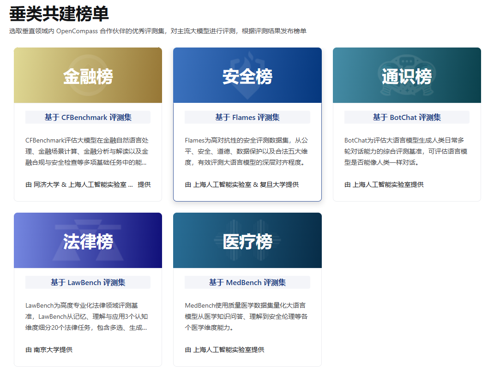

# 8.1 LLM 的评测

近年来，随着人工智能领域的迅猛发展，大规模预训练语言模型（简称大模型）成为了推动技术进步的核心力量。这些大模型在自然语言处理等任务中展现出了令人惊叹的能力。然而，要准确衡量一个大模型的性能，必须依靠科学而合理的评测。

什么是大模型评测？大模型评测就是通过各种标准化的方法和数据集，对大模型在不同任务上的表现进行量化和比较。这些评测不仅包括模型在特定任务上的准确性，还涉及模型的泛化能力、推理速度、资源消耗等多个方面。通过评测，我们能够更全面地了解大模型的实际表现，以及它们在现实世界中的应用潜力。

大模型的开发成本高昂，涉及大量的计算资源和数据，因此评测对于确保模型的实际价值至关重要。首先，评测能够揭示模型在各种任务中的表现，帮助研究人员和企业判断模型的适用性和可靠性。其次，评测可以暴露模型的潜在弱点，例如偏见、鲁棒性问题等，从而为进一步优化和改进提供依据。此外，公平、公开的评测还为学术界和工业界提供了一个共同的标准，促进了技术的交流与进步。

## 8.1.1 LLM 的评测数据集

在大模型的评测过程中，使用标准化的评测集至关重要。目前，主流的大模型评测集主要从以下几个方面进行评估，每个评测集都有其独特的用途和典型应用场景：

1. **通用评测集**：
   - **MMLU（Massive Multitask Language Understanding）**：MMLU评测模型在多种任务中的理解能力，包括各类学科和知识领域。具体包含了历史、数学、物理、生物、法律等任务类型，全面考察模型在不同学科的知识储备和语言理解能力。

2. **工具使用评测集**：
   - **BFCL V2**：用于评测模型在复杂工具使用任务中的表现，特别是在执行多步骤操作时的正确性和效率。这些任务通常涉及与数据库交互或执行特定指令，以模拟实际工具使用场景。
   - **Nexus**：用于测试模型在多步骤操作中的工具使用能力，主要评估其在多任务操作中的协调性和任务管理能力，如进行文件操作、数据整合等复杂流程。

3. **数学评测集**：
   - **GSM8K**：GSM8K是一个包含小学数学问题的数据集，用于测试模型的数学推理和逻辑分析能力。具体任务包括算术运算、简单方程求解、数字推理等。GSM8K中的问题虽然看似简单，但模型需要理解问题语义并进行正确的数学运算，体现了逻辑推理和语言理解的双重挑战。
   - **MATH**：MATH数据集用于测试模型在更复杂的数学问题上的表现，包括代数和几何。

4. **推理评测集**：
   - **ARC Challenge**：ARC Challenge评测模型在科学推理任务中的表现，尤其是常识性和科学性问题的解答，典型应用场景包括科学考试题解答和百科问答系统的开发。
   - **GPQA**：用于评测模型在零样本条件下对开放性问题的回答能力，通常应用于客服聊天机器人和知识问答系统中，帮助模型在缺乏特定领域数据的情况下给出合理的回答。
   - **HellaSwag**：评测模型在复杂语境下选择最符合逻辑的答案的能力，适用于故事续写、对话生成等需要高水平理解和推理的场景。

5. **长文本理解评测集**：
   - **InfiniteBench/En.MC**：评测模型在处理长文本阅读理解方面的能力，尤其是对科学文献的理解，适用于学术文献自动摘要、长篇报道分析等应用场景。
   - **NIH/Multi-needle**：用于测试模型在多样本长文档环境中的理解和总结能力，应用于政府报告解读、企业内部长文档分析等需要处理海量信息的场景。

6. **多语言评测集**：
   - **MGSM**：用于评估模型在不同语言下的数学问题解决能力，考察模型的多语言适应性，尤其适用于国际化环境中的数学教育和跨语言技术支持场景。

这些评测集的多样性帮助我们全面评估大模型在不同任务和应用场景中的表现，确保模型在处理多样化任务时能够保持高效和精准的表现。例如，在MMLU评测中，某些大模型在历史、物理等学科任务中表现优异，展现出对多领域知识的深度理解；在GSM8K数学评测中，最新的大模型在算术和方程求解方面表现接近甚至超越了一些人类基准，显示出在复杂数学推理任务中的潜力。这些实际评测结果展示了模型在各类复杂任务中的进步和应用潜力。

## 8.1.2 主流的评测榜单

大模型的评测不仅限于使用特定的数据集，许多机构还会根据评测结果发布模型排行榜，这些榜单为学术界和工业界提供了重要的参考，帮助他们了解当前最前沿的技术和模型。以下是一些主流的评测榜单：

### Open LLM Leaderboard

由Hugging Face提供的开放式榜单，汇集了多个开源大模型的评测结果，帮助用户了解不同模型在各种任务上的表现。该榜单通过多个标准化测试集来评估模型的性能，并通过持续更新的方式反映最新的技术进展，为研究者和开发者提供了高价值的对比参考。

### lmsys Chatbot Arena Leaderboard

由lmsys提供的聊天机器人评测榜单，通过多维度的评估，展示各类大模型在对话任务中的能力。该榜单采用真实用户与模型交互的方式来评测对话质量，重点考察模型的自然语言生成能力、上下文理解能力以及用户满意度，是当前评估聊天机器人性能的重要工具。

### OpenCompass

OpenCompass是国内的评测榜单，针对大模型在多种语言和任务上的表现进行评估，提供了中国市场特定应用的参考。该榜单结合了中文语言理解和多语言能力的测试，以适应本地化需求，并特别关注大模型在中文语境下的准确性、鲁棒性和适应性，为国内企业和研究者选择合适的模型提供了重要参考。

## 8.1.3 特定的评测榜单

此外，还有针对不同领域特定任务的大模型评测榜单，这些榜单专注于特定应用领域，帮助用户了解大模型在某一垂直领域的能力：

- 金融榜：基于CFBenchmark评测集，评估大模型在金融自然语言处理、金融预测计算、金融分析与安全检查等多项基础任务中的能力。由同济大学与上海人工智能实验室及东方财经提供。

- 安全榜：基于Flames评测集，评估大模型在公平、安全、数据保护以及合法五大维度的抗性，帮助深入了解模型在安全性上的表现。由上海人工智能实验室与复旦大学提供。

- 通识榜：基于BotChat评测集，评估大语言模型生成日常多轮对话能力的综合程度，判断模型在对话中是否具备类人水平。由上海人工智能实验室提供。

- 法律榜：基于LawBench评测集，评估模型在法律领域的理解、推理和应用能力，涵盖法律问题回答、文本生成、法律判例分析等任务。由南京大学提供。

- 医疗榜：基于MedBench评测集，评估大语言模型在医学知识问答、安全伦理理解等方面的表现。由上海人工智能实验室提供。

**参考文献**

- [Open LLM Leaderboard](https://huggingface.co/spaces/open-llm-leaderboard/open_llm_leaderboard)
- [lmsys Chatbot Arena Leaderboard](https://huggingface.co/spaces/awacke1/lmsys-chatbot-arena-leaderboard)
- [OpenCompass](https://rank.opencompass.org.cn/home)
- [金融榜 CFBenchmark](https://specialist.opencompass.org.cn/CFBenchmark)
- [安全榜 Flames](https://flames.opencompass.org.cn/leaderboard)
- [通识榜 BotChat](https://botchat.opencompass.org.cn/?lang=zh-CN)
- [法律榜 LawBench](https://lawbench.opencompass.org.cn/leaderboard?lang=en-US?lang=zh-CN)
- [医疗榜 MedBench](https://medbench.opencompass.org.cn/leaderboard?lang=zh-CN?lang=zh-CN)